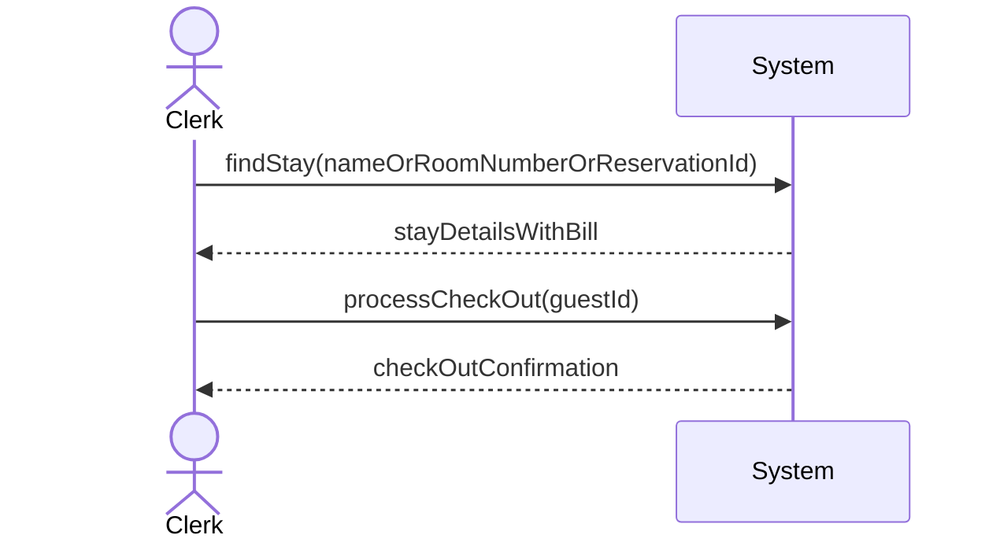
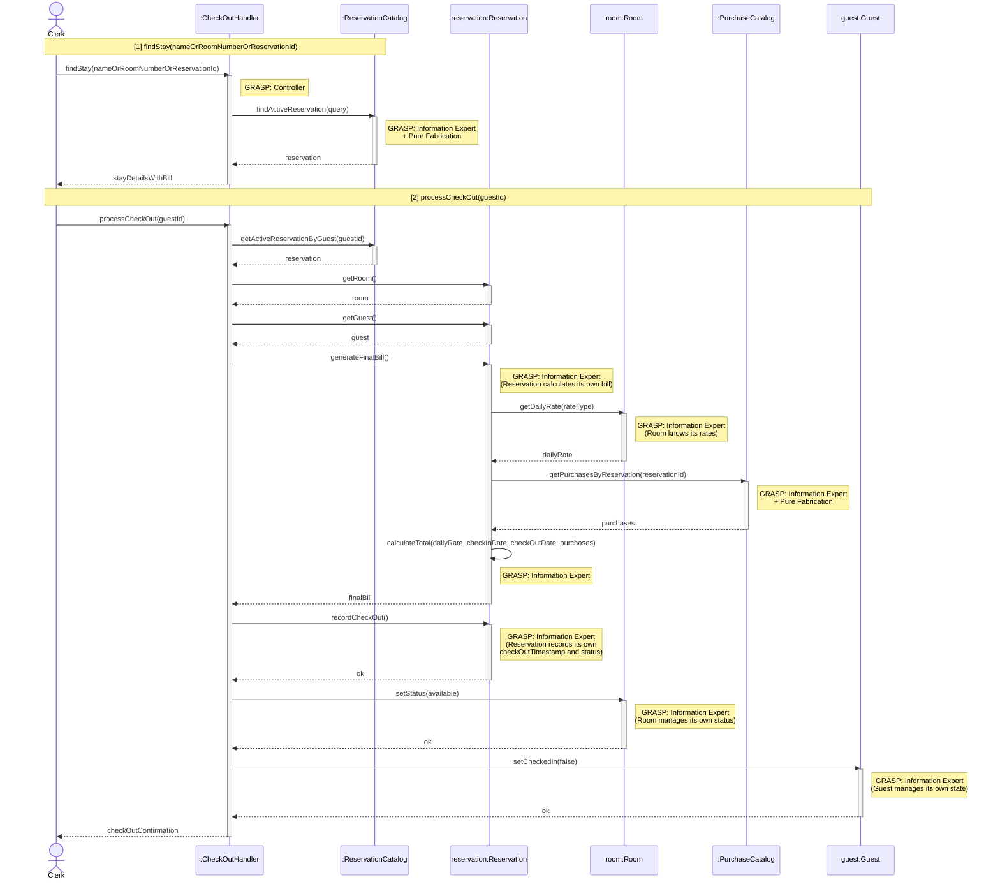
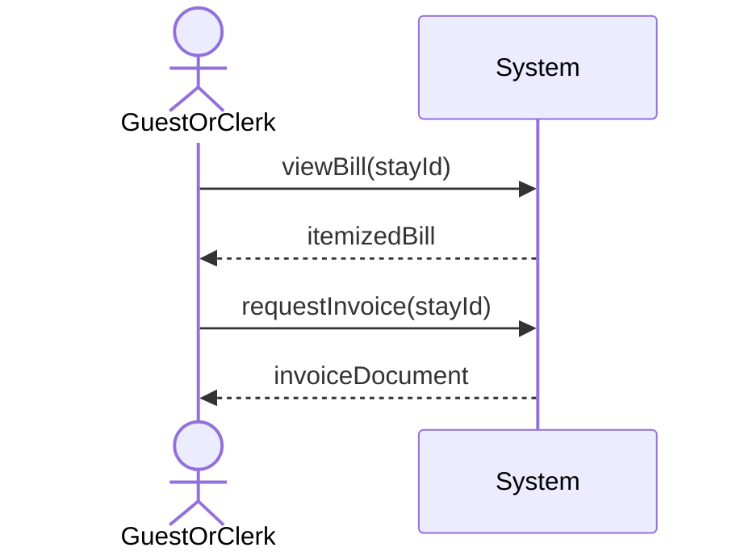
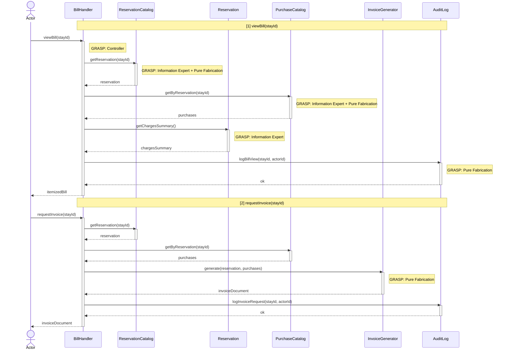
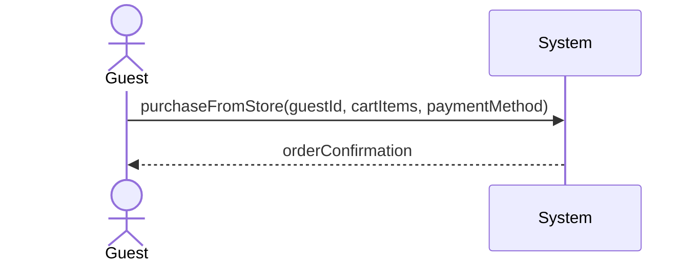
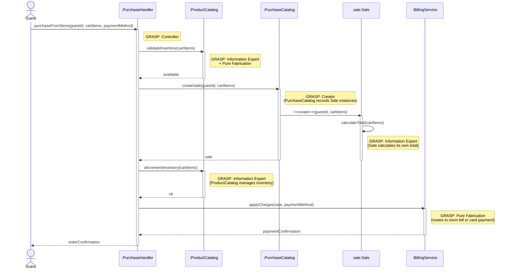

# Aaron — Use Cases

## Process Check-Out

| Use Case Name | Process Check-Out |
|---------------|-----------------|
| Actor         | Hotel Clerk    |
| Author        | [Aaron]    |
| Preconditions | 1. The hotel system is functional and online  2. The clerk is logged in to the system  3. The guest has been checked in and is currently occupying a room  4. The guest's room and stay details exist in the database |
| Postconditions | 1. The guest is checked out and the room is released  2. The room status is updated to available (or cleaning/maintenance as configured)  3. The check-out date and time are recorded  4. The final bill is calculated and recorded  5. Any outstanding balance or payment confirmation is documented |
| Main Success Scenario | 1. The clerk searches for the guest by name, room number, or reservation ID  2. The system displays the guest's current stay and room assignment  3. The clerk confirms the guest's identity and intent to check out  4. The system calculates the final bill (room charges, minibar, store purchases, incidentals)  5. The system displays the itemized bill to the clerk and guest  6. The guest pays any outstanding balance (or confirms prior payment)  7. The clerk confirms check-out in the system  8. The system updates the room status to available  9. The system records the check-out timestamp  10. The system displays a check-out confirmation and receipt (if requested)  11. The clerk provides the receipt or invoice to the guest |
| Extensions | [1]a. **Guest or room not found** &nbsp;&nbsp;&nbsp;&nbsp;[1]a1 The system displays a message that no matching stay was found &nbsp;&nbsp;&nbsp;&nbsp;[1]a2 The clerk verifies room number or guest name &nbsp;&nbsp;&nbsp;&nbsp;[1]a3 Return to step 1 or use case ends [6]a. **Payment declined or insufficient** &nbsp;&nbsp;&nbsp;&nbsp;[6]a1 The system displays payment failure message &nbsp;&nbsp;&nbsp;&nbsp;[6]a2 The clerk requests alternative payment or arranges follow-up &nbsp;&nbsp;&nbsp;&nbsp;[6]a3 Return to step 6 or use case ends with balance documented [8]a. **System cannot update room status** &nbsp;&nbsp;&nbsp;&nbsp;[8]a1 The system displays an error and logs the failure &nbsp;&nbsp;&nbsp;&nbsp;[8]a2 The clerk retries or escalates; check-out may be completed manually and room status updated later |
| Special Reqs | ● Check-out must update room availability in real-time for Search Available Room ● Final bill must include all room charges and any store or incidental charges linked to the stay ● Check-out time and payment status must be logged for auditing |

### Operation Contract

| Operation | `processCheckOut(guestId: String)` |
|---|---|
| Cross References | Use Case: Process Check-Out |
| Preconditions | 1. Hotel clerk is logged in 2. Guest is currently checked in and occupying a room 3. Guest's stay details exist in the database |
| Postconditions | 1. Room.status was changed to 'available' 2. Stay.checkOutTimestamp was recorded 3. Final bill was calculated and recorded (room charges, store purchases, and incidentals) 4. Guest.checkedIn was set to false 5. Payment status was documented and logged |

### Design Sequence Diagram

| Pattern | Applied To | Rationale |
|---|---|---|
| **Controller** | `:CheckOutHandler` | Use-case controller; receives both system operations for this use case session |
| **Information Expert + Pure Fabrication** | `:ReservationCatalog` | Holds all Reservation data; finds active stays by guest/room/ID |
| **Information Expert** | `reservation:Reservation` | Has `rateType`, `checkInDate`, `checkOutDate`, `totalCost` — calculates its own final bill and records its own check-out state |
| **Information Expert** | `room:Room` | Has `maxDailyRate`, `promotionRate` — expert on rate data used in billing |
| **Information Expert + Pure Fabrication** | `:PurchaseCatalog` | Records all store/incidental purchases linked to a reservation; no direct domain class |
| **Information Expert** | `guest:Guest` | Manages its own `checkedIn` flag |

---

## View or Request Bill

| Use Case Name | View or Request Bill |
|---------------|--------------------|
| Actor         | Hotel Guest or Hotel Clerk    |
| Author        | [Aaron]    |
| Preconditions | 1. The hotel system is functional and online  2. The actor is logged in to the system  3. There exists a stay, reservation, or set of charges associated with the guest (current or past) |
| Postconditions | 1. The actor has viewed the current bill or a historical bill for the specified stay  2. If requested, an invoice or receipt is generated and made available (e.g., download or email)  3. The request is logged for auditing where applicable |
| Main Success Scenario | 1. The guest or clerk navigates to billing, "My Stay," or reservation details  2. The guest selects their stay (or the clerk selects the guest and stay)  3. The system retrieves all charges for that stay (room, rate, taxes, minibar, store purchases, incidentals)  4. The system displays an itemized bill with line items, dates, and totals  5. The actor reviews the bill  6. If the actor requests an invoice or receipt, they select "Request Invoice" or "Download Receipt"  7. The system generates the document (PDF or formatted print) with hotel branding and bill details  8. The system makes the document available for download or sends it to the guest's email  9. The system displays confirmation that the bill was viewed and, if applicable, that the invoice was sent |
| Extensions | [2]a. **No stay or reservation found** &nbsp;&nbsp;&nbsp;&nbsp;[2]a1 The system displays a message that no billable stay was found for this guest &nbsp;&nbsp;&nbsp;&nbsp;[2]a2 Use case ends [6]a. **Invoice request for past stay** &nbsp;&nbsp;&nbsp;&nbsp;[6]a1 The system allows invoice generation for completed stays within the retention period &nbsp;&nbsp;&nbsp;&nbsp;[6]a2 Continue from step 7 [6]b. **Invoice request not allowed (e.g., stay in progress and policy requires check-out first)** &nbsp;&nbsp;&nbsp;&nbsp;[6]b1 The system displays "Final invoice available at check-out" or similar &nbsp;&nbsp;&nbsp;&nbsp;[6]b2 Use case ends with bill view only |
| Special Reqs | ● Bill must reflect all charges from room, store (Purchase from Store), and incidentals in real time ● Invoice/receipt must include all legally required information (hotel name, stay dates, tax breakdown, etc.) ● Guest may only view or request bills for their own stays; clerks may view bills for any guest as authorized |

### Operation Contract

| Operation | `viewBill(stayId: String)` / `requestInvoice(stayId: String)` |
|---|---|
| Cross References | Use Case: View or Request Bill |
| Preconditions | 1. Actor is logged in 2. A stay, reservation, or set of charges exists for the guest in the system |
| Postconditions | 1. Bill view event was logged for the stay 2. An invoice document was generated containing all line items, dates, and totals (if requested) 3. Invoice was made available for download or sent to the guest's email (if requested) 4. Invoice request was logged (if applicable) |

### Design Sequence Diagram

| Pattern | Applied To | Rationale |
|---|---|---|
| **Controller** | `:BillHandler` | Use-case controller; handles both system operations for this use case session |
| **Information Expert + Pure Fabrication** | `:ReservationCatalog` | Holds all Reservation data; retrieves the stay by ID |
| **Information Expert** | `reservation:Reservation` | Knows its own charges (room rate, dates, totalCost) |
| **Information Expert + Pure Fabrication** | `:PurchaseCatalog` | Holds all store purchase records linked to a stay |
| **Pure Fabrication** | `:InvoiceGenerator` | Generates the formatted invoice document; no domain counterpart |
| **Pure Fabrication** | `:AuditLog` | Logs bill views and invoice requests |

---

## Purchase from Store

| Use Case Name | Purchase from Store |
|---------------|-----------------|
| Actor         | Guest          |
| Author        | [Aaron]    |
| Preconditions | 1. The guest is logged into the hotel system  2. The guest has browsed the product catalog and identified items to purchase  3. The guest is checked in (or the system allows store purchases for registered guests as per policy)  4. Products are available in inventory |
| Postconditions | 1. The selected products are recorded as purchased and associated with the guest (and room/stay if checked in)  2. Inventory for purchased items is updated  3. Payment is recorded and the guest receives confirmation  4. Charges are applied to the room bill (if checked in) or paid at time of purchase |
| Main Success Scenario | 1. The guest navigates to the Store from the main dashboard  2. The guest adds one or more products to the cart (product, quantity, size/variant if applicable)  3. The guest views the cart and adjusts quantities or removes items if desired  4. The guest proceeds to checkout  5. The system displays order summary (items, quantities, prices, total) and confirms guest/room for billing  6. The guest confirms payment method (charge to room or enter card)  7. The system validates payment and inventory availability  8. The system records the sale and updates inventory  9. The system applies charges to the room bill or completes the payment transaction  10. The system displays order confirmation and, if applicable, delivery or pickup details  11. The guest acknowledges the confirmation |
| Extensions | [2]a. **Product no longer available** &nbsp;&nbsp;&nbsp;&nbsp;[2]a1 The system notifies the guest that the item is out of stock &nbsp;&nbsp;&nbsp;&nbsp;[2]a2 The guest removes the item or selects an alternative &nbsp;&nbsp;&nbsp;&nbsp;[2]a3 Continue from step 3 [7]a. **Payment failed** &nbsp;&nbsp;&nbsp;&nbsp;[7]a1 The system displays payment error message &nbsp;&nbsp;&nbsp;&nbsp;[7]a2 The guest corrects payment details or chooses another method &nbsp;&nbsp;&nbsp;&nbsp;[7]a3 Return to step 6 [7]b. **Guest not checked in and no payment method** &nbsp;&nbsp;&nbsp;&nbsp;[7]b1 The system prompts for a valid payment method to complete purchase &nbsp;&nbsp;&nbsp;&nbsp;[7]b2 Use case ends if guest cannot provide payment |
| Special Reqs | ● Store purchases for checked-in guests must be chargeable to the room and visible on the final bill (Process Check-Out) ● Inventory must be decremented atomically with the sale ● Payment and order details must be stored securely and logged for auditing |

### Operation Contract

| Operation | `purchaseFromStore(guestId: String, cartItems: List<CartItem>, paymentMethod: PaymentMethod)` |
|---|---|
| Cross References | Use Case: Purchase from Store |
| Preconditions | 1. Guest is logged in 2. All items in the cart are available in inventory 3. Guest is checked in or has a valid payment method on file |
| Postconditions | 1. A new Sale was created and associated with the guest and current stay 2. Inventory quantity was decremented for each purchased item 3. Charges were applied to the guest's room bill (if checked in) or a payment transaction was completed 4. Order confirmation was generated and associated with the sale |

### Design Sequence Diagram

| Pattern | Applied To | Rationale |
|---|---|---|
| **Controller** | `:PurchaseHandler` | Use-case controller; receives the `purchaseFromStore` system operation |
| **Information Expert + Pure Fabrication** | `:ProductCatalog` | Holds all Product and inventory data; validates stock and decrements quantities |
| **Creator + Pure Fabrication** | `:PurchaseCatalog` | Records Sale instances (GRASP Creator: B records A → B creates A) |
| **Information Expert** | `sale:Sale` | Calculates its own total from the cart items |
| **Pure Fabrication** | `:BillingService` | Routes charges to the room bill or processes a card payment; no domain counterpart |

