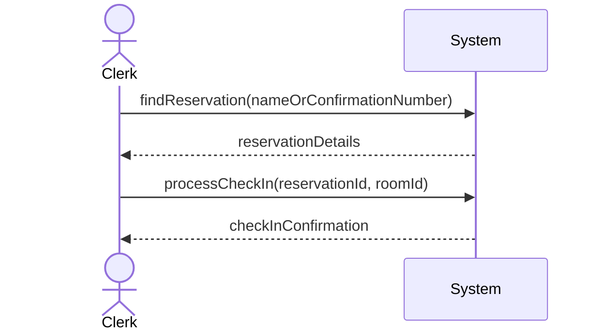
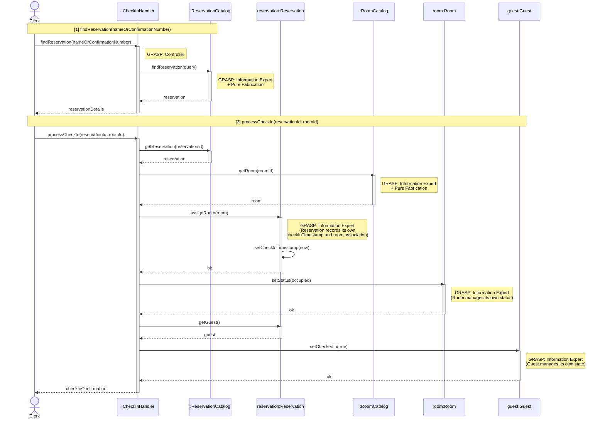
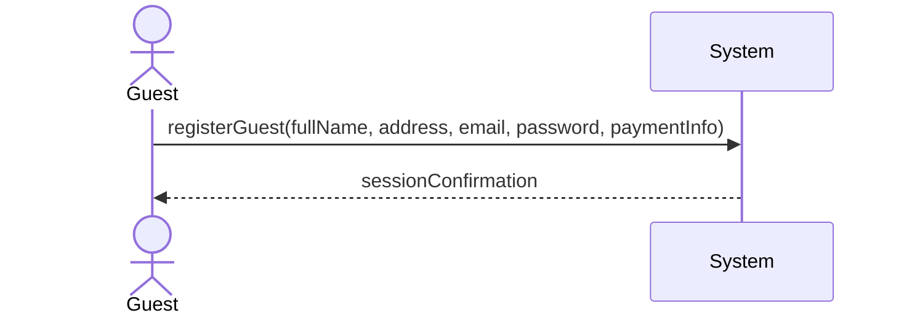
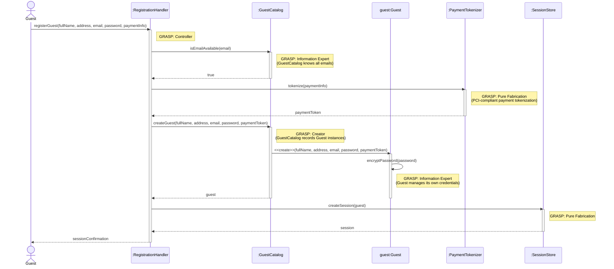
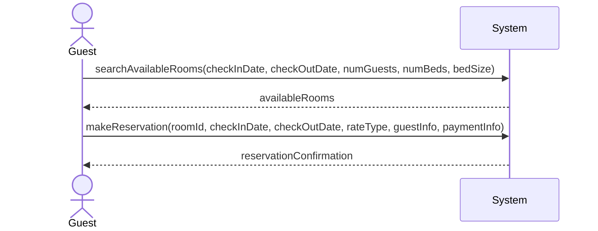
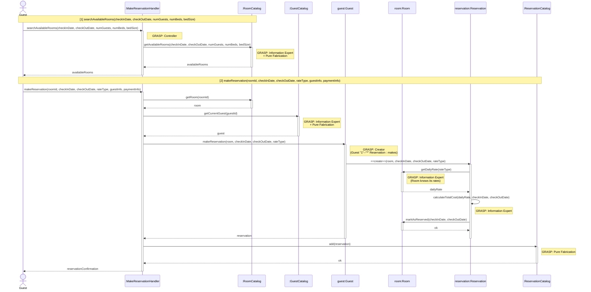

# Erick Martinez — Use Cases

## Process Check-In

| Use Case Name | Process Check-In |
|---------------|-----------------|
| Actor         | Hotel Clerk    |
| Author        | Erick Martinez |
| Preconditions | 1. The hotel system is functional and online  2. The clerk is logged in to the system  3. The guest has an existing reservation for the current date  4. At least one room matching the reservation criteria is available |
| Postconditions | 1. The guest is checked in and assigned to a specific room  2. The room status is updated to occupied  3. The check-in date and time are recorded  4. The guest can access hotel services (including the store) |
| Main Success Scenario | 1. The clerk searches for the guest's reservation by name or confirmation number  2. The system displays the reservation details  3. The clerk verifies the guest's identity  4. The clerk confirms the reservation details with the guest  5. The system displays available rooms matching the reservation  6. The clerk selects a room to assign to the guest  7. The system allocates the room to the guest  8. The system updates the room status to occupied  9. The system records the check-in timestamp  10. The clerk provides the room key/access information to the guest  11. The system displays check-in confirmation |
| Extensions | [1]a. **Reservation not found** &nbsp;&nbsp;&nbsp;&nbsp;[1]a1 The clerk verifies guest information &nbsp;&nbsp;&nbsp;&nbsp;[1]a2 The clerk offers to create a new reservation (see Make Reservation use case) &nbsp;&nbsp;&nbsp;&nbsp;[1]a3 Use case ends or continues with new reservation [4]a. **Guest requests different room type** &nbsp;&nbsp;&nbsp;&nbsp;[4]a1 The clerk searches for alternative available rooms &nbsp;&nbsp;&nbsp;&nbsp;[4]a2 The system displays available alternatives with price differences &nbsp;&nbsp;&nbsp;&nbsp;[4]a3 The guest selects a new room type &nbsp;&nbsp;&nbsp;&nbsp;[4]a4 The system updates the reservation with new rate if applicable &nbsp;&nbsp;&nbsp;&nbsp;[4]a5 Continue from step 5 [6]a. **No rooms available matching reservation** &nbsp;&nbsp;&nbsp;&nbsp;[6]a1 The system notifies the clerk of the situation &nbsp;&nbsp;&nbsp;&nbsp;[6]a2 The clerk offers an upgrade or alternative room &nbsp;&nbsp;&nbsp;&nbsp;[6]a3 The guest accepts or declines the alternative &nbsp;&nbsp;&nbsp;&nbsp;[6]a4 If declined, the clerk processes a cancellation with no penalty &nbsp;&nbsp;&nbsp;&nbsp;[6]a5 Use case ends or continues with alternative room |
| Special Reqs | ● Check-in must update room availability in real-time ● Guest must have an active reservation to access store purchasing |

### Operation Contract

| Operation | `processCheckIn(reservationId: String, roomId: String)` |
|---|---|
| Cross References | Use Case: Process Check-In |
| Preconditions | 1. Hotel clerk is logged in 2. Guest has a reservation for the current date 3. The specified room is available and matches the reservation criteria |
| Postconditions | 1. Room.status was changed to 'occupied' 2. Reservation.checkInTimestamp was recorded 3. Reservation was associated with the specific assigned Room 4. Guest.checkedIn was set to true |

### Design Sequence Diagram

| Pattern | Applied To | Rationale |
|---|---|---|
| **Controller** | `:CheckInHandler` | Use-case controller; handles both system operations for this use case session |
| **Information Expert + Pure Fabrication** | `:ReservationCatalog` | Holds all Reservation data; finds reservations by name or confirmation number |
| **Information Expert + Pure Fabrication** | `:RoomCatalog` | Holds all Room data; looks up a specific room by ID |
| **Information Expert** | `reservation:Reservation` | Records its own `checkInTimestamp` and updates its room association |
| **Information Expert** | `room:Room` | Manages its own `status` attribute |
| **Information Expert** | `guest:Guest` | Manages its own `checkedIn` flag |

---

## Guest Registration & Authentication

| Use Case Name | Guest Registration & Authentication |
|---------------|-----------------|
| Actor         | Guest           |
| Author        | Erick Martinez  |
| Preconditions | 1. The guest has access to the hotel system portal  2. The guest is not currently logged into an existing account |
| Postconditions | 1. A new guest profile is created in the database  2. Payment information is securely tokenized/stored  3. The guest is automatically logged in and redirected to the dashboard  4. A "Welcome [Name]" message is displayed |
| Main Success Scenario | 1. The guest selects the "Register" or "Create Account" option  2. The guest enters personal details: Full Name, Address, Email, and Password  3. The guest enters payment details: Credit Card Number, Expiration Date, and CVV  4. The system validates the format of all fields (e.g., email syntax, credit card)  5. The system checks if the email address is already registered  6. The system encrypts the password and stores the guest profile  7. The system authenticates the new session  8. The system displays a "Welcome [Guest Name]" message on the homepage/dashboard |
| Extensions | [4]a. **Invalid Data Format** &nbsp;&nbsp;&nbsp;&nbsp;[4]a1 The system highlights the specific field (e.g., "Invalid Credit Card Format") &nbsp;&nbsp;&nbsp;&nbsp;[4]a2 The guest corrects the data &nbsp;&nbsp;&nbsp;&nbsp;[4]a3 Continue from step 4 [5]a. **Email Already Exists** &nbsp;&nbsp;&nbsp;&nbsp;[5]a1 The system notifies the guest that an account already exists with that email &nbsp;&nbsp;&nbsp;&nbsp;[5]a2 The system offers a "Forgot Password" or "Login" link &nbsp;&nbsp;&nbsp;&nbsp;[5]a3 Use case ends [7]a. **Authentication Failure** &nbsp;&nbsp;&nbsp;&nbsp;[7]a1 The system creates the account but fails the initial login &nbsp;&nbsp;&nbsp;&nbsp;[7]a2 The system redirects the guest to the manual Login page |
| Special Reqs | ● PCI Compliance: Credit card data must be handled according to security standards (e.g., masking numbers in the UI) ● Data Integrity: The "Welcome" message must dynamically pull the FirstName attribute from the database ● Persistence: Guest information must remain accessible for future "Store" purchases without re-entry |

### Operation Contract

| Operation | `registerGuest(fullName: String, address: String, email: String, password: String, paymentInfo: PaymentInfo)` |
|---|---|
| Cross References | Use Case: Guest Registration & Authentication |
| Preconditions | 1. Guest has access to the hotel system portal 2. Guest is not currently logged in 3. The given email address is not already registered |
| Postconditions | 1. A new Guest profile was created in the database 2. Guest.password was encrypted and stored 3. Payment information was securely tokenized and stored 4. A new authenticated session was created and associated with the guest |

### Design Sequence Diagram

| Pattern | Applied To | Rationale |
|---|---|---|
| **Controller** | `:RegistrationHandler` | Use-case controller; receives the `registerGuest` system operation |
| **Information Expert + Pure Fabrication** | `:GuestCatalog` | Knows all registered emails; checks uniqueness before creation |
| **Creator** | `:GuestCatalog` | Records Guest instances (GRASP Creator: B records A → B creates A) |
| **Information Expert** | `guest:Guest` | Manages its own password encryption |
| **Pure Fabrication** | `:PaymentTokenizer` | Tokenizes payment info for PCI compliance; no domain counterpart |
| **Pure Fabrication** | `:SessionStore` | Creates and stores the authenticated session |

---

## Make Reservation

| Use Case Name | Make Reservation |
|---------------|-----------------|
| Actor         | Hotel Guest     |
| Author        | Erick Martinez  |
| Preconditions | 1. The hotel system is functional and online  2. The user is logged in to the system  3. Room and reservation data exists in the database  4. The user has searched for available rooms |
| Postconditions | 1. A new reservation is created in the system  2. The selected room is marked as reserved for the specified dates  3. Guest information is recorded (name, address, credit card number, expiration date)  4. Confirmation is displayed to the user |
| Main Success Scenario | 1. The user selects a room from the list of available rooms  2. The user enters the check-in and check-out dates  3. The user selects the rate type (standard, promotion, group, or non-refundable)  4. The user enters or confirms their personal information (name, address)  5. The user enters payment information (credit card number, expiration date)  6. The system validates all input data  7. The system verifies room availability for the selected dates  8. The system calculates the total cost based on quality level and rate type  9. The system creates the reservation and stores it in the database  10. The system displays reservation confirmation with details |
| Extensions | [3]a. **Corporate guest selected** &nbsp;&nbsp;&nbsp;&nbsp;[3]a1 The user selects their corporation from the list &nbsp;&nbsp;&nbsp;&nbsp;[3]a2 The system records the corporation for billing purposes &nbsp;&nbsp;&nbsp;&nbsp;[3]a3 Continue from step 4 [6]a. **Invalid input data** &nbsp;&nbsp;&nbsp;&nbsp;[6]a1 The system displays an error message indicating the invalid fields &nbsp;&nbsp;&nbsp;&nbsp;[6]a2 The user corrects the input &nbsp;&nbsp;&nbsp;&nbsp;[6]a3 Continue from step 6 [7]a. **Room is no longer available** &nbsp;&nbsp;&nbsp;&nbsp;[7]a1 The system notifies the user that the room has been booked &nbsp;&nbsp;&nbsp;&nbsp;[7]a2 The system redirects the user to search for available rooms &nbsp;&nbsp;&nbsp;&nbsp;[7]a3 Use case ends |
| Special Reqs | ● Credit card information must be securely stored ● Reservation must be atomic (all or nothing) |

### Operation Contract

| Operation | `makeReservation(roomId: String, checkInDate: Date, checkOutDate: Date, rateType: String, guestInfo: GuestInfo, paymentInfo: PaymentInfo)` |
|---|---|
| Cross References | Use Case: Make Reservation |
| Preconditions | 1. Guest is logged in 2. The selected room is available for the requested dates 3. Room and reservation data exist in the database |
| Postconditions | 1. A new Reservation was created in the database 2. Selected Room was marked as reserved for the specified dates 3. Guest information (name, address, credit card number, expiration date) was recorded 4. Reservation.totalCost was calculated based on quality level and rate type |

### Design Sequence Diagram

| Pattern | Applied To | Rationale |
|---|---|---|
| **Controller** | `:MakeReservationHandler` | Use-case controller; handles both system operations for this use case session |
| **Information Expert + Pure Fabrication** | `:RoomCatalog` | Holds all Room data; finds available rooms and retrieves a specific room by ID |
| **Information Expert + Pure Fabrication** | `:GuestCatalog` | Retrieves the current guest from the active session |
| **Creator** | `guest:Guest` | Domain model shows `Guest "1"--"*" Reservation : makes`; Guest aggregates Reservations |
| **Information Expert** | `room:Room` | Has `maxDailyRate`, `promotionRate` — expert on rate data |
| **Information Expert** | `reservation:Reservation` | Calculates its own `totalCost` from the room rate and stay dates |
| **Pure Fabrication** | `:ReservationCatalog` | Records and persists all Reservations |

