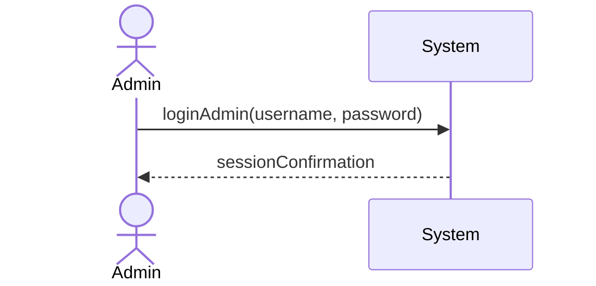
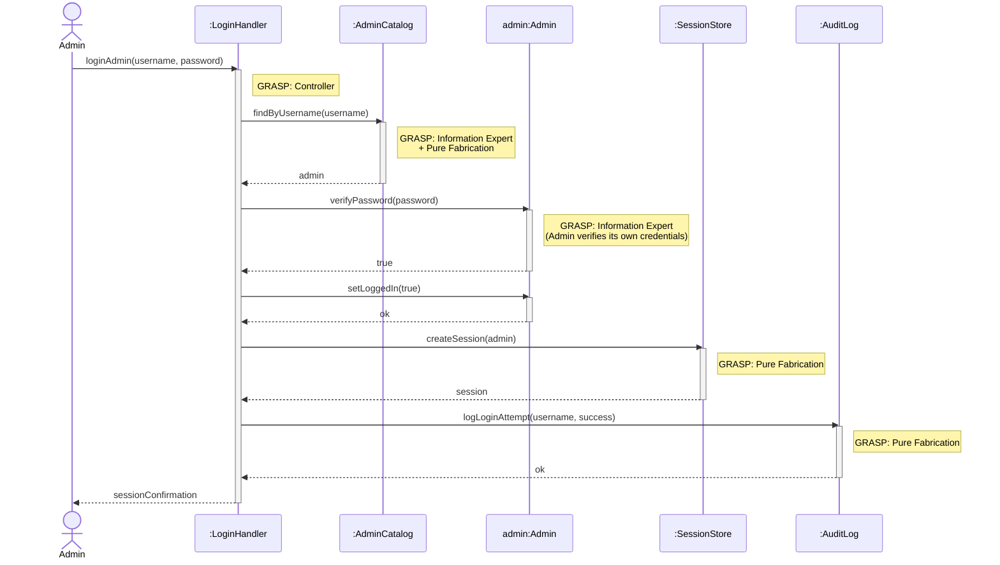
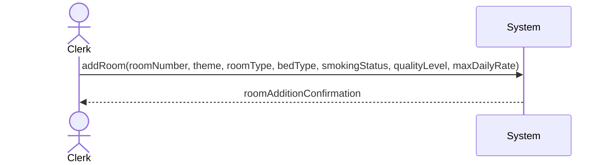
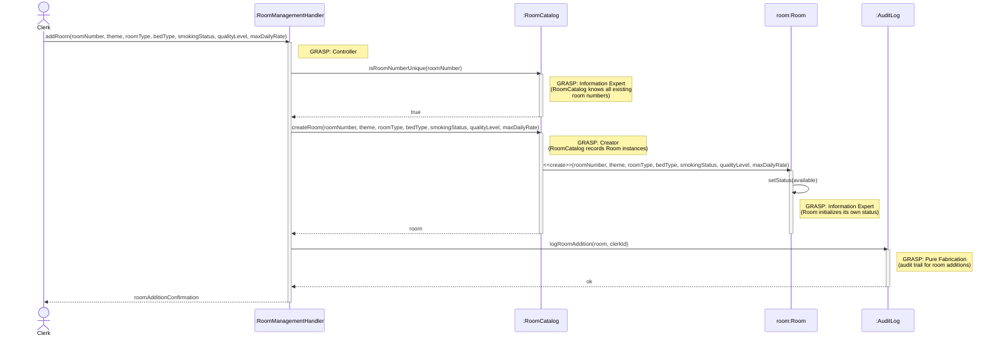
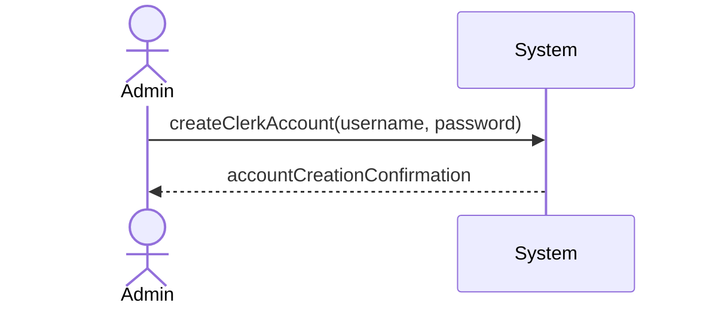
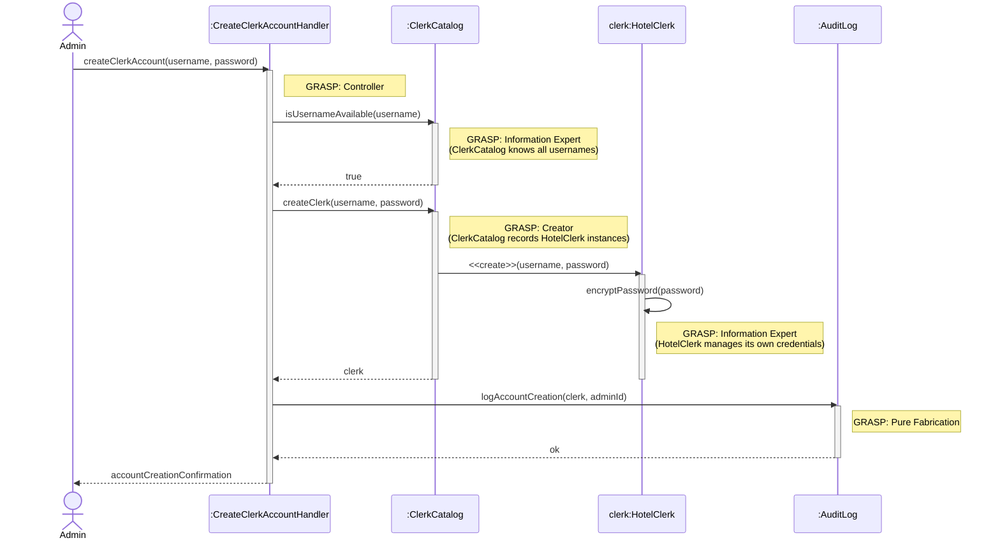

# Jace Yarborough — Use Cases

## Admin Login

| Use Case Name | Admin Login |
|---|---|
| Actor | Admin |
| Author | Jace Yarborough |
| Preconditions | 1. System operational 2. User has a valid admin account with username and password |
| Postconditions | 1. Admin is successfully logged in 2. Admin is redirected to admin dashboard/panel |
| Main Success Scenario | 1. Admin navigates to login page 2. Admin enters username 3. Admin enters password 4. Admin submits credentials 5. System validates input 6. System verifies credentials 7. System displays success message 8. Admin is brought to admin dashboard |
| Extensions | [4]a. **Invalid username format** &nbsp;&nbsp;&nbsp;&nbsp;[4]a1 System detects username doesn't meet format requirements &nbsp;&nbsp;&nbsp;&nbsp;[4]a2 System displays error message "Invalid username or password" &nbsp;&nbsp;&nbsp;&nbsp;[4]a3 System prompts user to re-enter credentials [6]a. **Invalid credentials** &nbsp;&nbsp;&nbsp;&nbsp;[6]a1 System detects username or password is incorrect &nbsp;&nbsp;&nbsp;&nbsp;[6]a2 System increments failed login attempt counter &nbsp;&nbsp;&nbsp;&nbsp;[6]a3 System displays error message "Invalid username or password" &nbsp;&nbsp;&nbsp;&nbsp;[6]a4 Return to step 2 [6]b. **Account locked** &nbsp;&nbsp;&nbsp;&nbsp;[6]b1 System detects account has been locked due to multiple failed attempts &nbsp;&nbsp;&nbsp;&nbsp;[6]b2 System displays error message "Account locked. Contact system administrator" &nbsp;&nbsp;&nbsp;&nbsp;[6]b3 Use case ends [6]c. **Password expired** &nbsp;&nbsp;&nbsp;&nbsp;[6]c1 System detects password has expired &nbsp;&nbsp;&nbsp;&nbsp;[6]c2 System prompts admin to reset password &nbsp;&nbsp;&nbsp;&nbsp;[6]c3 Redirect to password reset use case |
| Special Reqs | ● Password must be hashed in database ● Log all login attempts |

### Operation Contract

| Operation | `loginAdmin(username: String, password: String)` |
|---|---|
| Cross References | Use Case: Admin Login |
| Preconditions | 1. System is operational 2. An admin account with the given username exists in the system |
| Postconditions | 1. An admin session was created 2. Admin.isLoggedIn was set to true 3. The login attempt was logged |

### Design Sequence Diagram

| Pattern | Applied To | Rationale |
|---|---|---|
| **Controller** | `:LoginHandler` | Use-case controller; receives the `loginAdmin` system operation |
| **Information Expert + Pure Fabrication** | `:AdminCatalog` | Holds all Admin accounts; finds by username and verifies credentials |
| **Information Expert** | `admin:Admin` | Manages its own `isLoggedIn` flag |
| **Pure Fabrication** | `:SessionStore` | Creates and stores the authenticated session |
| **Pure Fabrication** | `:AuditLog` | Logs all login attempts for auditing |

---

## Add Room

| Use Case Name | Add Room |
|---|---|
| Actor | Hotel Clerk |
| Author | Jace Yarborough |
| Preconditions | 1. System operational 2. Hotel clerk is logged in |
| Postconditions | 1. New room is added to hotel inventory 2. Room is available for reservations |
| Main Success Scenario | 1. Hotel clerk navigates to room management page 2. Hotel clerk selects "Add New Room" 3. System displays room entry form 4. Hotel clerk enters room details: &nbsp;&nbsp;&nbsp;&nbsp;- Room number &nbsp;&nbsp;&nbsp;&nbsp;- Floor/theme (Nature Retreat, Urban Elegance, Vintage Charm) &nbsp;&nbsp;&nbsp;&nbsp;- Room type (single, double, family, suite, deluxe, standard) &nbsp;&nbsp;&nbsp;&nbsp;- Bed type and quantity (twin, full, queen, king) &nbsp;&nbsp;&nbsp;&nbsp;- Smoking/non-smoking status &nbsp;&nbsp;&nbsp;&nbsp;- Quality level (executive, business, comfort, economy) &nbsp;&nbsp;&nbsp;&nbsp;- Maximum daily rate 5. Hotel clerk submits form 6. System validates all fields 7. System verifies room number is unique 8. System saves room to database 9. System displays success message 10. Hotel clerk returns to room management page |
| Extensions | [6]a. **Required fields missing** &nbsp;&nbsp;&nbsp;&nbsp;[6]a1 System highlights missing fields &nbsp;&nbsp;&nbsp;&nbsp;[6]a2 System displays error "Please fill in all required fields" &nbsp;&nbsp;&nbsp;&nbsp;[6]a3 Return to step 4 [6]b. **Invalid data format** &nbsp;&nbsp;&nbsp;&nbsp;[6]b1 System displays error "Invalid format for [field name]" &nbsp;&nbsp;&nbsp;&nbsp;[6]b2 Return to step 4 [7]a. **Duplicate room number** &nbsp;&nbsp;&nbsp;&nbsp;[7]a1 System displays error "Room number already exists" &nbsp;&nbsp;&nbsp;&nbsp;[7]a2 Return to step 4 [8]a. **Database error** &nbsp;&nbsp;&nbsp;&nbsp;[8]a1 System displays error "Unable to add room. Try again" &nbsp;&nbsp;&nbsp;&nbsp;[8]a2 Use case ends |
| Special Reqs | ● Room numbers must follow hotel numbering convention ● Maximum daily rate must be positive value ● All room additions must be logged |

### Operation Contract

| Operation | `addRoom(roomNumber: String, theme: String, roomType: String, bedType: String, smokingStatus: Boolean, qualityLevel: String, maxDailyRate: Decimal)` |
|---|---|
| Cross References | Use Case: Add Room |
| Preconditions | 1. Hotel clerk is logged in 2. System is operational |
| Postconditions | 1. A new Room instance was created and saved to the database 2. Room was associated with the hotel inventory 3. Room.status was set to 'available' 4. The room addition was logged |

### Design Sequence Diagram

| Pattern | Applied To | Rationale |
|---|---|---|
| **Controller** | `:RoomManagementHandler` | Use-case controller; receives the `addRoom` system operation |
| **Information Expert** | `:RoomCatalog` | Knows all existing room numbers; can check uniqueness before creation |
| **Creator** | `:RoomCatalog` | Records Room instances (GRASP Creator: B records A → B creates A); creates the new Room |
| **Information Expert** | `room:Room` | Initializes and manages its own `status` attribute upon creation |
| **Pure Fabrication** | `:AuditLog` | Records all room additions for the audit trail; no direct domain counterpart |

---

## Create Hotel Clerk Account

| Use Case Name | Create Hotel Clerk Account |
|---------------|----------------------------|
| Actor         | Admin                      |
| Author        | Jace Yarborough            |
| Preconditions | 1. Hotel system online and operational  2. User is logged in as an Admin|
| Postconditions | 1. A new hotel clerk account is created   2. Clerk account has given username and default password (or custom password)|
| Main Success Scenario | 1. Admin selects option to create hotel clerk account  2. System prompts admin to enter desired username and shows prefilled password for account. 3. Admin enters username and optional different password 4. System validates input   5. System creates clerk account  6. System displays success message for created account |
| Extensions | [4]a. **Username already in use** &nbsp;&nbsp;&nbsp;&nbsp;[4]a1 System detects username already in use(Ex: John_Smith) &nbsp;&nbsp;&nbsp;&nbsp;[4]a2 System displays error message and potential username replacement (EX: John_Smith1) [5]a. **Failure to create account** &nbsp;&nbsp;&nbsp;&nbsp;[5]a1 Display error message of account creation failure &nbsp;&nbsp;&nbsp;&nbsp;[5]a2 Reprompt user to try creating account again.|
| Special Reqs | ● Create account in timely manner ● Keep log of created accounts  ● Keep log of which admin created account|

### Operation Contract

| Operation | `createClerkAccount(username: String, password: String)` |
|---|---|
| Cross References | Use Case: Create Hotel Clerk Account |
| Preconditions | 1. Admin is logged in 2. The given username does not already exist in the system |
| Postconditions | 1. A new HotelClerk account was created 2. HotelClerk.username was set 3. HotelClerk.password was encrypted and stored 4. Account creation was logged with the creating admin's identity |

### Design Sequence Diagram

| Pattern | Applied To | Rationale |
|---|---|---|
| **Controller** | `:CreateClerkAccountHandler` | Use-case controller; receives the `createClerkAccount` system operation |
| **Information Expert + Pure Fabrication** | `:ClerkCatalog` | Knows all existing usernames; checks uniqueness before creation |
| **Creator** | `:ClerkCatalog` | Records HotelClerk instances (GRASP Creator: B records A → B creates A) |
| **Information Expert** | `clerk:HotelClerk` | Manages its own password encryption |
| **Pure Fabrication** | `:AuditLog` | Logs account creation with the admin's identity |

