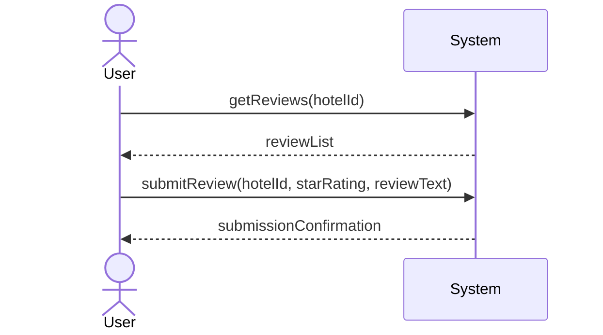
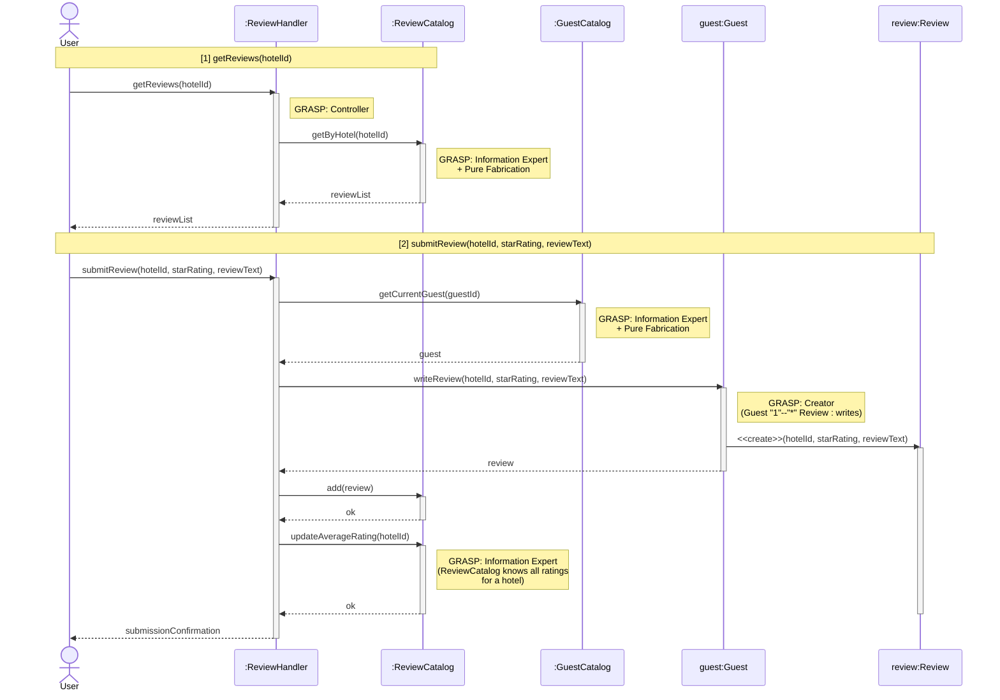
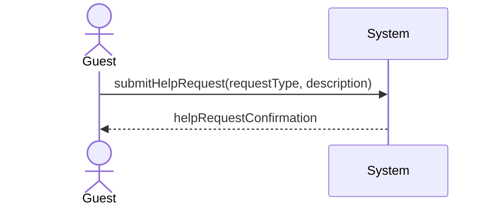
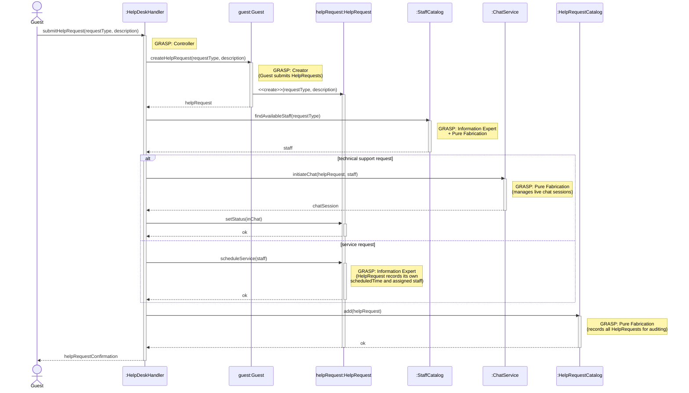
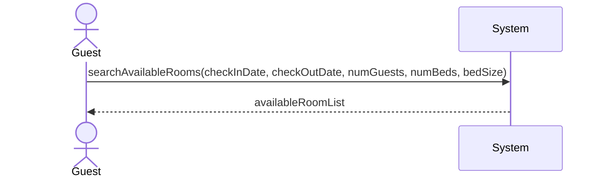
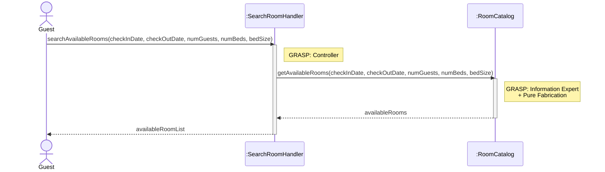

# James Bagwell — Use Cases

## Leaving and / or Viewing a Review

| Use Case Name | Leaving and / or Viewing a Review |
|---------------|-----------------|
| Actor         | Previous Hotel Guest / Potential Guest |
| Author        | James Bagwell |
| Preconditions | 1. The user is on the review / details page.  2. To leave a review, the user must be logged into their account and theyu must have reserved AND checked-in to a room previously. |
| Postconditions | 1. The new review is saved to the database and displayed on the hotel page.   2. The hotel's average star rating is updated. |
| Main Success Scenario | 1. The User selects the "Reviews" tab on the hotel detail page.  2. The System displays a list of existing reviews and the current average rating.  3. The User clicks the button to leave a review.  4. The User leaves a star rating ( 1–5 ) and writes their review in the text field.   5. The User clicks the submits the review.   6. The System validates the review and indicates that the review was successfully left. |
| Extensions | [3]a. **User is not logged in** &nbsp;&nbsp;&nbsp;&nbsp; [3]a1. The System prompts the user to log in or sign up. &nbsp;&nbsp;&nbsp;&nbsp; [3]a2. Upon successful login, the system redirects the user back to the review form. [5]b. **Incomplete Review Form** &nbsp;&nbsp;&nbsp;&nbsp; [5]b1. The System highlights the missing fields (for example, if the star rating is left blank). &nbsp;&nbsp;&nbsp;&nbsp; [5]b2. The System prevents submission until all required fields are filled.|
| Special Reqs | ● The system must filter for profanity or restricted content before publishing. ● The user must be able to filter how many reviews they want to see ( For example, show 10 reviews ).  ● Users should be able to sort reviews by "Most Recent" or "Highest Rated."|

### Operation Contract

| Operation | `submitReview(hotelId: String, starRating: Integer, reviewText: String)` |
|---|---|
| Cross References | Use Case: Leaving and / or Viewing a Review |
| Preconditions | 1. User is logged in 2. User has a prior completed stay (checked in) at the hotel |
| Postconditions | 1. A new Review was created and associated with the hotel 2. Review was associated with the Guest account 3. Hotel.averageStarRating was recalculated and updated 4. Review was stored in the database and made visible on the hotel page |

### Design Sequence Diagram

| Pattern | Applied To | Rationale |
|---|---|---|
| **Controller** | `:ReviewHandler` | Use-case controller; handles both system operations for this use case session |
| **Information Expert + Pure Fabrication** | `:ReviewCatalog` | Holds all Review data; retrieves reviews by hotel and recalculates average rating |
| **Information Expert + Pure Fabrication** | `:GuestCatalog` | Retrieves the current guest from the active session |
| **Creator** | `guest:Guest` | Domain model shows `Guest "1"--"*" Review : writes`; Guest aggregates Reviews |

---

## HelpDesk

| Use Case Name | HelpDesk |
|---------------|----------|
| Actor         | Guest    |
| Author        | James Bagwell |
| Preconditions | 1. There is a staff member on standby to help over the computer / phone  2. There is a staff member ready to complete the scheduled service at the time it was scheduled |
| Postconditions | 1. Guest received help they needed  2. Guest schedules a service and reason for scheduling |
| Main Success Scenario | 1. User logs into the hotel website and navigates to the HelpDesk menu  2. If they need technical help (such as Wi-Fi not working, how to use the phone, etc.), they select that option. If they need a technician or a house-keeper (for example, if the air-conditioning isn't working or the toilet is clogged), they choose the other option.  3. If the user selects the first option, they are able to chat on the computer with someone who can help. If they choose the second option, they can request a technician or house-keeper to fix the situation, and the system will assign and schedule someone to come help as soon as possible.  4. The situation is fixed. |
| Extensions | 2a. **No Virtual Technician Available** &nbsp;&nbsp;&nbsp;&nbsp;2a1. No staff member is available for technical support. &nbsp;&nbsp;&nbsp;&nbsp;2a2. The system displays a message notifying the yuser of a delay and it and allows the guest to submit a request to get a call back later. 3b. **No Technician or House-keeper Available** &nbsp;&nbsp;&nbsp;&nbsp;3b1. No technician or house-keeper is available at the requested time. &nbsp;&nbsp;&nbsp;&nbsp;3b2. The system prompts the guest to select an alternate time for the service request. |
| Special Reqs | ● The HelpDesk system must always be accessible through the hotel website. ● Live chat must occur quickly. ● All help requests and service schedules must be logged and associated with the guest's room number and account / phone number. |

### Operation Contract

| Operation | `submitHelpRequest(requestType: String, description: String)` |
|---|---|
| Cross References | Use Case: HelpDesk |
| Preconditions | 1. Guest is logged in 2. A staff member is on standby 3. Hotel system is accessible |
| Postconditions | 1. A new HelpRequest was created and associated with the guest's account and room number 2. If technical help: a live chat session was initiated between the guest and an available staff member 3. If service request: a ServiceRequest was created, a staff member was assigned, and a service time was scheduled 4. Help request was logged with the guest's room number and account |

### Design Sequence Diagram

| Pattern | Applied To | Rationale |
|---|---|---|
| **Controller** | `:HelpDeskHandler` | Use-case controller; receives the `submitHelpRequest` system operation |
| **Creator** | `guest:Guest` | Domain model shows `Guest "1"--"*" HelpRequest : submits`; Guest aggregates HelpRequests |
| **Information Expert + Pure Fabrication** | `:StaffCatalog` | Holds all Staff data and knows who is currently available; no direct domain class |
| **Information Expert** | `helpRequest:HelpRequest` | Manages its own `status` and `scheduledTime` attributes |
| **Pure Fabrication** | `:ChatService` | Handles live chat session orchestration; no domain counterpart |
| **Pure Fabrication** | `:HelpRequestCatalog` | Records and persists all HelpRequests for auditing and lookup |

---

## Search Available Room

| Use Case Name | Search Available Room |
|---------------|-----------------|
| Actor         | Hotel Guest    |
| Author        | James Bagwell  |
| Preconditions | 1. The hotel system is functional and online  2. Room and reservation data exists in the database |
| Postconditions | 1. Available rooms are displayed to the user  2. Data is not modified |
| Main Success Scenario | 1. The user selects the search option  2. The user enters their search criteria such as check in / out date, number of guests, number of beds, bed size, etc.  3. System validates input  4. System searches for rooms that match user criteria, if available  5. System displays list of available rooms that match user criteria, if available |
| Extensions | |
| Special Reqs | |

### Operation Contract

| Operation | `searchAvailableRooms(checkInDate: Date, checkOutDate: Date, numGuests: Integer, numBeds: Integer, bedSize: String)` |
|---|---|
| Cross References | Use Case: Search Available Room |
| Preconditions | 1. Hotel system is functional and online 2. Room and reservation data exist in the database |
| Postconditions | 1. No domain model state was changed (read-only operation) 2. A list of rooms matching the search criteria was retrieved and displayed |

### Design Sequence Diagram

| Pattern | Applied To | Rationale |
|---|---|---|
| **Controller** | `:SearchRoomHandler` | Use-case controller; receives the `searchAvailableRooms` system operation |
| **Information Expert + Pure Fabrication** | `:RoomCatalog` | Holds all Room and Reservation data; filters rooms by availability and all search criteria |

