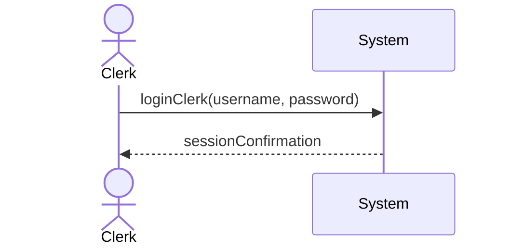
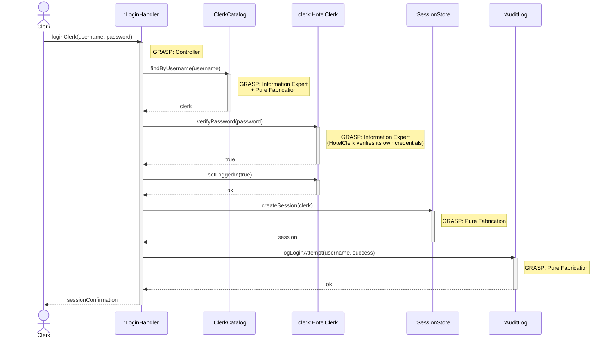
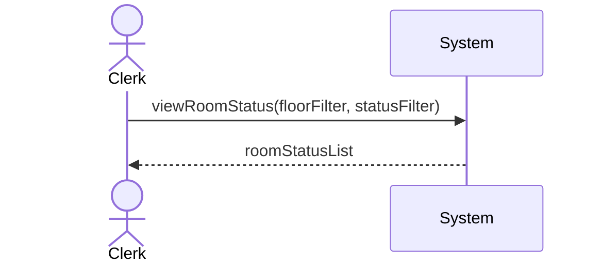
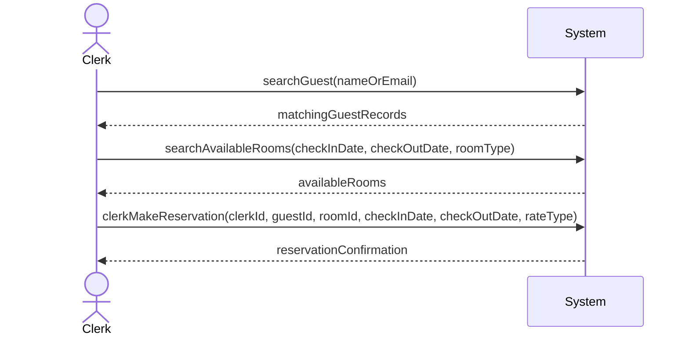
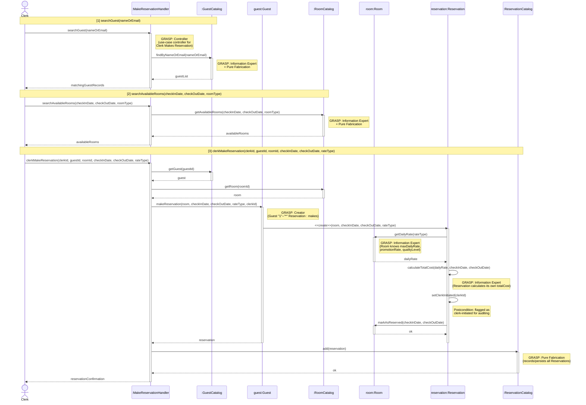

# Jonathan Deiss — Use Cases

## Hotel Clerk Login

| Use Case Name | Hotel Clerk Login |
|---------------|-----------------|
| Actor         | Hotel Clerk    |
| Author        | Jonathan Deiss |
| Preconditions | 1. System is operational 2. User has a valid hotel clerk account with a username and password |
| Postconditions | 1. Hotel clerk is successfully logged in 2. Clerk is redirected to the clerk dashboard |
| Main Success Scenario | 1. The clerk navigates to the login page 2. The clerk enters their username 3. The clerk enters their password 4. The clerk submits the credentials 5. The system validates the input format 6. The system verifies the credentials against the database 7. The system creates a clerk session 8. The system redirects the clerk to the clerk dashboard |
| Extensions | [6]a. **Invalid credentials** &nbsp;&nbsp;&nbsp;&nbsp;[6]a1 The system displays "Invalid username or password" &nbsp;&nbsp;&nbsp;&nbsp;[6]a2 Return to step 2 [6]b. **Account not found** &nbsp;&nbsp;&nbsp;&nbsp;[6]b1 The system displays "Invalid username or password" (generic, for security) &nbsp;&nbsp;&nbsp;&nbsp;[6]b2 Use case ends |
| Special Reqs | ● Passwords must be stored hashed in the database ● All login attempts (successful and failed) must be logged |

### Operation Contract

| Operation | `loginClerk(username: String, password: String)` |
|---|---|
| Cross References | Use Case: Hotel Clerk Login |
| Preconditions | 1. System is operational 2. A hotel clerk account with the given username exists in the system |
| Postconditions | 1. A clerk session was created 2. HotelClerk.isLoggedIn was set to true 3. The login attempt was logged |

### Design Sequence Diagram

| Pattern | Applied To | Rationale |
|---|---|---|
| **Controller** | `:LoginHandler` | Use-case controller; receives the `loginClerk` system operation |
| **Information Expert + Pure Fabrication** | `:ClerkCatalog` | Holds all HotelClerk accounts; finds by username and verifies credentials |
| **Information Expert** | `clerk:HotelClerk` | Manages its own `isLoggedIn` flag and verifies its own password |
| **Pure Fabrication** | `:SessionStore` | Creates and stores the authenticated clerk session |
| **Pure Fabrication** | `:AuditLog` | Logs all login attempts for auditing |

---

## View Room Status

| Use Case Name | View Room Status |
|---------------|-----------------|
| Actor         | Hotel Clerk    |
| Author        | Jonathan Deiss |
| Preconditions | 1. Hotel clerk is logged into the system 2. Room data exists in the database |
| Postconditions | 1. The clerk has viewed the current status of all rooms 2. No data is modified |
| Main Success Scenario | 1. The clerk navigates to the room status dashboard 2. The system retrieves all rooms from the database 3. The system displays each room with its room number, floor/theme, and current status (available, reserved, or occupied) 4. The clerk optionally filters rooms by floor or status 5. The system updates the displayed list based on the applied filter 6. The system displays a summary count of rooms by status |
| Extensions | [2]a. **No rooms in system** &nbsp;&nbsp;&nbsp;&nbsp;[2]a1 The system displays a message indicating no rooms have been added yet &nbsp;&nbsp;&nbsp;&nbsp;[2]a2 Use case ends [5]a. **No rooms match filter** &nbsp;&nbsp;&nbsp;&nbsp;[5]a1 The system displays a message indicating no rooms match the selected criteria |
| Special Reqs | ● Room statuses must reflect real-time reservation and check-in data ● The dashboard must display a summary count of rooms by status |

### Operation Contract

| Operation | `viewRoomStatus(floorFilter: String, statusFilter: String)` |
|---|---|
| Cross References | Use Case: View Room Status |
| Preconditions | 1. Hotel clerk is logged in 2. Room data exists in the database |
| Postconditions | 1. No domain model state was changed (read-only operation) 2. A list of rooms with their current status was retrieved and displayed, filtered by the given criteria if provided |

---

## Clerk Makes Reservation for Guest

| Use Case Name | Clerk Makes Reservation for Guest |
|---------------|-----------------|
| Actor         | Hotel Clerk    |
| Author        | Jonathan Deiss |
| Preconditions | 1. Hotel clerk is logged into the system 2. Room and reservation data exists in the database 3. The guest has an existing account or the clerk can look one up |
| Postconditions | 1. A new reservation is created in the system and associated with the guest 2. The selected room is marked as reserved for the specified dates 3. Guest information is recorded and linked to the reservation |
| Main Success Scenario | 1. The clerk selects "Make Reservation" from the clerk dashboard 2. The clerk searches for the guest by name or email 3. The system displays matching guest records 4. The clerk selects the guest 5. The clerk enters the check-in date, check-out date, and desired room type 6. The system displays available rooms matching the criteria 7. The clerk selects a room 8. The clerk selects a rate type (standard, promotion, group, or non-refundable) 9. The system calculates the total cost based on the room's quality level and rate type 10. The system creates the reservation and associates it with the guest 11. The system displays the reservation confirmation details |
| Extensions | [3]a. **Guest not found** &nbsp;&nbsp;&nbsp;&nbsp;[3]a1 The clerk creates a new guest record &nbsp;&nbsp;&nbsp;&nbsp;[3]a2 Continue from step 5 [6]a. **No rooms available for requested criteria** &nbsp;&nbsp;&nbsp;&nbsp;[6]a1 The system notifies the clerk that no rooms match the criteria &nbsp;&nbsp;&nbsp;&nbsp;[6]a2 The clerk adjusts dates or room type and returns to step 5 [8]a. **Corporate guest** &nbsp;&nbsp;&nbsp;&nbsp;[8]a1 The clerk selects the guest's corporation &nbsp;&nbsp;&nbsp;&nbsp;[8]a2 The system marks the reservation for deferred corporate billing &nbsp;&nbsp;&nbsp;&nbsp;[8]a3 Continue from step 9 |
| Special Reqs | ● Reservations created by a clerk must be flagged as clerk-initiated for auditing purposes ● Corporate guest reservations must be marked for deferred billing and not charged at time of booking |

### Operation Contract

| Operation | `clerkMakeReservation(clerkId: String, guestId: String, roomId: String, checkInDate: Date, checkOutDate: Date, rateType: String)` |
|---|---|
| Cross References | Use Case: Clerk Makes Reservation for Guest |
| Preconditions | 1. Hotel clerk is logged in 2. The specified guest account exists in the system 3. The selected room is available for the requested dates |
| Postconditions | 1. A new Reservation was created and associated with the guest 2. Selected Room was marked as reserved for the specified dates 3. Reservation.totalCost was calculated based on quality level and rate type 4. Reservation was flagged as clerk-initiated and linked to the creating clerk's account |

### Design Sequence Diagram

| Pattern | Applied To | Rationale |
|---|---|---|
| **Controller** | `:MakeReservationHandler` | Use-case controller; handles all three system operations for this use case session |
| **Information Expert + Pure Fabrication** | `:GuestCatalog` | Holds all Guest data; no direct domain counterpart |
| **Information Expert + Pure Fabrication** | `:RoomCatalog` | Holds all Room data; knows which rooms are available |
| **Creator** | `guest:Guest` | Domain model shows `Guest "1"--"*" Reservation : makes`; Guest aggregates Reservations |
| **Information Expert** | `room:Room` | Has `maxDailyRate`, `promotionRate`, `qualityLevel` — expert on rate data |
| **Information Expert** | `reservation:Reservation` | Has `rateType`, `checkInDate`, `checkOutDate` — calculates its own `totalCost` |
| **Pure Fabrication** | `:ReservationCatalog` | Records and persists all Reservations without burdening domain objects |

