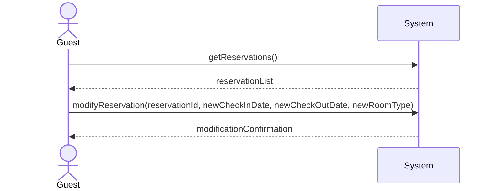
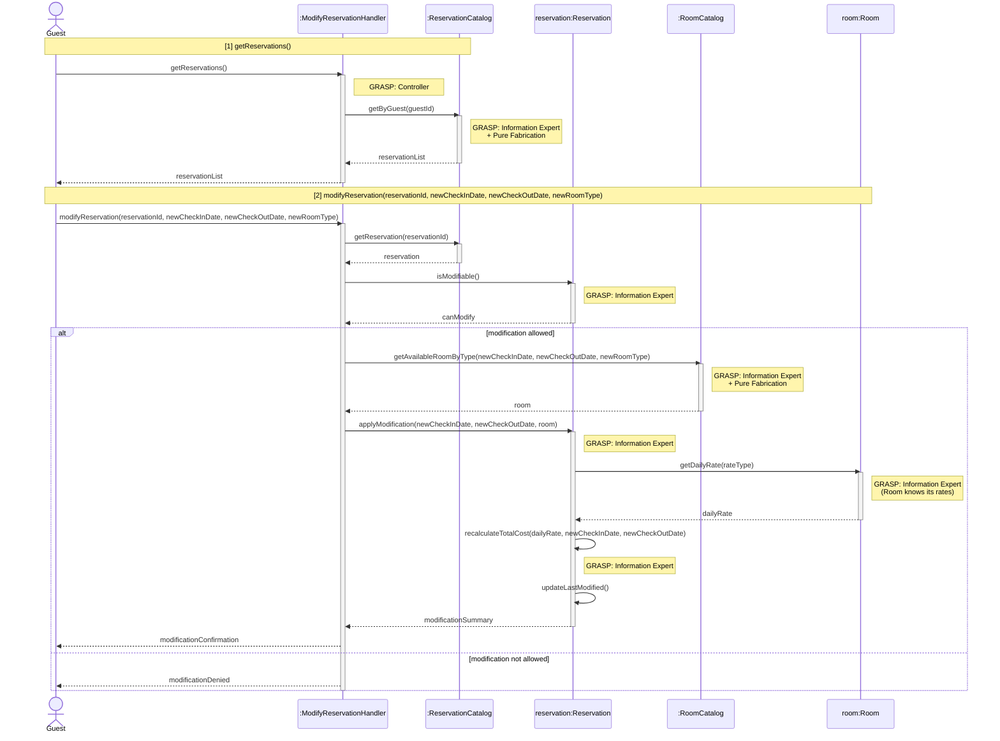
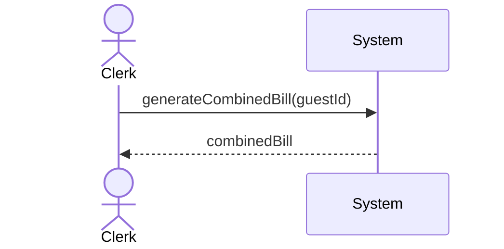
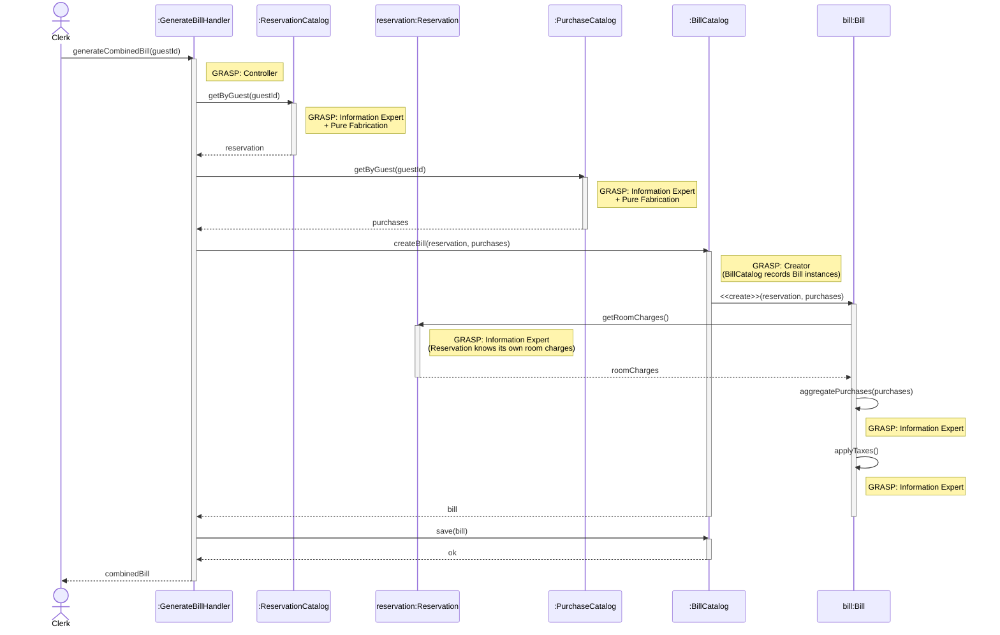
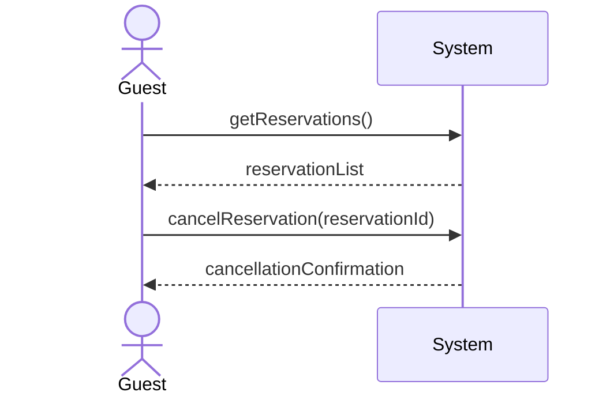
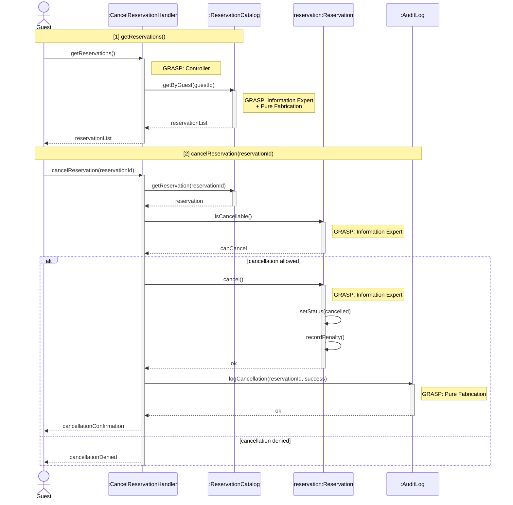

# Zain Altaf — Use Cases

## Modify Reservation

| Use Case Name| Modify Reservation |
|---------------|--------------------|
| Actor         | Hotel Guest    |
| Author        | Zain Altaf     |
| Preconditions | 1. The hotel guest is logged into the system.  2.The guest has an existing reservation.   3. The reservation has not yet started.|
| Postconditions | 1. The reservation is updated only if modification is permitted.   2. If modification is not permitted, the reservation remains unchanged.   3. Any change in price is recalculated and recorded. |
| Main Success Scenario | 1. The guest selects the option to view their reservations.  2. The system displays the guest's reservations. 3. The guest selects a reservation to modify. 4. The system displays the current reservation details   5.The guest enters the requested changes (e.g., dates or room type).  6. The system checks whether the modification request is more than X hours before the check-in time.   7. The system checks room availability for the requested changes.   8. The system recalculates the reservation cost, if applicable.   9. The system displays the updated reservation details.   10. The guest confirms the modification.   11. The system updates the reservation.   12. The system displays a modification confirmation message.|
| Extensions | [6]a. **Modification not allowed (within X hours of check-in)** &nbsp;&nbsp;&nbsp;&nbsp;[6]a1 The system determines that the modification request is within X hours of the check-in time. &nbsp;&nbsp;&nbsp;&nbsp;[6]a2 The system displays a message explaining that modifications are not permitted according to the policy.|
| Special Reqs | ● The system must enforce the X-hour modification policy exactly. ● Availability checks must be consistent with current reservations.  ● Price recalculation must follow hotel pricing rules.|

### Operation Contract

| Operation | `modifyReservation(reservationId: String, newCheckInDate: Date, newCheckOutDate: Date, newRoomType: String)` |
|---|---|
| Cross References | Use Case: Modify Reservation |
| Preconditions | 1. Guest is logged in 2. Reservation exists and is associated with the guest 3. The modification is requested more than X hours before check-in 4. The reservation has not yet started |
| Postconditions | 1. Reservation.checkInDate and/or Reservation.checkOutDate were updated (if changed) 2. Reservation was associated with the new room type (if changed) 3. Reservation.totalCost was recalculated and updated 4. Reservation.lastModified timestamp was updated |

### Design Sequence Diagram

| Pattern | Applied To | Rationale |
|---|---|---|
| **Controller** | `:ModifyReservationHandler` | Use-case controller; handles both system operations for this use case session |
| **Information Expert + Pure Fabrication** | `:ReservationCatalog` | Holds all Reservation data; retrieves reservations by guest and by ID |
| **Information Expert** | `reservation:Reservation` | Has `checkInDate` — enforces the X-hour modification policy; applies its own date/room changes and recalculates `totalCost` |
| **Information Expert** | `room:Room` | Has `maxDailyRate`, `promotionRate` — provides rate data for cost recalculation |
| **Information Expert + Pure Fabrication** | `:RoomCatalog` | Checks availability for the requested room type and date range |

---

## Generate Combined Bill

| Use Case Name | Generate Combined Bill |
|---------------|------------------------|
| Actor         | Hotel Clerk            |
| Author        | Zain Altaf             |
| Preconditions | 1. The hotel clerk is logged into the system.  2. The guest has completed check-out.  3. The guest has at least one reservation recorded in the system. |
| Postconditions | 1. A combined bill is generated for the guest.  2. The bill includes all room charges and store purchases.  3. The finalized bill is stored in the system. |
| Main Success Scenario | 1. The clerk selects a checked-out guest.  2. The system retrieves the guest's reservation details.  3. The system retrieves all store purchases made during the guest's stay.  4. The system calculates the total room charges.  5. The system calculates the total store charges.  6. The system applies any taxes or additional fees.  7. The system combines all charges into a single bill.  8. The system displays the bill summary.  9. The clerk reviews and confirms the bill.  10. The system finalizes and stores the bill. |
| Extensions | [3]a. **No store purchases recorded** &nbsp;&nbsp;&nbsp;&nbsp;[3]a1 The system generates a bill including only room charges. [2]b. **Corporate guest billing** &nbsp;&nbsp;&nbsp;&nbsp;[2]b1 The system marks the bill as corporate billing. &nbsp;&nbsp;&nbsp;&nbsp;[2]b2 The payment status is set to pending. |
| Special Reqs | ● Bill calculations must be accurate and consistent with reservation and purchase records. ● Tax calculations must follow applicable hotel policies. ● The generated bill must be stored for auditing and reporting purposes. |

### Operation Contract

| Operation | `generateCombinedBill(guestId: String)` |
|---|---|
| Cross References | Use Case: Generate Combined Bill |
| Preconditions | 1. Hotel clerk is logged in 2. Guest has completed check-out 3. At least one reservation is recorded for the guest |
| Postconditions | 1. A combined Bill was created and associated with the guest 2. Bill included all room charges from the guest's stay 3. Bill included all store purchase charges from the guest's stay 4. Applicable taxes and fees were applied to the total 5. Finalized bill was stored in the system for auditing |

### Design Sequence Diagram

| Pattern | Applied To | Rationale |
|---|---|---|
| **Controller** | `:GenerateBillHandler` | Use-case controller; receives the `generateCombinedBill` system operation |
| **Information Expert + Pure Fabrication** | `:ReservationCatalog` | Holds all Reservation data; retrieves the guest's reservation |
| **Information Expert + Pure Fabrication** | `:PurchaseCatalog` | Holds all store purchase records for a guest's stay |
| **Information Expert** | `reservation:Reservation` | Knows its own room charges (rate, dates, totalCost) |
| **Creator + Pure Fabrication** | `:BillCatalog` | Records Bill instances → creates Bill; stores finalized bill |
| **Information Expert** | `bill:Bill` | Aggregates all charges and applies taxes to its own total |

---

## Cancel Reservation

| Use Case Name| Cancel Reservation |
|---------------|--------------------|
| Actor         | Hotel Guest    |
| Author        | Zain Altaf     |
| Preconditions | 1. The hotel guest is logged into the system.  2. The guest has an existing reservation.|
| Postconditions | 1. The reservation is canceled only if cancellation is permitted.   2. If cancellation is permitted, any applicable cancellation penalty is recorded.   3.If cancellation is not permitted, the reservation remains unchanged.|
| Main Success Scenario | 1. The guest selects the option to view reservations.  2. The system displays the guest's reservations. 3. The guest selects a reservation to cancel.  4. The system checks the time remaining until the reservation's check-in date.   5. The system determines that the cancellation request is more than the required time.   6. The system displays the applicable cancellation policy and any penalty(if required).   7. The guest confirms the cancellation.   8.The system cancels the reservation.   9. The system displays a cancellation confirmation message.|
| Extensions | [4]a. **Cancellation not allowed (within a specific time frame)** &nbsp;&nbsp;&nbsp;&nbsp;[4]a1 The system determines that the cancellation request is within x hours of the check-in time. &nbsp;&nbsp;&nbsp;&nbsp;[4]a2 The system displays a message explaining that cancellation is not permitted according to the policy. &nbsp;&nbsp;&nbsp;&nbsp;[4]a3 The reservation remains unchanged.|
| Special Reqs | ● The system must enforce the X-hour cancellation policy exactly. ● Time comparisons must use the hotel's local time zone.   ● All cancellation attempts must be logged for auditing and billing purposes.|

### Operation Contract

| Operation | `cancelReservation(reservationId: String)` |
|---|---|
| Cross References | Use Case: Cancel Reservation |
| Preconditions | 1. Guest is logged in 2. Reservation exists and is associated with the guest 3. The cancellation request is more than X hours before the check-in time |
| Postconditions | 1. Reservation.status was set to 'cancelled' 2. Any applicable cancellation penalty was recorded and associated with the reservation 3. The cancellation attempt was logged for auditing |

### Design Sequence Diagram

| Pattern | Applied To | Rationale |
|---|---|---|
| **Controller** | `:CancelReservationHandler` | Use-case controller; handles both system operations for this use case session |
| **Information Expert + Pure Fabrication** | `:ReservationCatalog` | Holds all Reservation data; retrieves reservations by guest and by ID |
| **Information Expert** | `reservation:Reservation` | Has `checkInDate` — enforces the X-hour cancellation policy; sets its own status and records the penalty |
| **Pure Fabrication** | `:AuditLog` | Logs all cancellation attempts for auditing |

