# Hotel System — Iteration 2 Documentation

---

# Use Case Diagram

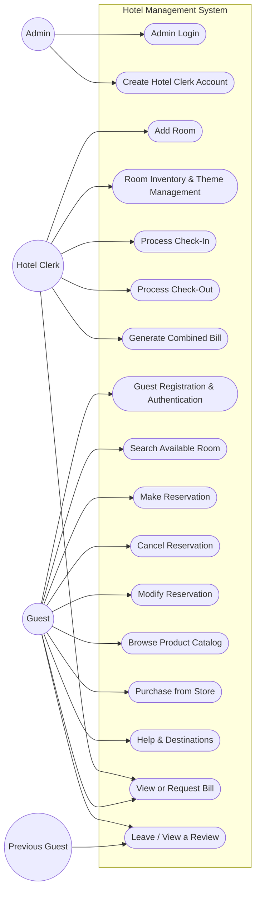
```mermaid
graph LR
    Admin((Admin))
    Clerk((Hotel Clerk))
    Guest((Guest))
    PrevGuest((Previous Guest))

    subgraph Hotel Management System
        AdminLogin([Admin Login])
        CreateClerkAccount([Create Hotel Clerk Account])

        AddRoom([Add Room])
        RoomThemeManagement([Room Inventory & Theme Management])
        ProcessCheckIn([Process Check-In])
        ProcessCheckOut([Process Check-Out])
        GenerateCombinedBill([Generate Combined Bill])

        GuestAuth([Guest Registration & Authentication])
        SearchRoom([Search Available Room])
        MakeReservation([Make Reservation])
        CancelReservation([Cancel Reservation])
        ModifyReservation([Modify Reservation])
        BrowseCatalog([Browse Product Catalog])
        PurchaseFromStore([Purchase from Store])
        HelpDestinations([Help & Destinations])

        ViewBill([View or Request Bill])
        Review([Leave / View a Review])
    end

    Admin --> AdminLogin
    Admin --> CreateClerkAccount

    Clerk --> AddRoom
    Clerk --> RoomThemeManagement
    Clerk --> ProcessCheckIn
    Clerk --> ProcessCheckOut
    Clerk --> GenerateCombinedBill
    Clerk --> ViewBill

    Guest --> GuestAuth
    Guest --> SearchRoom
    Guest --> MakeReservation
    Guest --> CancelReservation
    Guest --> ModifyReservation
    Guest --> BrowseCatalog
    Guest --> PurchaseFromStore
    Guest --> HelpDestinations
    Guest --> ViewBill
    Guest --> Review

    PrevGuest --> Review
```

---

# Use Cases

## UC-01: Admin Login

| Use Case Name | Admin Login |
|---|---|
| Actor | Admin |
| Author | Jace Yarborough |
| Preconditions | 1. System operational 2. User has a valid admin account with username and password |
| Postconditions | 1. Admin is successfully logged in 2. Admin is redirected to admin dashboard/panel |
| Main Success Scenario | 1. Admin navigates to login page 2. Admin enters username 3. Admin enters password 4. Admin submits credentials 5. System validates input 6. System verifies credentials 7. System displays success message 8. Admin is brought to admin dashboard |
| Extensions | [4]a. **Invalid username format** &nbsp;&nbsp;&nbsp;&nbsp;[4]a1 System detects username doesn't meet format requirements &nbsp;&nbsp;&nbsp;&nbsp;[4]a2 System displays error message "Invalid username or password" &nbsp;&nbsp;&nbsp;&nbsp;[4]a3 System prompts user to re-enter credentials [6]a. **Invalid credentials** &nbsp;&nbsp;&nbsp;&nbsp;[6]a1 System detects username or password is incorrect &nbsp;&nbsp;&nbsp;&nbsp;[6]a2 System increments failed login attempt counter &nbsp;&nbsp;&nbsp;&nbsp;[6]a3 System displays error message "Invalid username or password" &nbsp;&nbsp;&nbsp;&nbsp;[6]a4 Return to step 2 [6]b. **Account locked** &nbsp;&nbsp;&nbsp;&nbsp;[6]b1 System detects account has been locked due to multiple failed attempts &nbsp;&nbsp;&nbsp;&nbsp;[6]b2 System displays error message "Account locked. Contact system administrator" &nbsp;&nbsp;&nbsp;&nbsp;[6]b3 Use case ends [6]c. **Password expired** &nbsp;&nbsp;&nbsp;&nbsp;[6]c1 System detects password has expired &nbsp;&nbsp;&nbsp;&nbsp;[6]c2 System prompts admin to reset password &nbsp;&nbsp;&nbsp;&nbsp;[6]c3 Redirect to password reset use case |
| Special Reqs | ● Password must be hashed in database ● Log all login attempts |

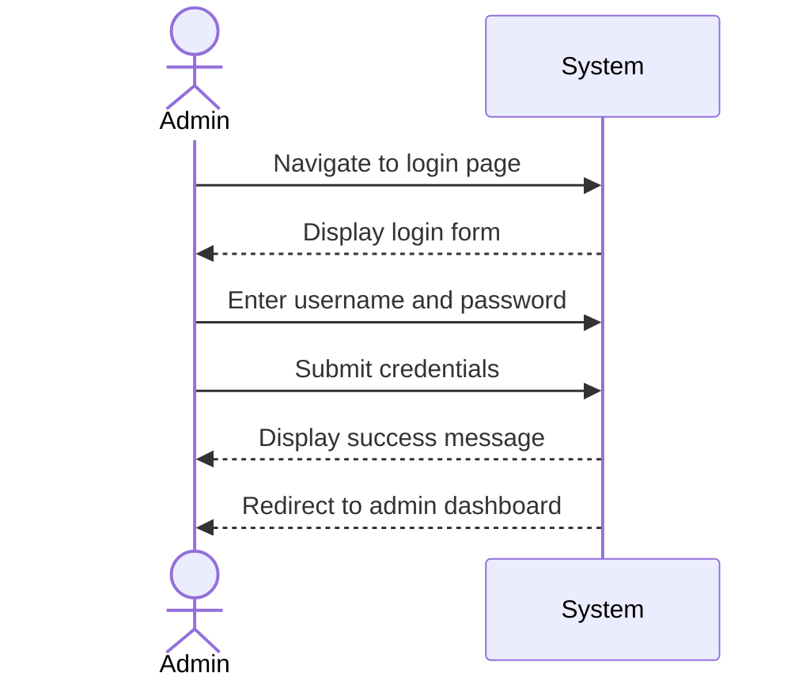
```mermaid
sequenceDiagram
    actor Admin
    participant System

    Admin->>System: Navigate to login page
    System-->>Admin: Display login form
    Admin->>System: Enter username and password
    Admin->>System: Submit credentials
    System-->>Admin: Display success message
    System-->>Admin: Redirect to admin dashboard
```

### Operation Contract

| Operation | `loginAdmin(username: String, password: String)` |
|---|---|
| Cross References | Use Case: Admin Login |
| Preconditions | 1. System is operational 2. An admin account with the given username exists in the system |
| Postconditions | 1. An admin session was created 2. Admin.isLoggedIn was set to true 3. The login attempt was logged |

---

## UC-02: Create Hotel Clerk Account

| Use Case Name | Create Hotel Clerk Account |
|---------------|----------------------------|
| Actor         | Admin                      |
| Author        | Jace Yarborough            |
| Preconditions | 1. Hotel system online and operational  2. User is logged in as an Admin|
|Postconditions | 1. A new hotel clerk account is created   2. Clerk account has given username and default password (or custom password)|
|Main Success Scenario| 1. Admin selects option to create hotel clerk account  2. System prompts admin to enter desired username and shows prefilled password for account. 3. Admin enters username and optional different password 4. System validates input   5. System creates clerk account  6. System displays success message for created account |
|Extensions| [4]a. **Username already in use** &nbsp;&nbsp;&nbsp;&nbsp;[4]a1 System detects username already in use(Ex: John_Smith) &nbsp;&nbsp;&nbsp;&nbsp;[4]a2 System displays error message and potential username replacement (EX: John_Smith1) [5]a. **Failure to create account** &nbsp;&nbsp;&nbsp;&nbsp;[5]a1 Display error message of account creation failure &nbsp;&nbsp;&nbsp;&nbsp;[5]a2 Reprompt user to try creating account again.|
|Special Reqs| ● Create account in timely manner ● Keep log of created accounts  ● Keep log of which admin created account|

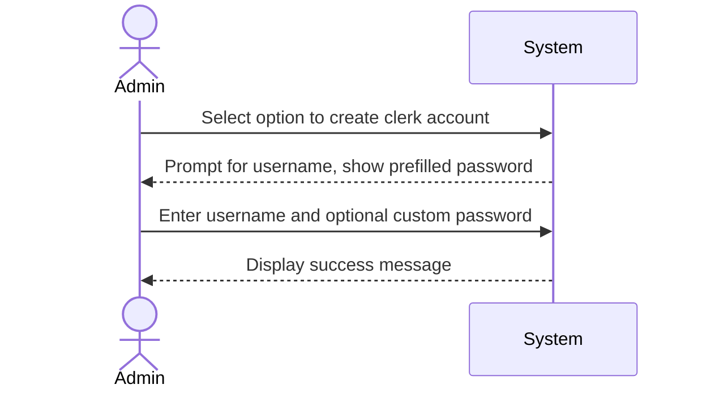
```mermaid
sequenceDiagram
    actor Admin
    participant System

    Admin->>System: Select option to create clerk account
    System-->>Admin: Prompt for username, show prefilled password
    Admin->>System: Enter username and optional custom password
    System-->>Admin: Display success message
```

### Operation Contract

| Operation | `createClerkAccount(username: String, password: String)` |
|---|---|
| Cross References | Use Case: Create Hotel Clerk Account |
| Preconditions | 1. Admin is logged in 2. The given username does not already exist in the system |
| Postconditions | 1. A new HotelClerk account was created 2. HotelClerk.username was set 3. HotelClerk.password was encrypted and stored 4. Account creation was logged with the creating admin's identity |

---

## UC-03: Guest Registration & Authentication

| Use Case Name | Guest Registration & Authentication |
|---------------|-----------------|
| Actor         | Guest           |
| Author        | Erick Martinez  |
| Preconditions | 1. The guest has access to the hotel system portal  2. The guest is not currently logged into an existing account |
| Postconditions | 1. A new guest profile is created in the database  2. Payment information is securely tokenized/stored  3. The guest is automatically logged in and redirected to the dashboard  4. A "Welcome [Name]" message is displayed |
| Main Success Scenario | 1. The guest selects the "Register" or "Create Account" option  2. The guest enters personal details: Full Name, Address, Email, and Password  3. The guest enters payment details: Credit Card Number, Expiration Date, and CVV  4. The system validates the format of all fields (e.g., email syntax, credit card number)  5. The system checks if the email address is already registered  6. The system encrypts the password and stores the guest profile  7. The system authenticates the new session  8. The system displays a "Welcome [Guest Name]" message on the homepage/dashboard |
| Extensions | [4]a. **Invalid Data Format** &nbsp;&nbsp;&nbsp;&nbsp;[4]a1 The system highlights the specific field (e.g., "Invalid Credit Card Format") &nbsp;&nbsp;&nbsp;&nbsp;[4]a2 The guest corrects the data &nbsp;&nbsp;&nbsp;&nbsp;[4]a3 Continue from step 4 [5]a. **Email Already Exists** &nbsp;&nbsp;&nbsp;&nbsp;[5]a1 The system notifies the guest that an account already exists with that email &nbsp;&nbsp;&nbsp;&nbsp;[5]a2 The system offers a "Forgot Password" or "Login" link &nbsp;&nbsp;&nbsp;&nbsp;[5]a3 Use case ends [7]a. **Authentication Failure** &nbsp;&nbsp;&nbsp;&nbsp;[7]a1 The system creates the account but fails the initial login &nbsp;&nbsp;&nbsp;&nbsp;[7]a2 The system redirects the guest to the manual Login page |
| Special Reqs | ● PCI Compliance: Credit card data must be handled according to security standards (e.g., masking numbers in the UI) ● Data Integrity: The "Welcome" message must dynamically pull the FirstName attribute from the database ● Persistence: Guest information must remain accessible for future "Store" purchases without re-entry |

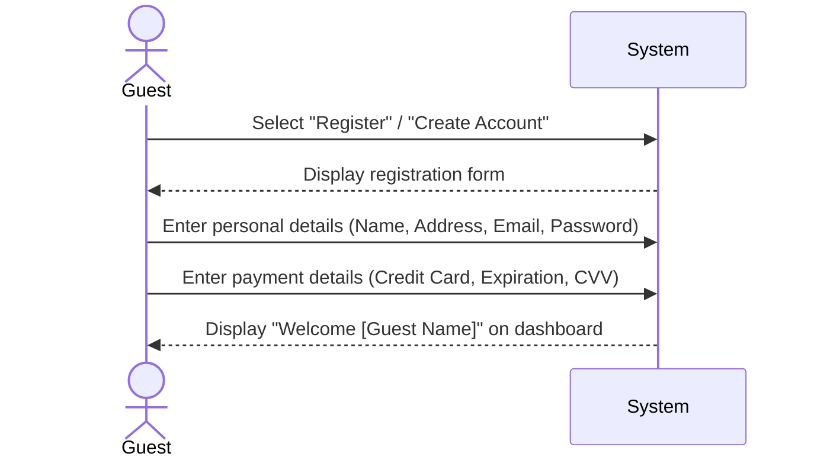
```mermaid
sequenceDiagram
    actor Guest
    participant System

    Guest->>System: Select "Register" / "Create Account"
    System-->>Guest: Display registration form
    Guest->>System: Enter personal details (Name, Address, Email, Password)
    Guest->>System: Enter payment details (Credit Card, Expiration, CVV)
    System-->>Guest: Display "Welcome [Guest Name]" on dashboard
```

### Operation Contract

| Operation | `registerGuest(fullName: String, address: String, email: String, password: String, paymentInfo: PaymentInfo)` |
|---|---|
| Cross References | Use Case: Guest Registration & Authentication |
| Preconditions | 1. Guest has access to the hotel system portal 2. Guest is not currently logged in 3. The given email address is not already registered |
| Postconditions | 1. A new Guest profile was created in the database 2. Guest.password was encrypted and stored 3. Payment information was securely tokenized and stored 4. A new authenticated session was created and associated with the guest |

---

## UC-04: Search Available Room

| Use Case Name | Search Available Room |
|---------------|-----------------|
| Actor         | Hotel Guest    |
| Author        | James Bagwell  |
| Preconditions | 1. The hotel system is functional and online  2. Room and reservation data exists in the database |
| Postconditions | 1. Available rooms are displayed to the user  2. Data is not modified |
| Main Success Scenario | 1. The user selects the search option  2. The user enters their search criteria such as check in / out date, number of guests, number of beds, bed size, etc.  3. System validates input  4. System searches for rooms that match user criteria, if available  5. System displays list of available rooms that match user criteria, if available |
| Extensions | |
| Special Reqs | |

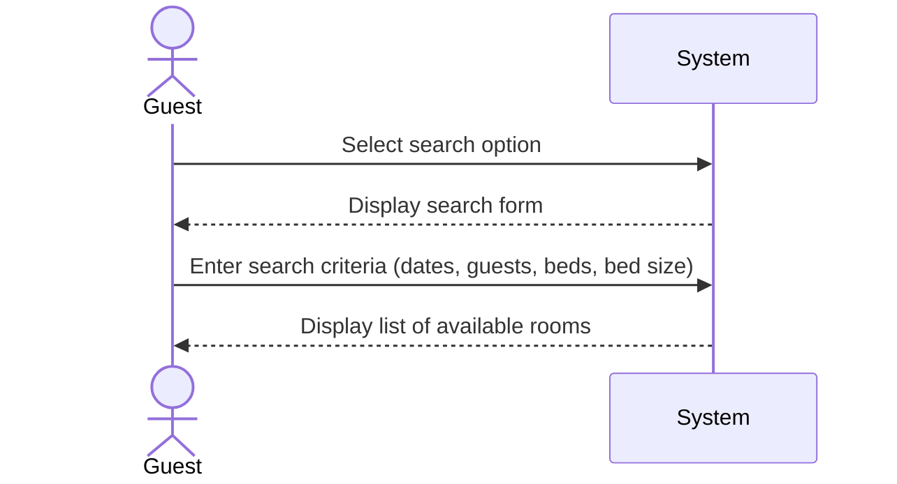
```mermaid
sequenceDiagram
    actor Guest
    participant System

    Guest->>System: Select search option
    System-->>Guest: Display search form
    Guest->>System: Enter search criteria (dates, guests, beds, bed size)
    System-->>Guest: Display list of available rooms
```

### Operation Contract

| Operation | `searchAvailableRooms(checkInDate: Date, checkOutDate: Date, numGuests: Integer, numBeds: Integer, bedSize: String)` |
|---|---|
| Cross References | Use Case: Search Available Room |
| Preconditions | 1. Hotel system is functional and online 2. Room and reservation data exist in the database |
| Postconditions | 1. No domain model state was changed (read-only operation) 2. A list of rooms matching the search criteria was retrieved and displayed |

---

## UC-05: Make Reservation

| Use Case Name | Make Reservation |
|---------------|-----------------|
| Actor         | Hotel Guest     |
| Author        | Erick Martinez  |
| Preconditions | 1. The hotel system is functional and online  2. The user is logged in to the system  3. Room and reservation data exists in the database  4. The user has searched for available rooms |
| Postconditions | 1. A new reservation is created in the system  2. The selected room is marked as reserved for the specified dates  3. Guest information is recorded (name, address, credit card number, expiration date)  4. Confirmation is displayed to the user |
| Main Success Scenario | 1. The user selects a room from the list of available rooms  2. The user enters the check-in and check-out dates  3. The user selects the rate type (standard, promotion, group, or non-refundable)  4. The user enters or confirms their personal information (name, address)  5. The user enters payment information (credit card number, expiration date)  6. The system validates all input data  7. The system verifies room availability for the selected dates  8. The system calculates the total cost based on quality level and rate type  9. The system creates the reservation and stores it in the database  10. The system displays reservation confirmation with details |
| Extensions | [3]a. **Corporate guest selected** &nbsp;&nbsp;&nbsp;&nbsp;[3]a1 The user selects their corporation from the list &nbsp;&nbsp;&nbsp;&nbsp;[3]a2 The system records the corporation for billing purposes &nbsp;&nbsp;&nbsp;&nbsp;[3]a3 Continue from step 4 [6]a. **Invalid input data** &nbsp;&nbsp;&nbsp;&nbsp;[6]a1 The system displays an error message indicating the invalid fields &nbsp;&nbsp;&nbsp;&nbsp;[6]a2 The user corrects the input &nbsp;&nbsp;&nbsp;&nbsp;[6]a3 Continue from step 6 [7]a. **Room is no longer available** &nbsp;&nbsp;&nbsp;&nbsp;[7]a1 The system notifies the user that the room has been booked &nbsp;&nbsp;&nbsp;&nbsp;[7]a2 The system redirects the user to search for available rooms &nbsp;&nbsp;&nbsp;&nbsp;[7]a3 Use case ends |
| Special Reqs | ● Credit card information must be securely stored ● Reservation must be atomic (all or nothing) |

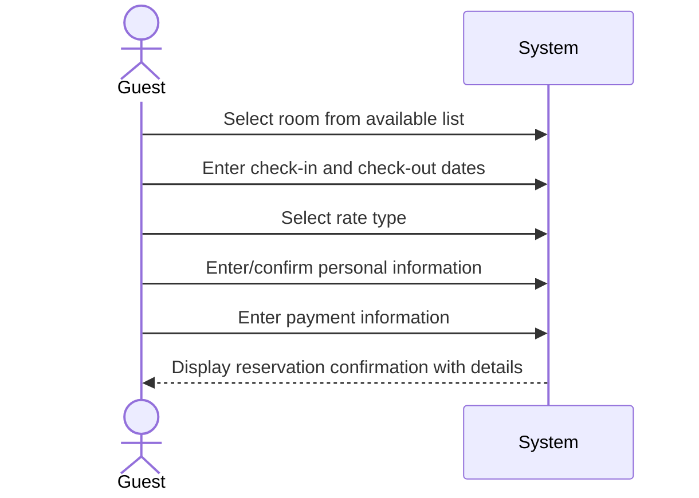
```mermaid
sequenceDiagram
    actor Guest
    participant System

    Guest->>System: Select room from available list
    Guest->>System: Enter check-in and check-out dates
    Guest->>System: Select rate type
    Guest->>System: Enter/confirm personal information
    Guest->>System: Enter payment information
    System-->>Guest: Display reservation confirmation with details
```

### Operation Contract

| Operation | `makeReservation(roomId: String, checkInDate: Date, checkOutDate: Date, rateType: String, guestInfo: GuestInfo, paymentInfo: PaymentInfo)` |
|---|---|
| Cross References | Use Case: Make Reservation |
| Preconditions | 1. Guest is logged in 2. The selected room is available for the requested dates 3. Room and reservation data exist in the database |
| Postconditions | 1. A new Reservation was created in the database 2. Selected Room was marked as reserved for the specified dates 3. Guest information (name, address, credit card number, expiration date) was recorded 4. Reservation.totalCost was calculated based on quality level and rate type |

---

## UC-06: Cancel Reservation

| Use Case Name| Cancel Reservation |
|---------------|-----------------|
| Actor         | Hotel Guest    |
| Author        | Zain Altaf     |
| Preconditions | 1. The hotel guest is logged into the system.  2. The guest has an existing reservation.|
|Postconditions | 1. The reservation is canceled only if cancellation is permitted.   2. If cancellation is permitted, any applicable cancellation penalty is recorded.   3.If cancellation is not permitted, the reservation remains unchanged.|
|Main Success Scenario| 1. The guest selects the option to view reservations.  2. The system displays the guest's reservations. 3. The guest selects a reservation to cancel.  4. The system checks the time remaining until the reservation's check-in date.   5. The system determines that the cancellation request is more than the required time.   6. The system displays the applicable cancellation policy and any penalty(if required).   7. The guest confirms the cancellation.   8.The system cancels the reservation.   9. The system displays a cancellation confirmation message.|
|Extensions| [4]a. **Cancellation not allowed (within a specific time frame)** &nbsp;&nbsp;&nbsp;&nbsp;[4]a1 The system determines that the cancellation request is within x hours of the check-in time. &nbsp;&nbsp;&nbsp;&nbsp;[4]a2 The system displays a message explaining that cancellation is not permitted according to the policy. &nbsp;&nbsp;&nbsp;&nbsp;[4]a3 The reservation remains unchanged.|
|Special Reqs| ● The system must enforce the X-hour cancellation policy exactly. ● Time comparisons must use the hotel's local time zone.   ● All cancellation attempts must be logged for auditing and billing purposes.|

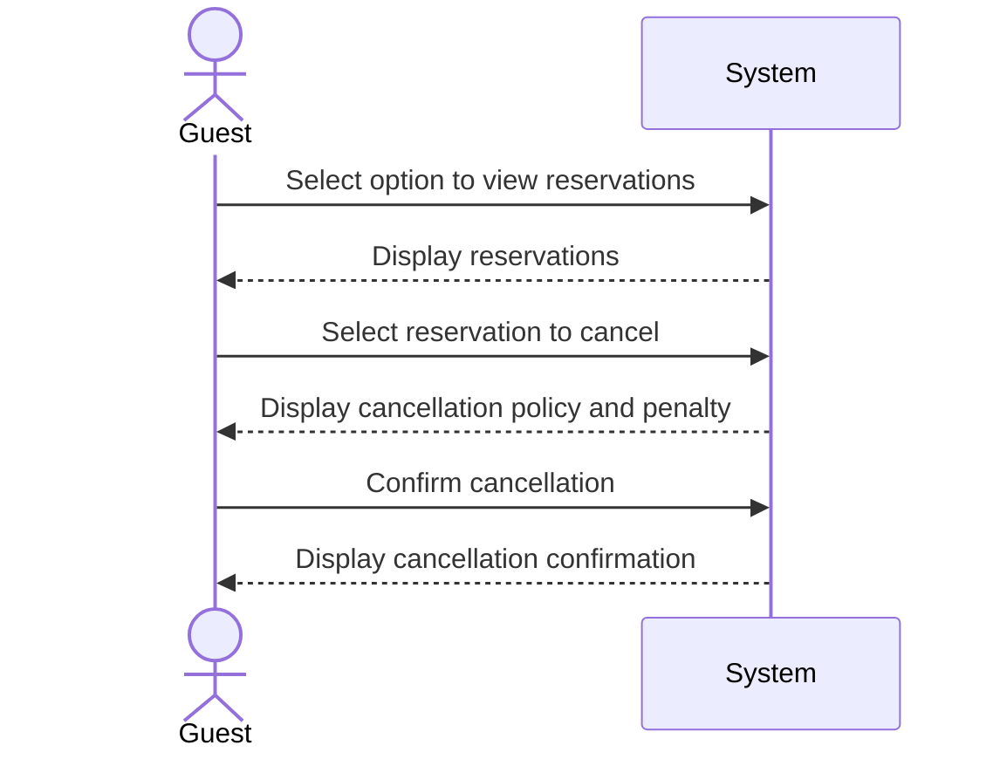
```mermaid
sequenceDiagram
    actor Guest
    participant System

    Guest->>System: Select option to view reservations
    System-->>Guest: Display reservations
    Guest->>System: Select reservation to cancel
    System-->>Guest: Display cancellation policy and penalty
    Guest->>System: Confirm cancellation
    System-->>Guest: Display cancellation confirmation
```

### Operation Contract

| Operation | `cancelReservation(reservationId: String)` |
|---|---|
| Cross References | Use Case: Cancel Reservation |
| Preconditions | 1. Guest is logged in 2. Reservation exists and is associated with the guest 3. The cancellation request is more than X hours before the check-in time |
| Postconditions | 1. Reservation.status was set to 'cancelled' 2. Any applicable cancellation penalty was recorded and associated with the reservation 3. The cancellation attempt was logged for auditing |

---

## UC-07: Modify Reservation

| Use Case Name| Modify Reservation |
|---------------|-----------------|
| Actor         | Hotel Guest    |
| Author        | Zain Altaf     |
| Preconditions | 1. The hotel guest is logged into the system.  2.The guest has an existing reservation.   3. The reservation has not yet started.|
|Postconditions | 1. The reservation is updated only if modification is permitted.   2. If modification is not permitted, the reservation remains unchanged.   3. Any change in price is recalculated and recorded. |
|Main Success Scenario| 1. The guest selects the option to view their reservations.  2. The system displays the guest's reservations. 3. The guest selects a reservation to modify. 4. The system displays the current reservation details   5.The guest enters the requested changes (e.g., dates or room type).  6. The system checks whether the modification request is more than X hours before the check-in time.   7. The system checks room availability for the requested changes.   8. The system recalculates the reservation cost, if applicable.   9. The system displays the updated reservation details.   10. The guest confirms the modification.   11. The system updates the reservation.   12. The system displays a modification confirmation message.|
|Extensions| [6]a. **Modification not allowed (within X hours of check-in)** &nbsp;&nbsp;&nbsp;&nbsp;[6]a1 The system determines that the modification request is within X hours of the check-in time. &nbsp;&nbsp;&nbsp;&nbsp;[6]a2 The system displays a message explaining that modifications are not permitted according to the policy.|
|Special Reqs| ● The system must enforce the X-hour modification policy exactly. ● Availability checks must be consistent with current reservations.  ● Price recalculation must follow hotel pricing rules.|

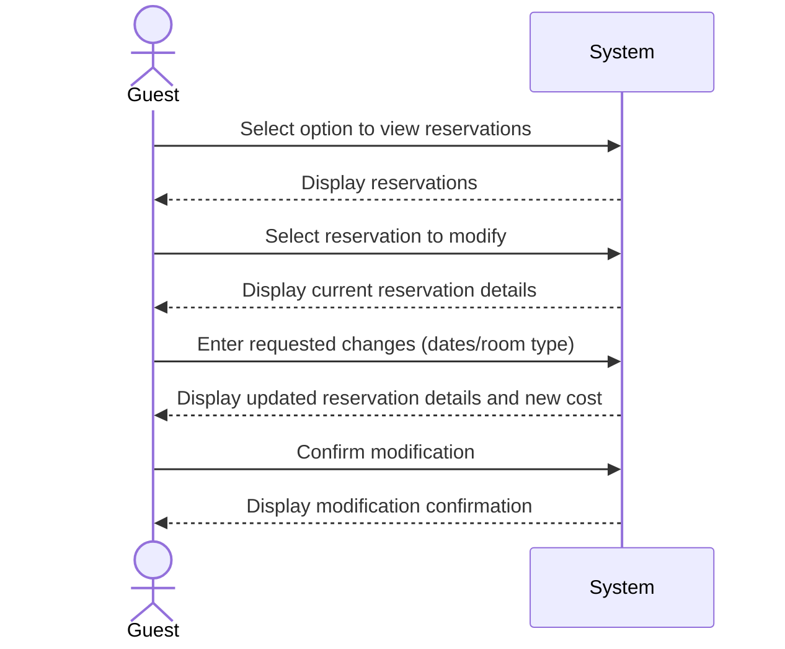
```mermaid
sequenceDiagram
    actor Guest
    participant System

    Guest->>System: Select option to view reservations
    System-->>Guest: Display reservations
    Guest->>System: Select reservation to modify
    System-->>Guest: Display current reservation details
    Guest->>System: Enter requested changes (dates/room type)
    System-->>Guest: Display updated reservation details and new cost
    Guest->>System: Confirm modification
    System-->>Guest: Display modification confirmation
```

### Operation Contract

| Operation | `modifyReservation(reservationId: String, newCheckInDate: Date, newCheckOutDate: Date, newRoomType: String)` |
|---|---|
| Cross References | Use Case: Modify Reservation |
| Preconditions | 1. Guest is logged in 2. Reservation exists and is associated with the guest 3. The modification is requested more than X hours before check-in 4. The reservation has not yet started |
| Postconditions | 1. Reservation.checkInDate and/or Reservation.checkOutDate were updated (if changed) 2. Reservation was associated with the new room type (if changed) 3. Reservation.totalCost was recalculated and updated 4. Reservation.lastModified timestamp was updated |

---

## UC-08: Process Check-In

| Use Case Name | Process Check-In |
|---------------|-----------------|
| Actor         | Hotel Clerk    |
| Author        | Erick Martinez |
| Preconditions | 1. The hotel system is functional and online  2. The clerk is logged in to the system  3. The guest has an existing reservation for the current date  4. At least one room matching the reservation criteria is available |
| Postconditions | 1. The guest is checked in and assigned to a specific room  2. The room status is updated to occupied  3. The check-in date and time are recorded  4. The guest can access hotel services (including the store) |
| Main Success Scenario | 1. The clerk searches for the guest's reservation by name or confirmation number  2. The system displays the reservation details  3. The clerk verifies the guest's identity  4. The clerk confirms the reservation details with the guest  5. The system displays available rooms matching the reservation  6. The clerk selects a room to assign to the guest  7. The system allocates the room to the guest  8. The system updates the room status to occupied  9. The system records the check-in timestamp  10. The clerk provides the room key/access information to the guest  11. The system displays check-in confirmation |
| Extensions | [1]a. **Reservation not found** &nbsp;&nbsp;&nbsp;&nbsp;[1]a1 The clerk verifies guest information &nbsp;&nbsp;&nbsp;&nbsp;[1]a2 The clerk offers to create a new reservation (see Make Reservation use case) &nbsp;&nbsp;&nbsp;&nbsp;[1]a3 Use case ends or continues with new reservation [4]a. **Guest requests different room type** &nbsp;&nbsp;&nbsp;&nbsp;[4]a1 The clerk searches for alternative available rooms &nbsp;&nbsp;&nbsp;&nbsp;[4]a2 The system displays available alternatives with price differences &nbsp;&nbsp;&nbsp;&nbsp;[4]a3 The guest selects a new room type &nbsp;&nbsp;&nbsp;&nbsp;[4]a4 The system updates the reservation with new rate if applicable &nbsp;&nbsp;&nbsp;&nbsp;[4]a5 Continue from step 5 [6]a. **No rooms available matching reservation** &nbsp;&nbsp;&nbsp;&nbsp;[6]a1 The system notifies the clerk of the situation &nbsp;&nbsp;&nbsp;&nbsp;[6]a2 The clerk offers an upgrade or alternative room &nbsp;&nbsp;&nbsp;&nbsp;[6]a3 The guest accepts or declines the alternative &nbsp;&nbsp;&nbsp;&nbsp;[6]a4 If declined, the clerk processes a cancellation with no penalty &nbsp;&nbsp;&nbsp;&nbsp;[6]a5 Use case ends or continues with alternative room |
| Special Reqs | ● Check-in must update room availability in real-time ● Guest must have an active reservation to access store purchasing |

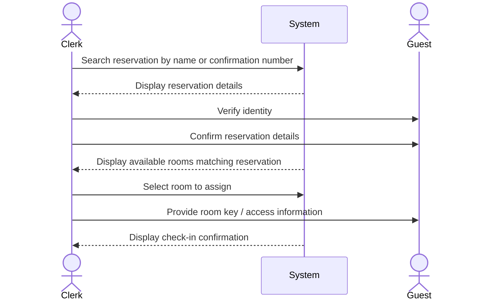
```mermaid
sequenceDiagram
    actor Clerk
    participant System
    actor Guest

    Clerk->>System: Search reservation by name or confirmation number
    System-->>Clerk: Display reservation details
    Clerk->>Guest: Verify identity
    Clerk->>Guest: Confirm reservation details
    System-->>Clerk: Display available rooms matching reservation
    Clerk->>System: Select room to assign
    Clerk->>Guest: Provide room key / access information
    System-->>Clerk: Display check-in confirmation
```

### Operation Contract

| Operation | `processCheckIn(reservationId: String, roomId: String)` |
|---|---|
| Cross References | Use Case: Process Check-In |
| Preconditions | 1. Hotel clerk is logged in 2. Guest has a reservation for the current date 3. The specified room is available and matches the reservation criteria |
| Postconditions | 1. Room.status was changed to 'occupied' 2. Reservation.checkInTimestamp was recorded 3. Reservation was associated with the specific assigned Room 4. Guest.checkedIn was set to true |

---

## UC-09: Browse Product Catalog

| Use Case Name | Browse Product Catalog |
|---------------|-----------------|
| Actor         | Guest          |
| Author        | Jonathan Deiss |
| Preconditions | 1. The guest is logged into the hotel system |
| Postconditions | 1. The guest has viewed available products and their specific details |
| Main Success Scenario | 1. The guest selects the "Store" or "Shop" tab from the main dashboard  2. The system retrieves all product categories: Clothing, Accessories, and Local Artisanal Goods  3. The guest filters products by category or searches by name  4. The system displays a list of products including Name, Description, and Price  5. The guest selects a specific product to view detailed attributes (e.g., size for clothing, origin for artisanal goods) |
| Extensions | [2]a. **No Products Available** &nbsp;&nbsp;&nbsp;&nbsp;[2]a1 The system displays a "Coming Soon" or "Store is currently empty" message [3]a. **Search Not Found** &nbsp;&nbsp;&nbsp;&nbsp;[3]a1 The system suggests similar products or allows the user to clear filters |
| Special Reqs | ● The UI must distinguish between "Standard" items and "Exclusive Artisanal" goods as per the establishment's unique theme |

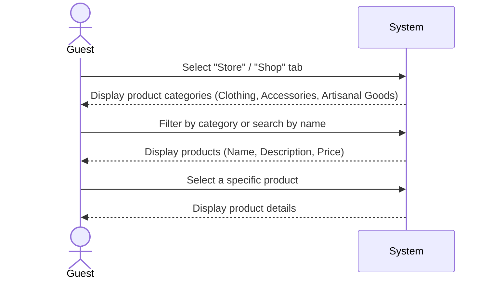
```mermaid
sequenceDiagram
    actor Guest
    participant System

    Guest->>System: Select "Store" / "Shop" tab
    System-->>Guest: Display product categories (Clothing, Accessories, Artisanal Goods)
    Guest->>System: Filter by category or search by name
    System-->>Guest: Display products (Name, Description, Price)
    Guest->>System: Select a specific product
    System-->>Guest: Display product details
```

### Operation Contract

| Operation | `browseProductCatalog(category: String, searchTerm: String)` |
|---|---|
| Cross References | Use Case: Browse Product Catalog |
| Preconditions | 1. Guest is logged in 2. Product data exists in the system |
| Postconditions | 1. No domain model state was changed (read-only operation) 2. Product listing filtered by the given category or search term was retrieved and displayed |

---

## UC-10: Purchase from Store

| Use Case Name | Purchase from Store |
|---------------|-----------------|
| Actor         | Guest          |
| Author        | [Aaron]    |
| Preconditions | 1. The guest is logged into the hotel system  2. The guest has browsed the product catalog and identified items to purchase  3. The guest is checked in (or the system allows store purchases for registered guests as per policy)  4. Products are available in inventory |
| Postconditions | 1. The selected products are recorded as purchased and associated with the guest (and room/stay if checked in)  2. Inventory for purchased items is updated  3. Payment is recorded and the guest receives confirmation  4. Charges are applied to the room bill (if checked in) or paid at time of purchase |
| Main Success Scenario | 1. The guest navigates to the Store from the main dashboard  2. The guest adds one or more products to the cart (product, quantity, size/variant if applicable)  3. The guest views the cart and adjusts quantities or removes items if desired  4. The guest proceeds to checkout  5. The system displays order summary (items, quantities, prices, total) and confirms guest/room for billing  6. The guest confirms payment method (charge to room or enter card)  7. The system validates payment and inventory availability  8. The system records the sale and updates inventory  9. The system applies charges to the room bill or completes the payment transaction  10. The system displays order confirmation and, if applicable, delivery or pickup details  11. The guest acknowledges the confirmation |
| Extensions | [2]a. **Product no longer available** &nbsp;&nbsp;&nbsp;&nbsp;[2]a1 The system notifies the guest that the item is out of stock &nbsp;&nbsp;&nbsp;&nbsp;[2]a2 The guest removes the item or selects an alternative &nbsp;&nbsp;&nbsp;&nbsp;[2]a3 Continue from step 3 [7]a. **Payment failed** &nbsp;&nbsp;&nbsp;&nbsp;[7]a1 The system displays payment error message &nbsp;&nbsp;&nbsp;&nbsp;[7]a2 The guest corrects payment details or chooses another method &nbsp;&nbsp;&nbsp;&nbsp;[7]a3 Return to step 6 [7]b. **Guest not checked in and no payment method** &nbsp;&nbsp;&nbsp;&nbsp;[7]b1 The system prompts for a valid payment method to complete purchase &nbsp;&nbsp;&nbsp;&nbsp;[7]b2 Use case ends if guest cannot provide payment |
| Special Reqs | ● Store purchases for checked-in guests must be chargeable to the room and visible on the final bill (Process Check-Out) ● Inventory must be decremented atomically with the sale ● Payment and order details must be stored securely and logged for auditing |

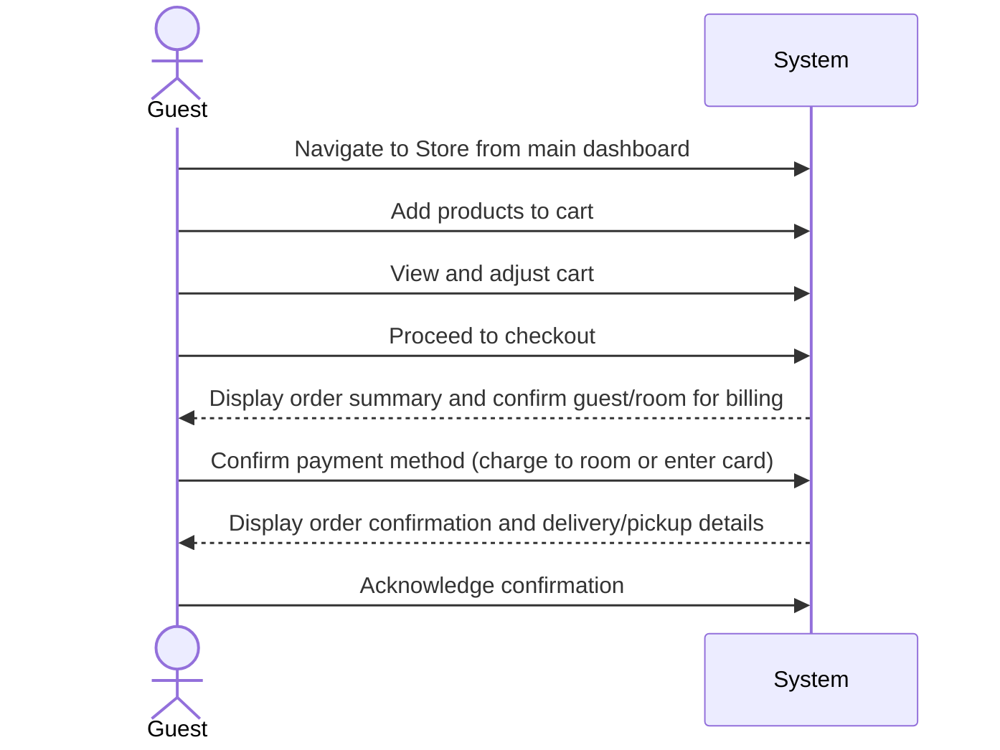
```mermaid
sequenceDiagram
    actor Guest
    participant System

    Guest->>System: Navigate to Store from main dashboard
    Guest->>System: Add products to cart
    Guest->>System: View and adjust cart
    Guest->>System: Proceed to checkout
    System-->>Guest: Display order summary and confirm guest/room for billing
    Guest->>System: Confirm payment method (charge to room or enter card)
    System-->>Guest: Display order confirmation and delivery/pickup details
    Guest->>System: Acknowledge confirmation
```

### Operation Contract

| Operation | `purchaseFromStore(guestId: String, cartItems: List<CartItem>, paymentMethod: PaymentMethod)` |
|---|---|
| Cross References | Use Case: Purchase from Store |
| Preconditions | 1. Guest is logged in 2. All items in the cart are available in inventory 3. Guest is checked in or has a valid payment method on file |
| Postconditions | 1. A new Sale was created and associated with the guest and current stay 2. Inventory quantity was decremented for each purchased item 3. Charges were applied to the guest's room bill (if checked in) or a payment transaction was completed 4. Order confirmation was generated and associated with the sale |

---

## UC-11: View or Request Bill

| Use Case Name | View or Request Bill |
|---------------|-----------------|
| Actor         | Hotel Guest or Hotel Clerk    |
| Author        | [Aaron]    |
| Preconditions | 1. The hotel system is functional and online  2. The actor is logged in to the system  3. There exists a stay, reservation, or set of charges associated with the guest (current or past) |
| Postconditions | 1. The actor has viewed the current bill or a historical bill for the specified stay  2. If requested, an invoice or receipt is generated and made available (e.g., download or email)  3. The request is logged for auditing where applicable |
| Main Success Scenario | 1. The guest or clerk navigates to billing, "My Stay," or reservation details  2. The guest selects their stay (or the clerk selects the guest and stay)  3. The system retrieves all charges for that stay (room, rate, taxes, minibar, store purchases, incidentals)  4. The system displays an itemized bill with line items, dates, and totals  5. The actor reviews the bill  6. If the actor requests an invoice or receipt, they select "Request Invoice" or "Download Receipt"  7. The system generates the document (PDF or formatted print) with hotel branding and bill details  8. The system makes the document available for download or sends it to the guest's email  9. The system displays confirmation that the bill was viewed and, if applicable, that the invoice was sent |
| Extensions | [2]a. **No stay or reservation found** &nbsp;&nbsp;&nbsp;&nbsp;[2]a1 The system displays a message that no billable stay was found for this guest &nbsp;&nbsp;&nbsp;&nbsp;[2]a2 Use case ends [6]a. **Invoice request for past stay** &nbsp;&nbsp;&nbsp;&nbsp;[6]a1 The system allows invoice generation for completed stays within the retention period &nbsp;&nbsp;&nbsp;&nbsp;[6]a2 Continue from step 7 [6]b. **Invoice request not allowed (e.g., stay in progress and policy requires check-out first)** &nbsp;&nbsp;&nbsp;&nbsp;[6]b1 The system displays "Final invoice available at check-out" or similar &nbsp;&nbsp;&nbsp;&nbsp;[6]b2 Use case ends with bill view only |
| Special Reqs | ● Bill must reflect all charges from room, store (Purchase from Store), and incidentals in real time ● Invoice/receipt must include all legally required information (hotel name, stay dates, tax breakdown, etc.) ● Guest may only view or request bills for their own stays; clerks may view bills for any guest as authorized |

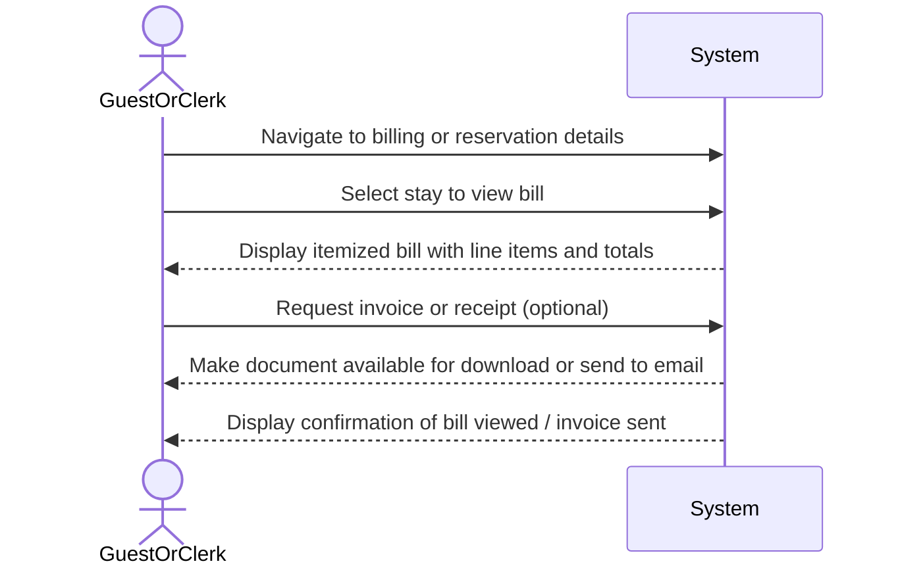
```mermaid
sequenceDiagram
    actor GuestOrClerk
    participant System

    GuestOrClerk->>System: Navigate to billing or reservation details
    GuestOrClerk->>System: Select stay to view bill
    System-->>GuestOrClerk: Display itemized bill with line items and totals
    GuestOrClerk->>System: Request invoice or receipt (optional)
    System-->>GuestOrClerk: Make document available for download or send to email
    System-->>GuestOrClerk: Display confirmation of bill viewed / invoice sent
```

### Operation Contract

| Operation | `viewBill(stayId: String)` / `requestInvoice(stayId: String)` |
|---|---|
| Cross References | Use Case: View or Request Bill |
| Preconditions | 1. Actor is logged in 2. A stay, reservation, or set of charges exists for the guest in the system |
| Postconditions | 1. Bill view event was logged for the stay 2. An invoice document was generated containing all line items, dates, and totals (if requested) 3. Invoice was made available for download or sent to the guest's email (if requested) 4. Invoice request was logged (if applicable) |

---

## UC-12: Process Check-Out

| Use Case Name | Process Check-Out |
|---------------|-----------------|
| Actor         | Hotel Clerk    |
| Author        | [Aaron]    |
| Preconditions | 1. The hotel system is functional and online  2. The clerk is logged in to the system  3. The guest has been checked in and is currently occupying a room  4. The guest's room and stay details exist in the database |
| Postconditions | 1. The guest is checked out and the room is released  2. The room status is updated to available (or cleaning/maintenance as configured)  3. The check-out date and time are recorded  4. The final bill is calculated and recorded  5. Any outstanding balance or payment confirmation is documented |
| Main Success Scenario | 1. The clerk searches for the guest by name, room number, or reservation ID  2. The system displays the guest's current stay and room assignment  3. The clerk confirms the guest's identity and intent to check out  4. The system calculates the final bill (room charges, minibar, store purchases, incidentals)  5. The system displays the itemized bill to the clerk and guest  6. The guest pays any outstanding balance (or confirms prior payment)  7. The clerk confirms check-out in the system  8. The system updates the room status to available  9. The system records the check-out timestamp  10. The system displays a check-out confirmation and receipt (if requested)  11. The clerk provides the receipt or invoice to the guest |
| Extensions | [1]a. **Guest or room not found** &nbsp;&nbsp;&nbsp;&nbsp;[1]a1 The system displays a message that no matching stay was found &nbsp;&nbsp;&nbsp;&nbsp;[1]a2 The clerk verifies room number or guest name &nbsp;&nbsp;&nbsp;&nbsp;[1]a3 Return to step 1 or use case ends [6]a. **Payment declined or insufficient** &nbsp;&nbsp;&nbsp;&nbsp;[6]a1 The system displays payment failure message &nbsp;&nbsp;&nbsp;&nbsp;[6]a2 The clerk requests alternative payment or arranges follow-up &nbsp;&nbsp;&nbsp;&nbsp;[6]a3 Return to step 6 or use case ends with balance documented [8]a. **System cannot update room status** &nbsp;&nbsp;&nbsp;&nbsp;[8]a1 The system displays an error and logs the failure &nbsp;&nbsp;&nbsp;&nbsp;[8]a2 The clerk retries or escalates; check-out may be completed manually and room status updated later |
| Special Reqs | ● Check-out must update room availability in real-time for Search Available Room ● Final bill must include all room charges and any store or incidental charges linked to the stay ● Check-out time and payment status must be logged for auditing |

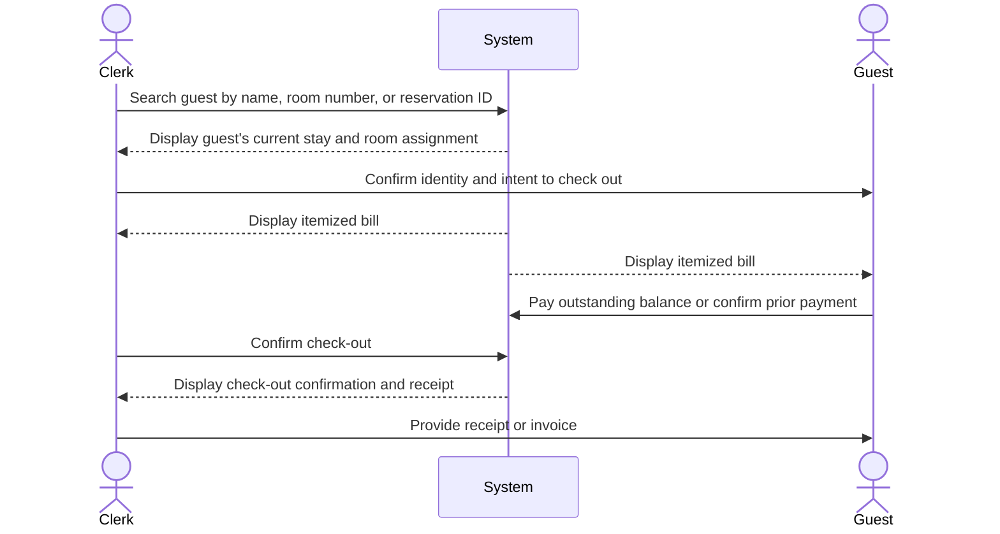
```mermaid
sequenceDiagram
    actor Clerk
    participant System
    actor Guest

    Clerk->>System: Search guest by name, room number, or reservation ID
    System-->>Clerk: Display guest's current stay and room assignment
    Clerk->>Guest: Confirm identity and intent to check out
    System-->>Clerk: Display itemized bill
    System-->>Guest: Display itemized bill
    Guest->>System: Pay outstanding balance or confirm prior payment
    Clerk->>System: Confirm check-out
    System-->>Clerk: Display check-out confirmation and receipt
    Clerk->>Guest: Provide receipt or invoice
```

### Operation Contract

| Operation | `processCheckOut(guestId: String)` |
|---|---|
| Cross References | Use Case: Process Check-Out |
| Preconditions | 1. Hotel clerk is logged in 2. Guest is currently checked in and occupying a room 3. Guest's stay details exist in the database |
| Postconditions | 1. Room.status was changed to 'available' 2. Stay.checkOutTimestamp was recorded 3. Final bill was calculated and recorded (room charges, store purchases, and incidentals) 4. Guest.checkedIn was set to false 5. Payment status was documented and logged |

---

## UC-13: Generate Combined Bill

| Use Case Name | Generate Combined Bill |
|---------------|------------------------|
| Actor         | Hotel Clerk            |
| Author        | Zain Altaf             |
| Preconditions | 1. The hotel clerk is logged into the system.  2. The guest has completed check-out.  3. The guest has at least one reservation recorded in the system. |
| Postconditions | 1. A combined bill is generated for the guest.  2. The bill includes all room charges and store purchases.  3. The finalized bill is stored in the system. |
| Main Success Scenario | 1. The clerk selects a checked-out guest.  2. The system retrieves the guest's reservation details.  3. The system retrieves all store purchases made during the guest's stay.  4. The system calculates the total room charges.  5. The system calculates the total store charges.  6. The system applies any taxes or additional fees.  7. The system combines all charges into a single bill.  8. The system displays the bill summary.  9. The clerk reviews and confirms the bill.  10. The system finalizes and stores the bill. |
| Extensions | [3]a. **No store purchases recorded** &nbsp;&nbsp;&nbsp;&nbsp;[3]a1 The system generates a bill including only room charges. [2]b. **Corporate guest billing** &nbsp;&nbsp;&nbsp;&nbsp;[2]b1 The system marks the bill as corporate billing. &nbsp;&nbsp;&nbsp;&nbsp;[2]b2 The payment status is set to pending. |
| Special Reqs | ● Bill calculations must be accurate and consistent with reservation and purchase records. ● Tax calculations must follow applicable hotel policies. ● The generated bill must be stored for auditing and reporting purposes. |

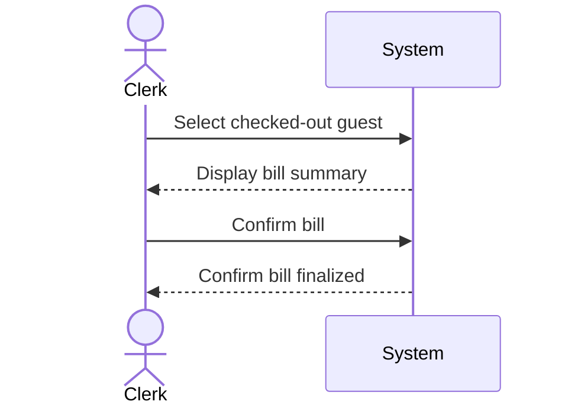
```mermaid
sequenceDiagram
    actor Clerk
    participant System

    Clerk->>System: Select checked-out guest
    System-->>Clerk: Display bill summary
    Clerk->>System: Confirm bill
    System-->>Clerk: Confirm bill finalized
```

### Operation Contract

| Operation | `generateCombinedBill(guestId: String)` |
|---|---|
| Cross References | Use Case: Generate Combined Bill |
| Preconditions | 1. Hotel clerk is logged in 2. Guest has completed check-out 3. At least one reservation is recorded for the guest |
| Postconditions | 1. A combined Bill was created and associated with the guest 2. Bill included all room charges from the guest's stay 3. Bill included all store purchase charges from the guest's stay 4. Applicable taxes and fees were applied to the total 5. Finalized bill was stored in the system for auditing |

---

## UC-14: Add Room

| Use Case Name | Add Room |
|---|---|
| Actor | Hotel Clerk |
| Author | Jace Yarborough |
| Preconditions | 1. System operational 2. Hotel clerk is logged in |
| Postconditions | 1. New room is added to hotel inventory 2. Room is available for reservations |
| Main Success Scenario | 1. Hotel clerk navigates to room management page 2. Hotel clerk selects "Add New Room" 3. System displays room entry form 4. Hotel clerk enters room details: &nbsp;&nbsp;&nbsp;&nbsp;- Room number &nbsp;&nbsp;&nbsp;&nbsp;- Floor/theme (Nature Retreat, Urban Elegance, Vintage Charm) &nbsp;&nbsp;&nbsp;&nbsp;- Room type (single, double, family, suite, deluxe, standard) &nbsp;&nbsp;&nbsp;&nbsp;- Bed type and quantity (twin, full, queen, king) &nbsp;&nbsp;&nbsp;&nbsp;- Smoking/non-smoking status &nbsp;&nbsp;&nbsp;&nbsp;- Quality level (executive, business, comfort, economy) &nbsp;&nbsp;&nbsp;&nbsp;- Maximum daily rate 5. Hotel clerk submits form 6. System validates all fields 7. System verifies room number is unique 8. System saves room to database 9. System displays success message 10. Hotel clerk returns to room management page |
| Extensions | [6]a. **Required fields missing** &nbsp;&nbsp;&nbsp;&nbsp;[6]a1 System highlights missing fields &nbsp;&nbsp;&nbsp;&nbsp;[6]a2 System displays error "Please fill in all required fields" &nbsp;&nbsp;&nbsp;&nbsp;[6]a3 Return to step 4 [6]b. **Invalid data format** &nbsp;&nbsp;&nbsp;&nbsp;[6]b1 System displays error "Invalid format for [field name]" &nbsp;&nbsp;&nbsp;&nbsp;[6]b2 Return to step 4 [7]a. **Duplicate room number** &nbsp;&nbsp;&nbsp;&nbsp;[7]a1 System displays error "Room number already exists" &nbsp;&nbsp;&nbsp;&nbsp;[7]a2 Return to step 4 [8]a. **Database error** &nbsp;&nbsp;&nbsp;&nbsp;[8]a1 System displays error "Unable to add room. Try again" &nbsp;&nbsp;&nbsp;&nbsp;[8]a2 Use case ends |
| Special Reqs | ● Room numbers must follow hotel numbering convention ● Maximum daily rate must be positive value ● All room additions must be logged |

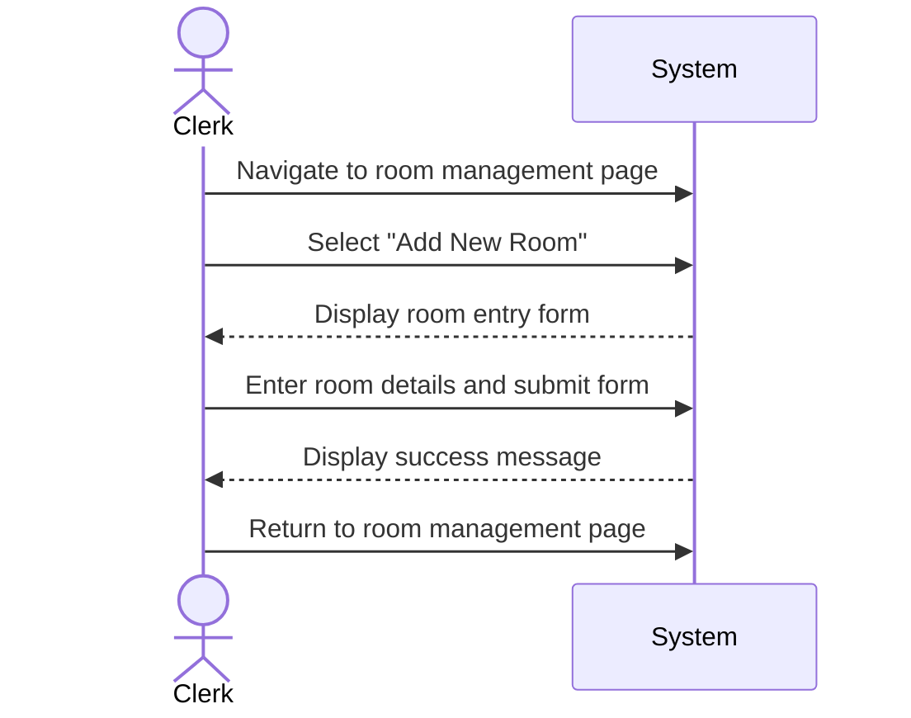
```mermaid
sequenceDiagram
    actor Clerk
    participant System

    Clerk->>System: Navigate to room management page
    Clerk->>System: Select "Add New Room"
    System-->>Clerk: Display room entry form
    Clerk->>System: Enter room details and submit form
    System-->>Clerk: Display success message
    Clerk->>System: Return to room management page
```

### Operation Contract

| Operation | `addRoom(roomNumber: String, theme: String, roomType: String, bedType: String, smokingStatus: Boolean, qualityLevel: String, maxDailyRate: Decimal)` |
|---|---|
| Cross References | Use Case: Add Room |
| Preconditions | 1. Hotel clerk is logged in 2. System is operational |
| Postconditions | 1. A new Room instance was created and saved to the database 2. Room was associated with the hotel inventory 3. Room.status was set to 'available' 4. The room addition was logged |

---

## UC-15: Configure Room Inventory

| Use Case Name | Configure Room Inventory |
|---------------|-----------------|
| Actor         | Hotel Clerk    |
| Author        | Jonathan Deiss |
| Preconditions | 1. The clerk is logged into an authorized Clerk account |
| Postconditions | 1. A new room is added to the hotel inventory with a specific theme and daily rate |
| Main Success Scenario | 1. The clerk selects the "Manage Rooms" dashboard  2. The clerk enters a Room Number and selects a Floor/Theme (e.g., Nature Retreat)  3. The clerk assigns a Bed Type (Twin, Full, Queen, King) and Quality Level  4. The system calculates the "Maximum Daily Rate" based on the Quality Level  5. The system saves the room status as "Available" for future searches |
| Extensions | [2]a. **Duplicate Room Number** &nbsp;&nbsp;&nbsp;&nbsp;[2]a1 System prevents saving and alerts the clerk that the room number already exists [4]a. **Rate Overrides** &nbsp;&nbsp;&nbsp;&nbsp;[4]a1 Clerk can manually set a "Promotion Rate" for a specific room |
| Special Reqs | ● Data Integrity: The system must enforce that "Suite" types only exist on the "Urban Elegance" floor as per the problem statement |

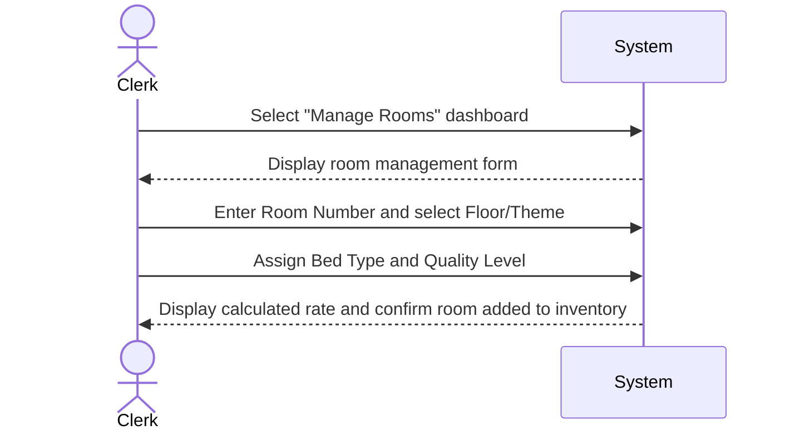
```mermaid
sequenceDiagram
    actor Clerk
    participant System

    Clerk->>System: Select "Manage Rooms" dashboard
    System-->>Clerk: Display room management form
    Clerk->>System: Enter Room Number and select Floor/Theme
    Clerk->>System: Assign Bed Type and Quality Level
    System-->>Clerk: Display calculated rate and confirm room added to inventory
```

### Operation Contract

| Operation | `configureRoom(roomNumber: String, theme: String, bedType: String, qualityLevel: String)` |
|---|---|
| Cross References | Use Case: Configure Room Inventory |
| Preconditions | 1. Hotel clerk is logged in with an authorized clerk account 2. The room number does not already exist in the system |
| Postconditions | 1. A new Room was created and saved to the inventory 2. Room.theme was set to the selected floor/theme 3. Room.bedType was set 4. Room.qualityLevel was set 5. Room.maxDailyRate was calculated based on quality level and saved 6. Room.status was set to 'available' |

---

## UC-16: Leaving and / or Viewing a Review

| Use Case Name | Leaving and / or Viewing a Review |
|---------------|-----------------|
| Actor         | Previous Hotel Guest / Potential Guest |
| Author        | James Bagwell |
| Preconditions | 1. The user is on the review / details page.  2. To leave a review, the user must be logged into their account and theyu must have reserved AND checked-in to a room previously. |
| Postconditions | 1. The new review is saved to the database and displayed on the hotel page.   2. The hotel's average star rating is updated. |
| Main Success Scenario | 1. The User selects the "Reviews" tab on the hotel detail page.  2. The System displays a list of existing reviews and the current average rating.  3. The User clicks the button to leave a review.  4. The User leaves a star rating ( 1–5 ) and writes their review in the text field.   5. The User clicks the submits the review.   6. The System validates the review and indicates that the review was successfully left. |
| Extensions | [3]a. **User is not logged in** &nbsp;&nbsp;&nbsp;&nbsp; [3]a1. The System prompts the user to log in or sign up. &nbsp;&nbsp;&nbsp;&nbsp; [3]a2. Upon successful login, the system redirects the user back to the review form. [5]b. **Incomplete Review Form** &nbsp;&nbsp;&nbsp;&nbsp; [5]b1. The System highlights the missing fields (for example, if the star rating is left blank). &nbsp;&nbsp;&nbsp;&nbsp; [5]b2. The System prevents submission until all required fields are filled.|
| Special Reqs | ● The system must filter for profanity or restricted content before publishing. ● The user must be able to filter how many reviews they want to see ( For example, show 10 reviews ).  ● Users should be able to sort reviews by "Most Recent" or "Highest Rated."|

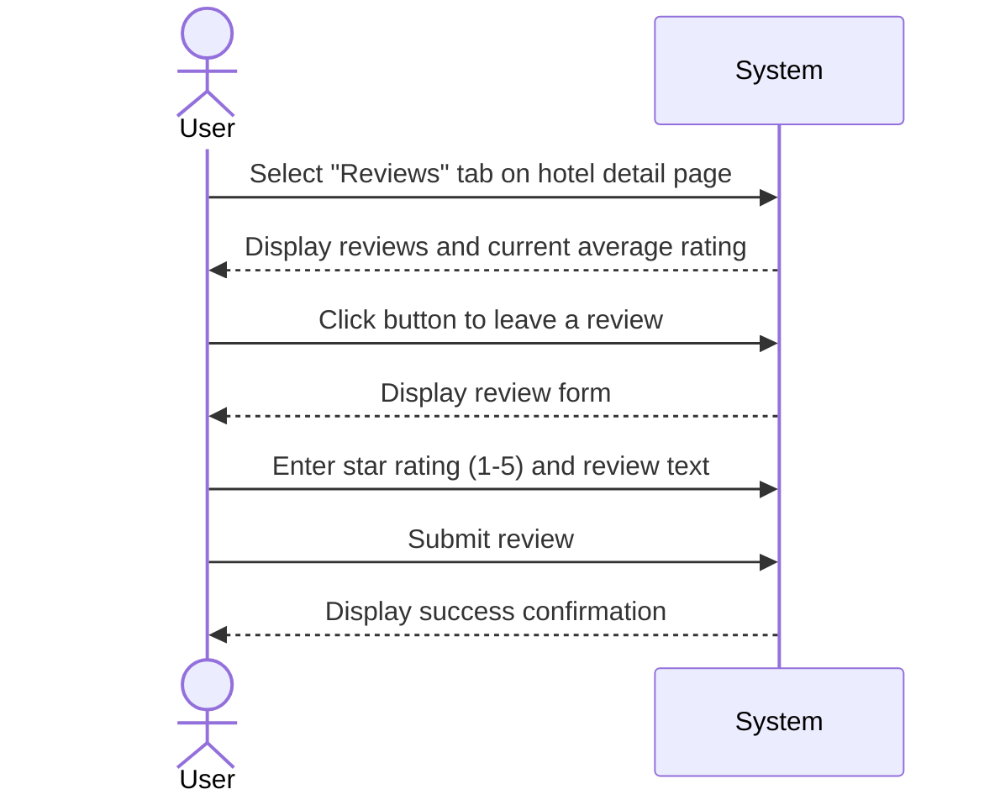
```mermaid
sequenceDiagram
    actor User
    participant System

    User->>System: Select "Reviews" tab on hotel detail page
    System-->>User: Display reviews and current average rating
    User->>System: Click button to leave a review
    System-->>User: Display review form
    User->>System: Enter star rating (1-5) and review text
    User->>System: Submit review
    System-->>User: Display success confirmation
```

### Operation Contract

| Operation | `submitReview(hotelId: String, starRating: Integer, reviewText: String)` |
|---|---|
| Cross References | Use Case: Leaving and / or Viewing a Review |
| Preconditions | 1. User is logged in 2. User has a prior completed stay (checked in) at the hotel |
| Postconditions | 1. A new Review was created and associated with the hotel 2. Review was associated with the Guest account 3. Hotel.averageStarRating was recalculated and updated 4. Review was stored in the database and made visible on the hotel page |

---

## UC-17: HelpDesk

| Use Case Name | HelpDesk |
|---------------|----------|
| Actor         | Guest    |
| Author        | James Bagwell |
| Preconditions | 1. There is a staff member on standby to help over the computer / phone  2. There is a staff member ready to complete the scheduled service at the time it was scheduled |
| Postconditions | 1. Guest received help they needed  2. Guest schedules a service and reason for scheduling |
| Main Success Scenario | 1. User logs into the hotel website and navigates to the HelpDesk menu  2. If they need technical help (such as Wi-Fi not working, how to use the phone, etc.), they select that option. If they need a technician or a house-keeper (for example, if the air-conditioning isn't working or the toilet is clogged), they choose the other option.  3. If the user selects the first option, they are able to chat on the computer with someone who can help. If they choose the second option, they can request a technician or house-keeper to fix the situation, and the system will assign and schedule someone to come help as soon as possible.  4. The situation is fixed. |
| Extensions | 2a. **No Virtual Technician Available** &nbsp;&nbsp;&nbsp;&nbsp;2a1. No staff member is available for technical support. &nbsp;&nbsp;&nbsp;&nbsp;2a2. The system displays a message notifying the yuser of a delay and it and allows the guest to submit a request to get a call back later. 3b. **No Technician or House-keeper Available** &nbsp;&nbsp;&nbsp;&nbsp;3b1. No technician or house-keeper is available at the requested time. &nbsp;&nbsp;&nbsp;&nbsp;3b2. The system prompts the guest to select an alternate time for the service request. |
| Special Reqs | ● The HelpDesk system must always be accessible through the hotel website. ● Live chat must occur quickly. ● All help requests and service schedules must be logged and associated with the guest's room number and account / phone number. |

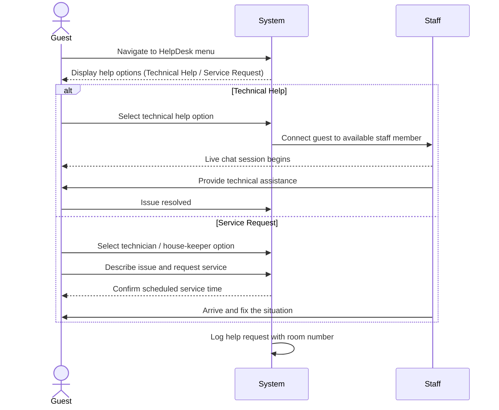
```mermaid
sequenceDiagram
    actor Guest
    participant System
    participant Staff

    Guest->>System: Navigate to HelpDesk menu
    System-->>Guest: Display help options (Technical Help / Service Request)

    alt Technical Help
        Guest->>System: Select technical help option
        System->>Staff: Connect guest to available staff member
        Staff-->>Guest: Live chat session begins
        Staff->>Guest: Provide technical assistance
        Guest->>System: Issue resolved
    else Service Request
        Guest->>System: Select technician / house-keeper option
        Guest->>System: Describe issue and request service
        System-->>Guest: Confirm scheduled service time
        Staff->>Guest: Arrive and fix the situation
    end

    System->>System: Log help request with room number
```

### Operation Contract

| Operation | `submitHelpRequest(requestType: String, description: String)` |
|---|---|
| Cross References | Use Case: HelpDesk |
| Preconditions | 1. Guest is logged in 2. A staff member is on standby 3. Hotel system is accessible |
| Postconditions | 1. A new HelpRequest was created and associated with the guest's account and room number 2. If technical help: a live chat session was initiated between the guest and an available staff member 3. If service request: a ServiceRequest was created, a staff member was assigned, and a service time was scheduled 4. Help request was logged with the guest's room number and account |

---

# Domain Model

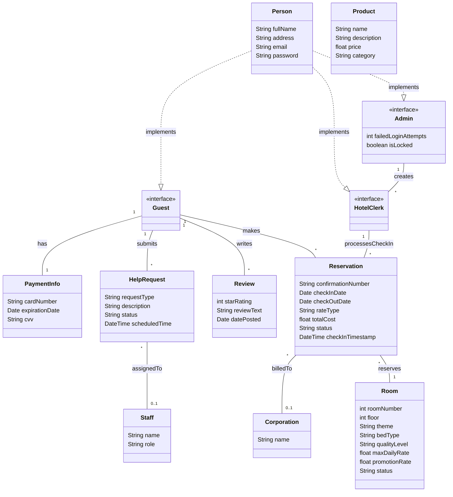
```mermaid
classDiagram
    class Person {
        String fullName
        String address
        String email
        String password
    }

    class Guest {
        <<interface>>
    }

    class Admin {
        <<interface>>
        int failedLoginAttempts
        boolean isLocked
    }

    class HotelClerk {
        <<interface>>
    }

    Person ..|> Guest : implements
    Person ..|> Admin : implements
    Person ..|> HotelClerk : implements

    class PaymentInfo {
        String cardNumber
        Date expirationDate
        String cvv
    }

    class Room {
        int roomNumber
        int floor
        String theme
        String bedType
        String qualityLevel
        float maxDailyRate
        float promotionRate
        String status
    }

    class Reservation {
        String confirmationNumber
        Date checkInDate
        Date checkOutDate
        String rateType
        float totalCost
        String status
        DateTime checkInTimestamp
    }

    class Product {
        String name
        String description
        float price
        String category
    }

    class Review {
        int starRating
        String reviewText
        Date datePosted
    }

    class HelpRequest {
        String requestType
        String description
        String status
        DateTime scheduledTime
    }

    class Corporation {
        String name
    }

    class Staff {
        String name
        String role
    }

    Guest "1" -- "1" PaymentInfo : has
    Guest "1" -- "*" Reservation : makes
    Guest "1" -- "*" Review : writes
    Guest "1" -- "*" HelpRequest : submits
    Reservation "*" -- "1" Room : reserves
    Reservation "*" -- "0..1" Corporation : billedTo
    Admin "1" -- "*" HotelClerk : creates
    HotelClerk "1" -- "*" Reservation : processesCheckIn
    HelpRequest "*" -- "0..1" Staff : assignedTo
```

---

# Wireframes

## Hotel System Overview

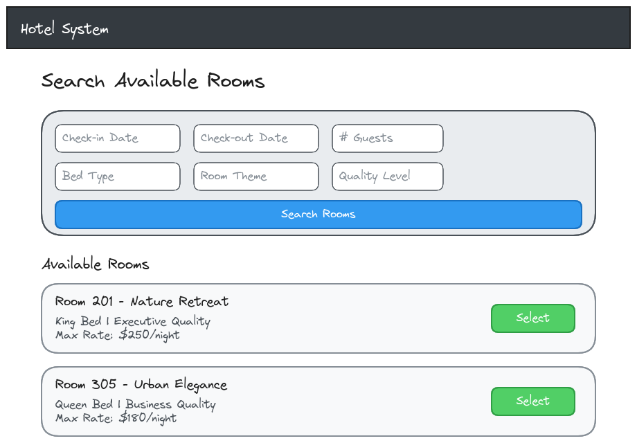

## Guest Registration

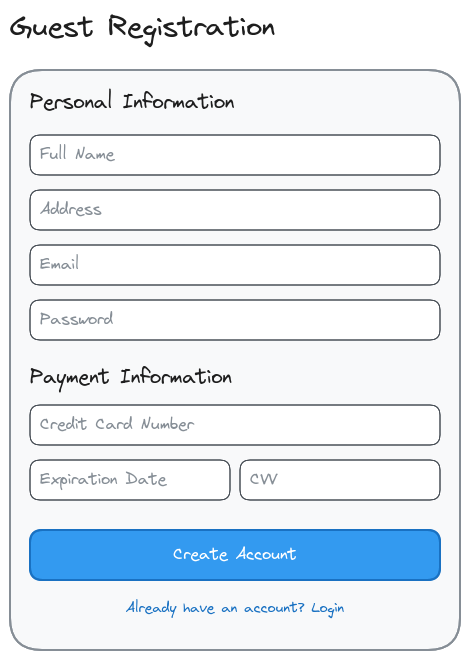

## Guest Dashboard

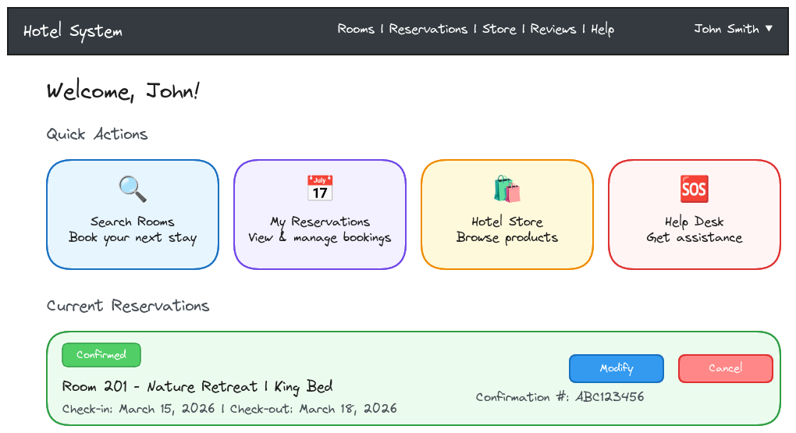

## Make Reservation

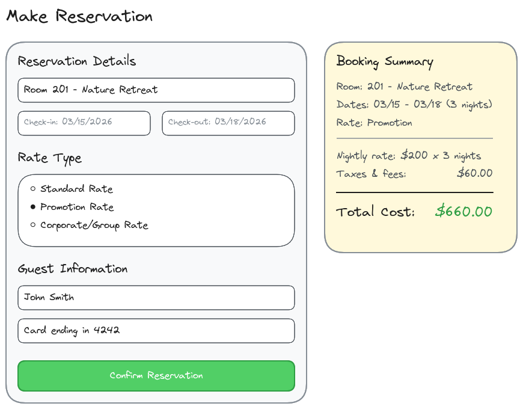

## Clerk Check-In

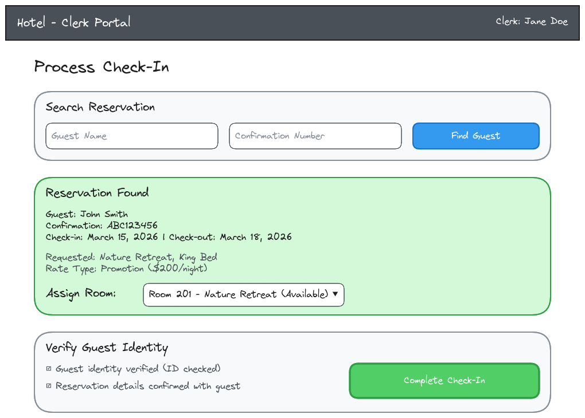
