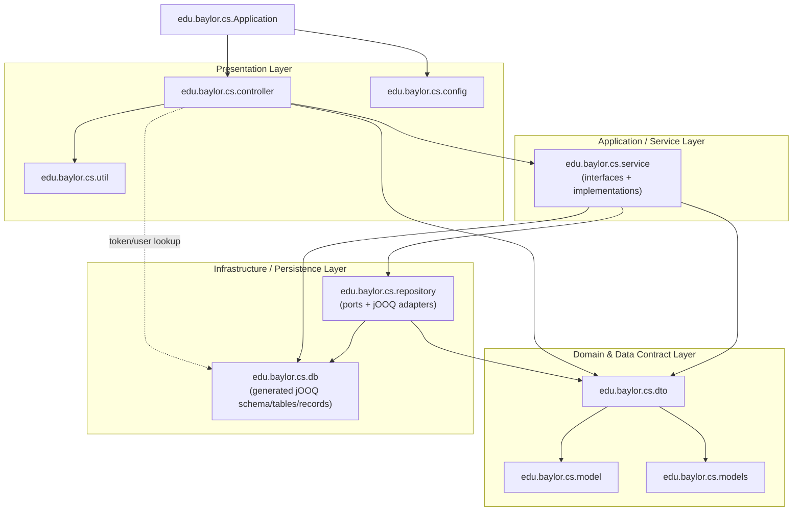

# Iteration Twelve

## Overview
- Database Choice: SQLite file
- Database Modeling: We use jOOQ to define the schema and query the database. This allows for typesafe queries. Of course, our actual controllers interact with repository objects to reduce coupling and increase cohesion.
- Current status: All implementation and testing complete. 
- Roadblocks: None. Currently working on deployment

## Diagram

