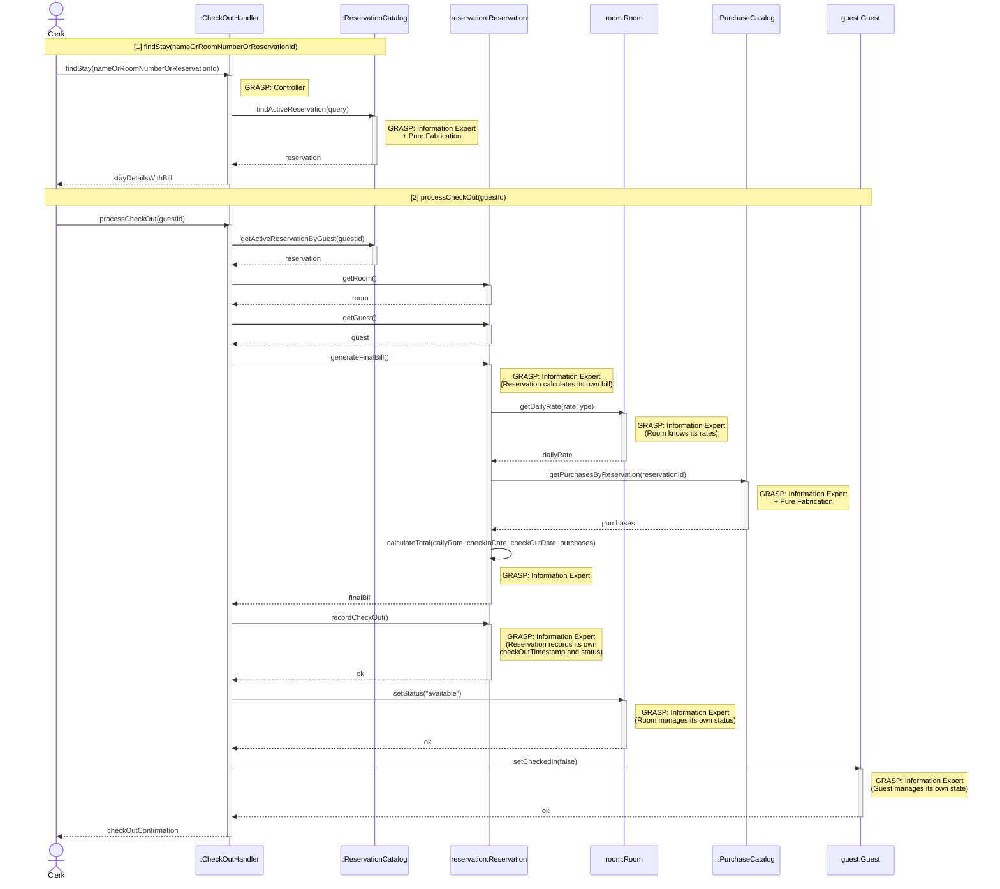

# Process Check-Out — Design Sequence Diagram

**Author:** Aaron
**Source Use Case:** `ProcessCheckOut.md`

## GRASP Patterns Applied

| Pattern | Applied To | Rationale |
|---|---|---|
| **Controller** | `:CheckOutHandler` | Use-case controller; receives both system operations for this use case session |
| **Information Expert + Pure Fabrication** | `:ReservationCatalog` | Holds all Reservation data; finds active stays by guest/room/ID |
| **Information Expert** | `reservation:Reservation` | Has `rateType`, `checkInDate`, `checkOutDate`, `totalCost` — calculates its own final bill and records its own check-out state |
| **Information Expert** | `room:Room` | Has `maxDailyRate`, `promotionRate` — expert on rate data used in billing |
| **Information Expert + Pure Fabrication** | `:PurchaseCatalog` | Records all store/incidental purchases linked to a reservation; no direct domain class |
| **Information Expert** | `guest:Guest` | Manages its own `checkedIn` flag |

## Sequence Diagram

