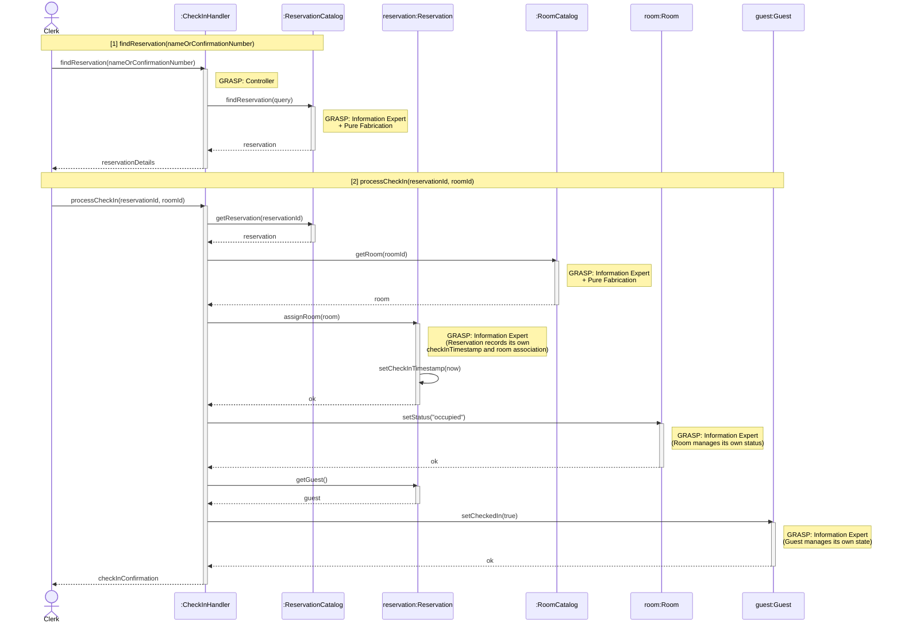

# Process Check-In — Design Sequence Diagram

**Author:** Erick Martinez
**Source Use Case:** `ProcessCheckIn.md`

## GRASP Patterns Applied

| Pattern | Applied To | Rationale |
|---|---|---|
| **Controller** | `:CheckInHandler` | Use-case controller; handles both system operations for this use case session |
| **Information Expert + Pure Fabrication** | `:ReservationCatalog` | Holds all Reservation data; finds reservations by name or confirmation number |
| **Information Expert + Pure Fabrication** | `:RoomCatalog` | Holds all Room data; looks up a specific room by ID |
| **Information Expert** | `reservation:Reservation` | Records its own `checkInTimestamp` and updates its room association |
| **Information Expert** | `room:Room` | Manages its own `status` attribute |
| **Information Expert** | `guest:Guest` | Manages its own `checkedIn` flag |

## Sequence Diagram

