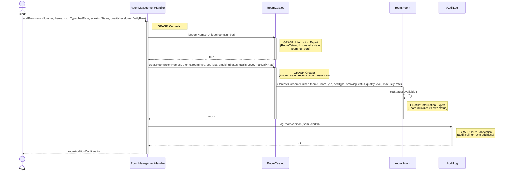

# Add Room — Design Sequence Diagram

**Author:** Jace Yarborough
**Source Use Case:** `HotelClerkAddRoom.md`

## GRASP Patterns Applied

| Pattern | Applied To | Rationale |
|---|---|---|
| **Controller** | `:RoomManagementHandler` | Use-case controller; receives the `addRoom` system operation |
| **Information Expert** | `:RoomCatalog` | Knows all existing room numbers; can check uniqueness before creation |
| **Creator** | `:RoomCatalog` | Records Room instances (GRASP Creator: B records A → B creates A); creates the new Room |
| **Information Expert** | `room:Room` | Initializes and manages its own `status` attribute upon creation |
| **Pure Fabrication** | `:AuditLog` | Records all room additions for the audit trail; no direct domain counterpart |

## Sequence Diagram

