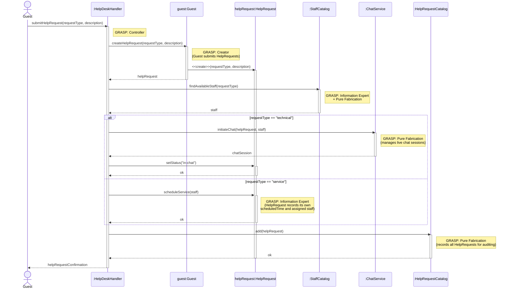

# HelpDesk — Design Sequence Diagram

**Author:** James Bagwell
**Source Use Case:** `HelpDest.md`

## GRASP Patterns Applied

| Pattern | Applied To | Rationale |
|---|---|---|
| **Controller** | `:HelpDeskHandler` | Use-case controller; receives the `submitHelpRequest` system operation |
| **Creator** | `guest:Guest` | Domain model shows `Guest "1"--"*" HelpRequest : submits`; Guest aggregates HelpRequests |
| **Information Expert + Pure Fabrication** | `:StaffCatalog` | Holds all Staff data and knows who is currently available; no direct domain class |
| **Information Expert** | `helpRequest:HelpRequest` | Manages its own `status` and `scheduledTime` attributes |
| **Pure Fabrication** | `:ChatService` | Handles live chat session orchestration; no domain counterpart |
| **Pure Fabrication** | `:HelpRequestCatalog` | Records and persists all HelpRequests for auditing and lookup |

## Sequence Diagram

