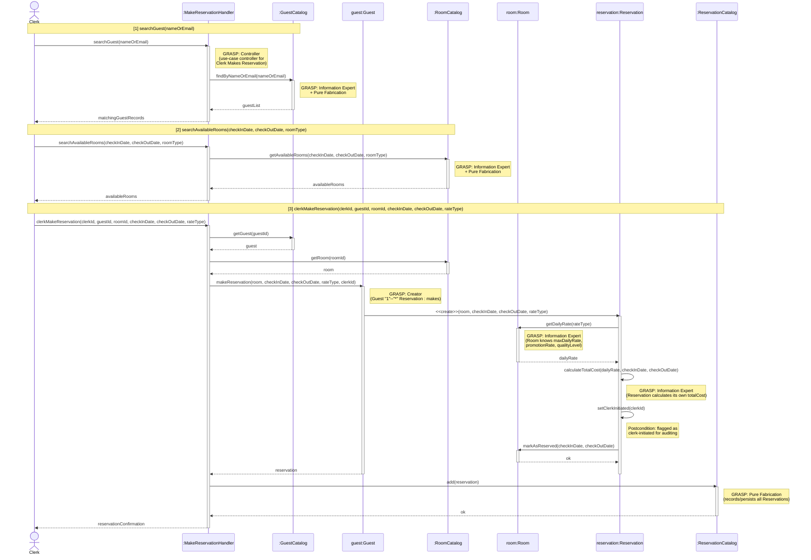

# Clerk Makes Reservation for Guest — Design Sequence Diagram

**Author:** Jonathan Deiss
**Source Use Case:** `ClerkMakesReservation.md`

## GRASP Patterns Applied

| Pattern | Applied To | Rationale |
|---|---|---|
| **Controller** | `:MakeReservationHandler` | Use-case controller; handles all three system operations for this use case session |
| **Information Expert + Pure Fabrication** | `:GuestCatalog` | Holds all Guest data; no direct domain counterpart |
| **Information Expert + Pure Fabrication** | `:RoomCatalog` | Holds all Room data; knows which rooms are available |
| **Creator** | `guest:Guest` | Domain model shows `Guest "1"--"*" Reservation : makes`; Guest aggregates Reservations |
| **Information Expert** | `room:Room` | Has `maxDailyRate`, `promotionRate`, `qualityLevel` — expert on rate data |
| **Information Expert** | `reservation:Reservation` | Has `rateType`, `checkInDate`, `checkOutDate` — calculates its own `totalCost` |
| **Pure Fabrication** | `:ReservationCatalog` | Records and persists all Reservations without burdening domain objects |

## Sequence Diagram

