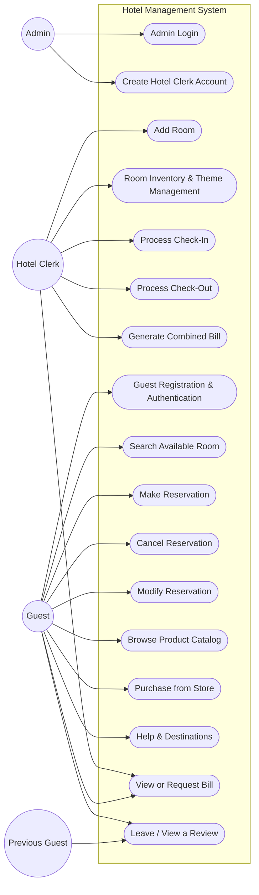

# Use Case Diagram

```mermaid
graph LR
    Admin((Admin))
    Clerk((Hotel Clerk))
    Guest((Guest))
    PrevGuest((Previous Guest))

    subgraph Hotel Management System
        AdminLogin([Admin Login])
        CreateClerkAccount([Create Hotel Clerk Account])

        AddRoom([Add Room])
        RoomThemeManagement([Room Inventory & Theme Management])
        ProcessCheckIn([Process Check-In])
        ProcessCheckOut([Process Check-Out])
        GenerateCombinedBill([Generate Combined Bill])

        GuestAuth([Guest Registration & Authentication])
        SearchRoom([Search Available Room])
        MakeReservation([Make Reservation])
        CancelReservation([Cancel Reservation])
        ModifyReservation([Modify Reservation])
        BrowseCatalog([Browse Product Catalog])
        PurchaseFromStore([Purchase from Store])
        HelpDestinations([Help & Destinations])

        ViewBill([View or Request Bill])
        Review([Leave / View a Review])
    end

    Admin --> AdminLogin
    Admin --> CreateClerkAccount

    Clerk --> AddRoom
    Clerk --> RoomThemeManagement
    Clerk --> ProcessCheckIn
    Clerk --> ProcessCheckOut
    Clerk --> GenerateCombinedBill
    Clerk --> ViewBill

    Guest --> GuestAuth
    Guest --> SearchRoom
    Guest --> MakeReservation
    Guest --> CancelReservation
    Guest --> ModifyReservation
    Guest --> BrowseCatalog
    Guest --> PurchaseFromStore
    Guest --> HelpDestinations
    Guest --> ViewBill
    Guest --> Review

    PrevGuest --> Review
```
