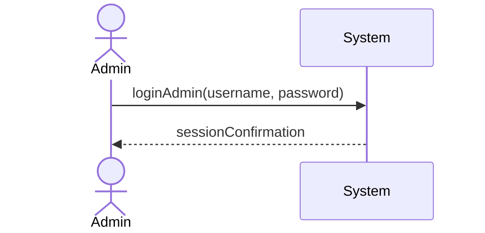
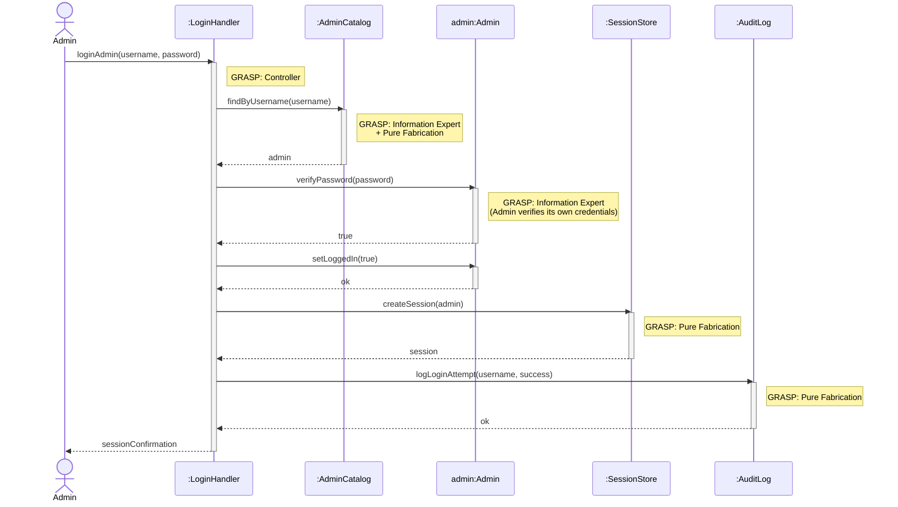

| Use Case Name | Admin Login |
|---|---|
| Actor | Admin |
| Author | Jace Yarborough |
| Preconditions | 1. System operational 2. User has a valid admin account with username and password |
| Postconditions | 1. Admin is successfully logged in 2. Admin is redirected to admin dashboard/panel |
| Main Success Scenario | 1. Admin navigates to login page 2. Admin enters username 3. Admin enters password 4. Admin submits credentials 5. System validates input 6. System verifies credentials 7. System displays success message 8. Admin is brought to admin dashboard |
| Extensions | [4]a. **Invalid username format** &nbsp;&nbsp;&nbsp;&nbsp;[4]a1 System detects username doesn't meet format requirements &nbsp;&nbsp;&nbsp;&nbsp;[4]a2 System displays error message "Invalid username or password" &nbsp;&nbsp;&nbsp;&nbsp;[4]a3 System prompts user to re-enter credentials [6]a. **Invalid credentials** &nbsp;&nbsp;&nbsp;&nbsp;[6]a1 System detects username or password is incorrect &nbsp;&nbsp;&nbsp;&nbsp;[6]a2 System increments failed login attempt counter &nbsp;&nbsp;&nbsp;&nbsp;[6]a3 System displays error message "Invalid username or password" &nbsp;&nbsp;&nbsp;&nbsp;[6]a4 Return to step 2 [6]b. **Account locked** &nbsp;&nbsp;&nbsp;&nbsp;[6]b1 System detects account has been locked due to multiple failed attempts &nbsp;&nbsp;&nbsp;&nbsp;[6]b2 System displays error message "Account locked. Contact system administrator" &nbsp;&nbsp;&nbsp;&nbsp;[6]b3 Use case ends [6]c. **Password expired** &nbsp;&nbsp;&nbsp;&nbsp;[6]c1 System detects password has expired &nbsp;&nbsp;&nbsp;&nbsp;[6]c2 System prompts admin to reset password &nbsp;&nbsp;&nbsp;&nbsp;[6]c3 Redirect to password reset use case |
| Special Reqs | ● Password must be hashed in database ● Log all login attempts |

### Operation Contract

| Operation | `loginAdmin(username: String, password: String)` |
|---|---|
| Cross References | Use Case: Admin Login |
| Preconditions | 1. System is operational 2. An admin account with the given username exists in the system |
| Postconditions | 1. An admin session was created 2. Admin.isLoggedIn was set to true 3. The login attempt was logged |

### Design Sequence Diagram

| Pattern | Applied To | Rationale |
|---|---|---|
| **Controller** | `:LoginHandler` | Use-case controller; receives the `loginAdmin` system operation |
| **Information Expert + Pure Fabrication** | `:AdminCatalog` | Holds all Admin accounts; finds by username and verifies credentials |
| **Information Expert** | `admin:Admin` | Manages its own `isLoggedIn` flag |
| **Pure Fabrication** | `:SessionStore` | Creates and stores the authenticated session |
| **Pure Fabrication** | `:AuditLog` | Logs all login attempts for auditing |

