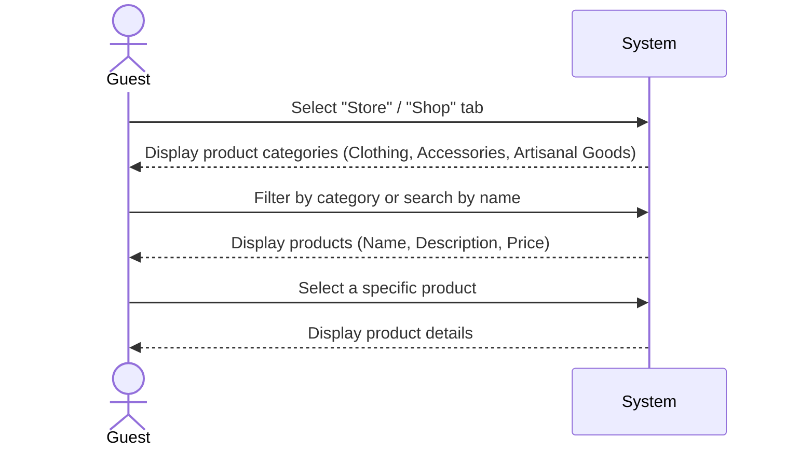

| Use Case Name | Browse Product Catalog |
|---------------|-----------------|
| Actor         | Guest          |
| Author        | Jonathan Deiss |
| Preconditions | 1. The guest is logged into the hotel system |
| Postconditions | 1. The guest has viewed available products and their specific details |
| Main Success Scenario | 1. The guest selects the "Store" or "Shop" tab from the main dashboard  2. The system retrieves all product categories: Clothing, Accessories, and Local Artisanal Goods  3. The guest filters products by category or searches by name  4. The system displays a list of products including Name, Description, and Price  5. The guest selects a specific product to view detailed attributes (e.g., size for clothing, origin for artisanal goods) |
| Extensions | [2]a. **No Products Available** &nbsp;&nbsp;&nbsp;&nbsp;[2]a1 The system displays a "Coming Soon" or "Store is currently empty" message [3]a. **Search Not Found** &nbsp;&nbsp;&nbsp;&nbsp;[3]a1 The system suggests similar products or allows the user to clear filters |
| Special Reqs | ● The UI must distinguish between "Standard" items and "Exclusive Artisanal" goods as per the establishment's unique theme |

