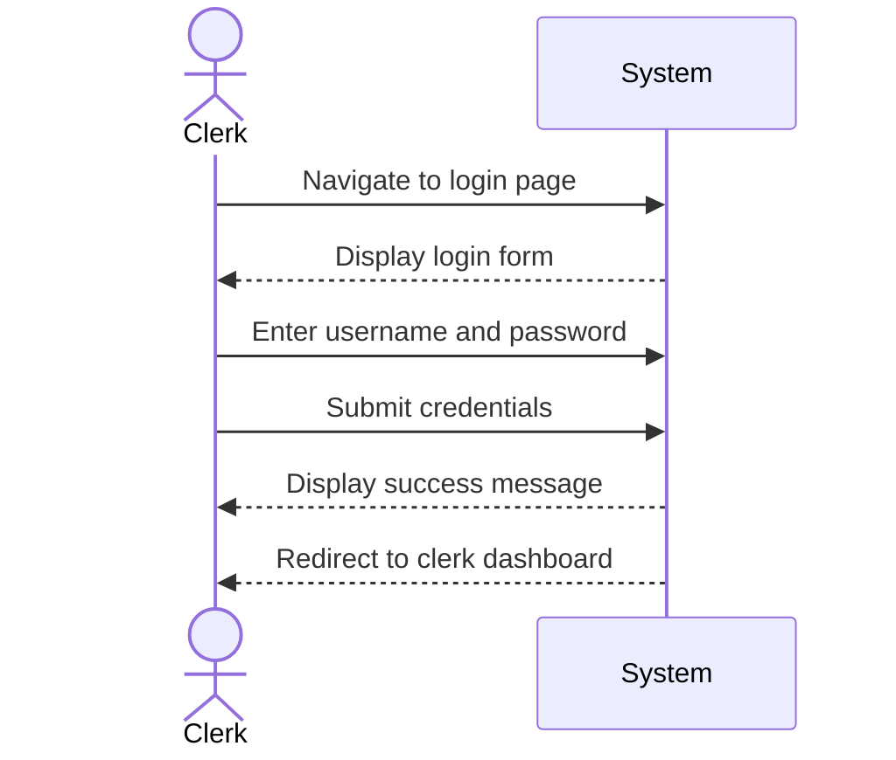

| Use Case Name | Hotel Clerk Login |
|---------------|-----------------|
| Actor         | Hotel Clerk    |
| Author        | Jonathan Deiss |
| Preconditions | 1. System is operational 2. User has a valid hotel clerk account with a username and password |
| Postconditions | 1. Hotel clerk is successfully logged in 2. Clerk is redirected to the clerk dashboard |
| Main Success Scenario | 1. The clerk navigates to the login page 2. The clerk enters their username 3. The clerk enters their password 4. The clerk submits the credentials 5. The system validates the input format 6. The system verifies the credentials against the database 7. The system creates a clerk session 8. The system redirects the clerk to the clerk dashboard |
| Extensions | [6]a. **Invalid credentials** &nbsp;&nbsp;&nbsp;&nbsp;[6]a1 The system displays "Invalid username or password" &nbsp;&nbsp;&nbsp;&nbsp;[6]a2 Return to step 2 [6]b. **Account not found** &nbsp;&nbsp;&nbsp;&nbsp;[6]b1 The system displays "Invalid username or password" (generic, for security) &nbsp;&nbsp;&nbsp;&nbsp;[6]b2 Use case ends |
| Special Reqs | ● Passwords must be stored hashed in the database ● All login attempts (successful and failed) must be logged |

---

## Operation Contract

| Operation | `loginClerk(username: String, password: String)` |
|---|---|
| Cross References | Use Case: Hotel Clerk Login |
| Preconditions | 1. System is operational 2. A hotel clerk account with the given username exists in the system |
| Postconditions | 1. A clerk session was created 2. HotelClerk.isLoggedIn was set to true 3. The login attempt was logged |

