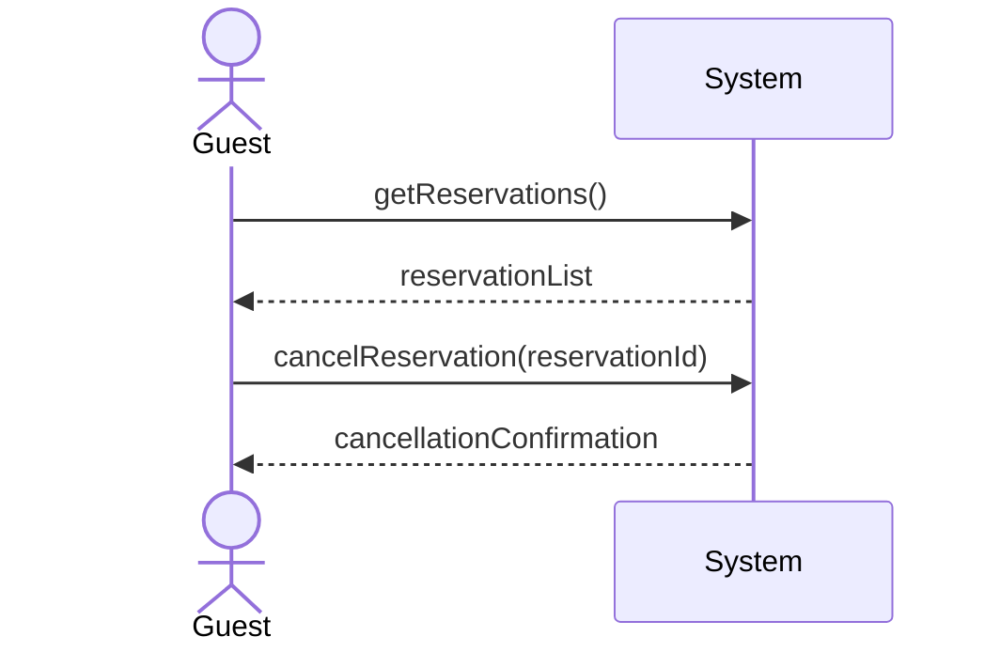

| Use Case Name| Cancel Reservation |
|---------------|-----------------|
| Actor         | Hotel Guest    |
| Author        | Zain Altaf     |
| Preconditions | 1. The hotel guest is logged into the system. <br>2. The guest has an existing reservation.|
|Postconditions | 1. The reservation is canceled only if cancellation is permitted. <br> 2. If cancellation is permitted, any applicable cancellation penalty is recorded. <br> 3.If cancellation is not permitted, the reservation remains unchanged.|
|Main Success Scenario| 1. The guest selects the option to view reservations. <br>2. The system displays the guest’s reservations.<br>3. The guest selects a reservation to cancel. <br>4. The system checks the time remaining until the reservation’s check-in date. <br> 5. The system determines that the cancellation request is more than the required time. <br> 6. The system displays the applicable cancellation policy and any penalty(if required). <br> 7. The guest confirms the cancellation. <br> 8.The system cancels the reservation. <br> 9. The system displays a cancellation confirmation message.|
|Extensions| [4]a. **Cancellation not allowed (within a specific time frame)**<br>&nbsp;&nbsp;&nbsp;&nbsp;[4]a1 The system determines that the cancellation request is within x hours of the check-in time.<br>&nbsp;&nbsp;&nbsp;&nbsp;[4]a2 The system displays a message explaining that cancellation is not permitted according to the policy.<br>&nbsp;&nbsp;&nbsp;&nbsp;[4]a3 The reservation remains unchanged.|
|Special Reqs| ● The system must enforce the X-hour cancellation policy exactly.<br>● Time comparisons must use the hotel's local time zone. <br> ● All cancellation attempts must be logged for auditing and billing purposes.|



### Operation Contract

| Operation | `cancelReservation(reservationId: String)` |
|---|---|
| Cross References | Use Case: Cancel Reservation |
| Preconditions | 1. Guest is logged in<br>2. Reservation exists and is associated with the guest<br>3. The cancellation request is more than X hours before the check-in time |
| Postconditions | 1. Reservation.status was set to 'cancelled'<br>2. Any applicable cancellation penalty was recorded and associated with the reservation<br>3. The cancellation attempt was logged for auditing |

### Design Sequence Diagram

| Pattern | Applied To | Rationale |
|---|---|---|
| **Controller** | `:CancelReservationHandler` | Use-case controller; handles both system operations for this use case session |
| **Information Expert + Pure Fabrication** | `:ReservationCatalog` | Holds all Reservation data; retrieves reservations by guest and by ID |
| **Information Expert** | `reservation:Reservation` | Has `checkInDate` — enforces the X-hour cancellation policy; sets its own status and records the penalty |
| **Pure Fabrication** | `:AuditLog` | Logs all cancellation attempts for auditing |

```mermaid
sequenceDiagram
    actor Guest
    participant ctrl as :CancelReservationHandler
    participant rcat as :ReservationCatalog
    participant res as reservation:Reservation
    participant al as :AuditLog

    Note over Guest,rcat: [1] getReservations()
    Guest->>ctrl: getReservations()
    activate ctrl
    Note right of ctrl: GRASP: Controller
    ctrl->>rcat: getByGuest(guestId)
    activate rcat
    Note right of rcat: GRASP: Information Expert<br>+ Pure Fabrication
    rcat-->>ctrl: reservationList
    deactivate rcat
    ctrl-->>Guest: reservationList
    deactivate ctrl

    Note over Guest,al: [2] cancelReservation(reservationId)
    Guest->>ctrl: cancelReservation(reservationId)
    activate ctrl

    ctrl->>rcat: getReservation(reservationId)
    activate rcat
    rcat-->>ctrl: reservation
    deactivate rcat

    ctrl->>res: isCancellable()
    activate res
    Note right of res: GRASP: Information Expert<br>(Reservation knows its checkInDate;<br>enforces X-hour cancellation policy)
    res-->>ctrl: canCancel
    deactivate res

    alt canCancel == true
        ctrl->>res: cancel()
        activate res
        Note right of res: GRASP: Information Expert<br>(Reservation sets its own status<br>and records any penalty)
        res->>res: setStatus("cancelled")
        res->>res: recordPenalty()
        res-->>ctrl: ok
        deactivate res

        ctrl->>al: logCancellation(reservationId, success)
        activate al
        Note right of al: GRASP: Pure Fabrication
        al-->>ctrl: ok
        deactivate al

        ctrl-->>Guest: cancellationConfirmation
    else canCancel == false
        ctrl-->>Guest: cancellationDenied
    end

    deactivate ctrl
```

