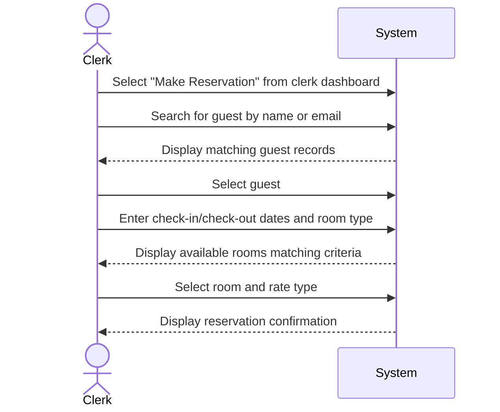

| Use Case Name | Clerk Makes Reservation for Guest |
|---------------|-----------------|
| Actor         | Hotel Clerk    |
| Author        | Jonathan Deiss |
| Preconditions | 1. Hotel clerk is logged into the system 2. Room and reservation data exists in the database 3. The guest has an existing account or the clerk can look one up |
| Postconditions | 1. A new reservation is created in the system and associated with the guest 2. The selected room is marked as reserved for the specified dates 3. Guest information is recorded and linked to the reservation |
| Main Success Scenario | 1. The clerk selects "Make Reservation" from the clerk dashboard 2. The clerk searches for the guest by name or email 3. The system displays matching guest records 4. The clerk selects the guest 5. The clerk enters the check-in date, check-out date, and desired room type 6. The system displays available rooms matching the criteria 7. The clerk selects a room 8. The clerk selects a rate type (standard, promotion, group, or non-refundable) 9. The system calculates the total cost based on the room's quality level and rate type 10. The system creates the reservation and associates it with the guest 11. The system displays the reservation confirmation details |
| Extensions | [3]a. **Guest not found** &nbsp;&nbsp;&nbsp;&nbsp;[3]a1 The clerk creates a new guest record &nbsp;&nbsp;&nbsp;&nbsp;[3]a2 Continue from step 5 [6]a. **No rooms available for requested criteria** &nbsp;&nbsp;&nbsp;&nbsp;[6]a1 The system notifies the clerk that no rooms match the criteria &nbsp;&nbsp;&nbsp;&nbsp;[6]a2 The clerk adjusts dates or room type and returns to step 5 [8]a. **Corporate guest** &nbsp;&nbsp;&nbsp;&nbsp;[8]a1 The clerk selects the guest's corporation &nbsp;&nbsp;&nbsp;&nbsp;[8]a2 The system marks the reservation for deferred corporate billing &nbsp;&nbsp;&nbsp;&nbsp;[8]a3 Continue from step 9 |
| Special Reqs | ● Reservations created by a clerk must be flagged as clerk-initiated for auditing purposes ● Corporate guest reservations must be marked for deferred billing and not charged at time of booking |

---

## Operation Contract

| Operation | `clerkMakeReservation(clerkId: String, guestId: String, roomId: String, checkInDate: Date, checkOutDate: Date, rateType: String)` |
|---|---|
| Cross References | Use Case: Clerk Makes Reservation for Guest |
| Preconditions | 1. Hotel clerk is logged in 2. The specified guest account exists in the system 3. The selected room is available for the requested dates |
| Postconditions | 1. A new Reservation was created and associated with the guest 2. Selected Room was marked as reserved for the specified dates 3. Reservation.totalCost was calculated based on quality level and rate type 4. Reservation was flagged as clerk-initiated and linked to the creating clerk's account |

