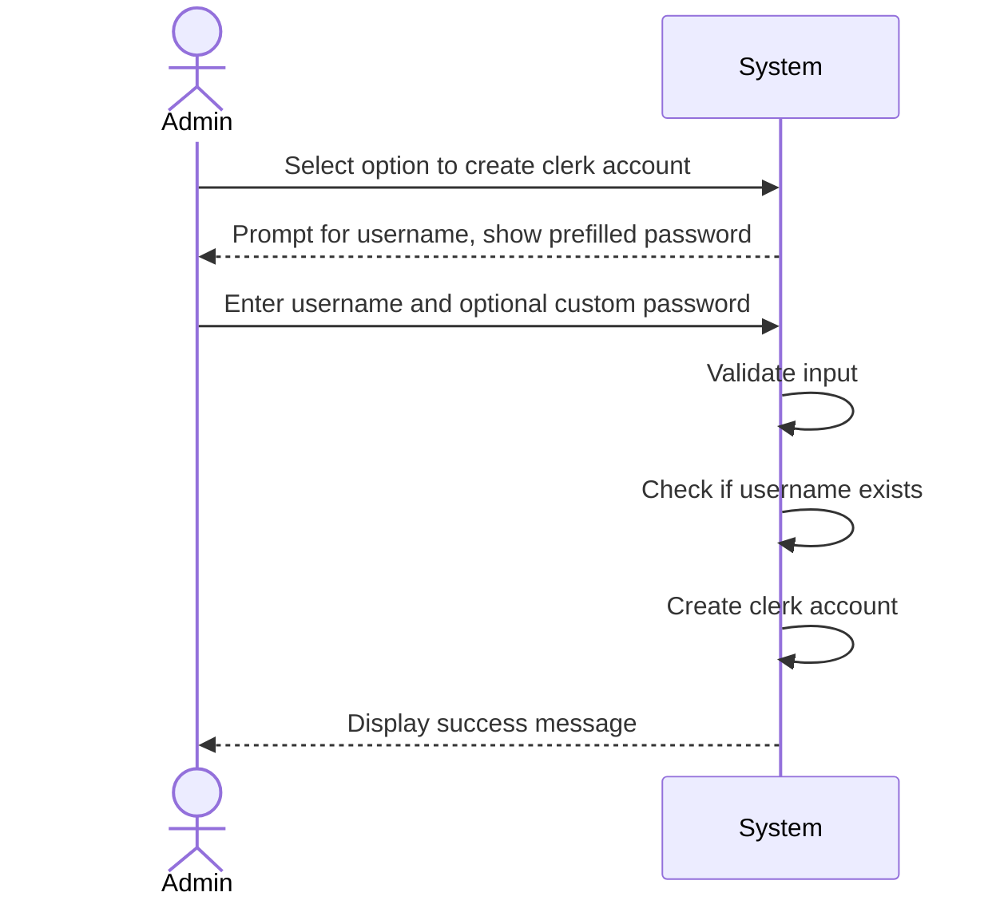

| Use Case Name | Create Hotel Clerk Account |
|---------------|----------------------------|
| Actor         | Admin                      |
| Author        | Jace Yarborough            |
| Preconditions | 1. Hotel system online and operational  2. User is logged in as an Admin|
|Postconditions | 1. A new hotel clerk account is created   2. Clerk account has given username and default password (or custom password)|
|Main Success Scenario| 1. Admin selects option to create hotel clerk account  2. System prompts admin to enter desired username and shows prefilled password for account. 3. Admin enters username and optional different password 4. System validates input   5. System creates clerk account  6. System displays success message for created account |
|Extensions| [4]a. **Username already in use** &nbsp;&nbsp;&nbsp;&nbsp;[4]a1 System detects username already in use(Ex: John_Smith) &nbsp;&nbsp;&nbsp;&nbsp;[4]a2 System displays error message and potential username replacement (EX: John_Smith1) [5]a. **Failure to create account** &nbsp;&nbsp;&nbsp;&nbsp;[5]a1 Display error message of account creation failure &nbsp;&nbsp;&nbsp;&nbsp;[5]a2 Reprompt user to try creating account again.|
|Special Reqs| ● Create account in timely manner ● Keep log of created accounts  ● Keep log of which admin created account|

---

## Operation Contract

| Operation | `createClerkAccount(username: String, password: String)` |
|---|---|
| Cross References | Use Case: Create Hotel Clerk Account |
| Preconditions | 1. Admin is logged in 2. The given username does not already exist in the system |
| Postconditions | 1. A new HotelClerk account was created 2. HotelClerk.username was set 3. HotelClerk.password was encrypted and stored 4. Account creation was logged with the creating admin's identity |

