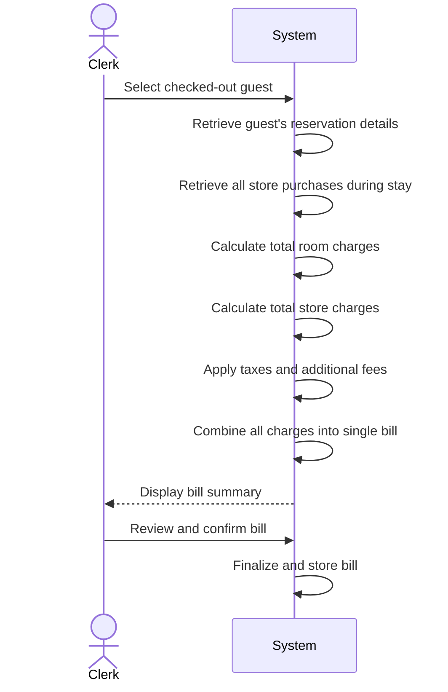

| Use Case Name | Generate Combined Bill |
|---------------|------------------------|
| Actor         | Hotel Clerk            |
| Author        | Zain Altaf             |
| Preconditions | 1. The hotel clerk is logged into the system.  2. The guest has completed check-out.  3. The guest has at least one reservation recorded in the system. |
| Postconditions | 1. A combined bill is generated for the guest.  2. The bill includes all room charges and store purchases.  3. The finalized bill is stored in the system. |
| Main Success Scenario | 1. The clerk selects a checked-out guest.  2. The system retrieves the guest’s reservation details.  3. The system retrieves all store purchases made during the guest’s stay.  4. The system calculates the total room charges.  5. The system calculates the total store charges.  6. The system applies any taxes or additional fees.  7. The system combines all charges into a single bill.  8. The system displays the bill summary.  9. The clerk reviews and confirms the bill.  10. The system finalizes and stores the bill. |
| Extensions | [3]a. **No store purchases recorded** &nbsp;&nbsp;&nbsp;&nbsp;[3]a1 The system generates a bill including only room charges. [2]b. **Corporate guest billing** &nbsp;&nbsp;&nbsp;&nbsp;[2]b1 The system marks the bill as corporate billing. &nbsp;&nbsp;&nbsp;&nbsp;[2]b2 The payment status is set to pending. |
| Special Reqs | ● Bill calculations must be accurate and consistent with reservation and purchase records. ● Tax calculations must follow applicable hotel policies. ● The generated bill must be stored for auditing and reporting purposes. |

---

## Operation Contract

| Operation | `generateCombinedBill(guestId: String)` |
|---|---|
| Cross References | Use Case: Generate Combined Bill |
| Preconditions | 1. Hotel clerk is logged in 2. Guest has completed check-out 3. At least one reservation is recorded for the guest |
| Postconditions | 1. A combined Bill was created and associated with the guest 2. Bill included all room charges from the guest's stay 3. Bill included all store purchase charges from the guest's stay 4. Applicable taxes and fees were applied to the total 5. Finalized bill was stored in the system for auditing |

