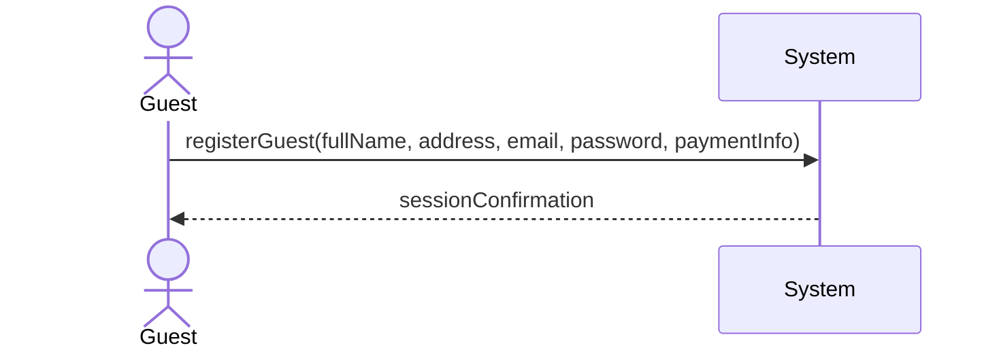
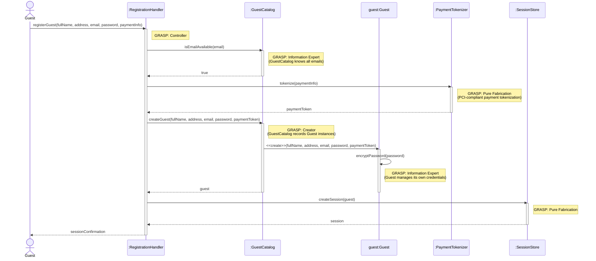

| Use Case Name | Guest Registration & Authentication |
|---------------|-----------------|
| Actor         | Guest           |
| Author        | Erick Martinez  |
| Preconditions | 1. The guest has access to the hotel system portal  2. The guest is not currently logged into an existing account |
| Postconditions | 1. A new guest profile is created in the database  2. Payment information is securely tokenized/stored  3. The guest is automatically logged in and redirected to the dashboard  4. A "Welcome [Name]" message is displayed |
| Main Success Scenario | 1. The guest selects the "Register" or "Create Account" option  2. The guest enters personal details: Full Name, Address, Email, and Password  3. The guest enters payment details: Credit Card Number, Expiration Date, and CVV  4. The system validates the format of all fields (e.g., email syntax, credit card)  5. The system checks if the email address is already registered  6. The system encrypts the password and stores the guest profile  7. The system authenticates the new session  8. The system displays a "Welcome [Guest Name]" message on the homepage/dashboard |
| Extensions | [4]a. **Invalid Data Format** &nbsp;&nbsp;&nbsp;&nbsp;[4]a1 The system highlights the specific field (e.g., "Invalid Credit Card Format") &nbsp;&nbsp;&nbsp;&nbsp;[4]a2 The guest corrects the data &nbsp;&nbsp;&nbsp;&nbsp;[4]a3 Continue from step 4 [5]a. **Email Already Exists** &nbsp;&nbsp;&nbsp;&nbsp;[5]a1 The system notifies the guest that an account already exists with that email &nbsp;&nbsp;&nbsp;&nbsp;[5]a2 The system offers a "Forgot Password" or "Login" link &nbsp;&nbsp;&nbsp;&nbsp;[5]a3 Use case ends [7]a. **Authentication Failure** &nbsp;&nbsp;&nbsp;&nbsp;[7]a1 The system creates the account but fails the initial login &nbsp;&nbsp;&nbsp;&nbsp;[7]a2 The system redirects the guest to the manual Login page |
| Special Reqs | ● PCI Compliance: Credit card data must be handled according to security standards (e.g., masking numbers in the UI) ● Data Integrity: The "Welcome" message must dynamically pull the FirstName attribute from the database ● Persistence: Guest information must remain accessible for future "Store" purchases without re-entry |

### Operation Contract

| Operation | `registerGuest(fullName: String, address: String, email: String, password: String, paymentInfo: PaymentInfo)` |
|---|---|
| Cross References | Use Case: Guest Registration & Authentication |
| Preconditions | 1. Guest has access to the hotel system portal 2. Guest is not currently logged in 3. The given email address is not already registered |
| Postconditions | 1. A new Guest profile was created in the database 2. Guest.password was encrypted and stored 3. Payment information was securely tokenized and stored 4. A new authenticated session was created and associated with the guest |

### Design Sequence Diagram

| Pattern | Applied To | Rationale |
|---|---|---|
| **Controller** | `:RegistrationHandler` | Use-case controller; receives the `registerGuest` system operation |
| **Information Expert + Pure Fabrication** | `:GuestCatalog` | Knows all registered emails; checks uniqueness before creation |
| **Creator** | `:GuestCatalog` | Records Guest instances (GRASP Creator: B records A → B creates A) |
| **Information Expert** | `guest:Guest` | Manages its own password encryption |
| **Pure Fabrication** | `:PaymentTokenizer` | Tokenizes payment info for PCI compliance; no domain counterpart |
| **Pure Fabrication** | `:SessionStore` | Creates and stores the authenticated session |

