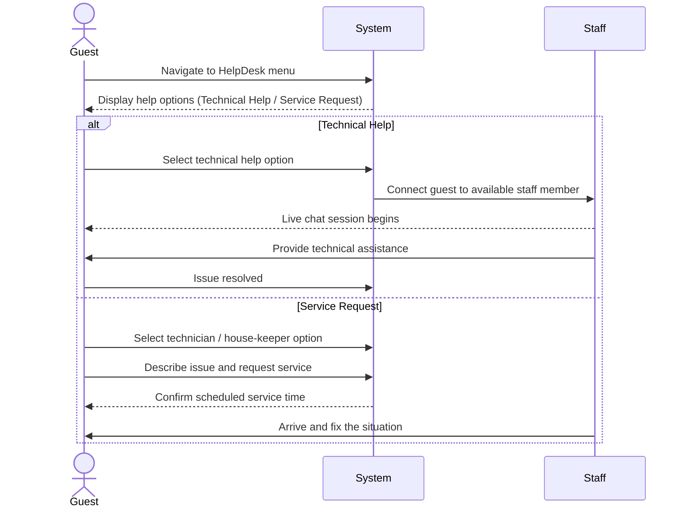

| Use Case Name | HelpDesk |
|---------------|----------|
| Actor         | Guest    |
| Author        | James Bagwell |
| Preconditions | 1. There is a staff member on standby to help over the computer / phone  2. There is a staff member ready to complete the scheduled service at the time it was scheduled |
| Postconditions | 1. Guest received help they needed  2. Guest schedules a service and reason for scheduling |
| Main Success Scenario | 1. User logs into the hotel website and navigates to the HelpDesk menu  2. If they need technical help (such as Wi-Fi not working, how to use the phone, etc.), they select that option. If they need a technician or a house-keeper (for example, if the air-conditioning isn't working or the toilet is clogged), they choose the other option.  3. If the user selects the first option, they are able to chat on the computer with someone who can help. If they choose the second option, they can request a technician or house-keeper to fix the situation, and the system will assign and schedule someone to come help as soon as possible.  4. The situation is fixed. |
| Extensions | 2a. **No Virtual Technician Available** &nbsp;&nbsp;&nbsp;&nbsp;2a1. No staff member is available for technical support. &nbsp;&nbsp;&nbsp;&nbsp;2a2. The system displays a message notifying the yuser of a delay and it and allows the guest to submit a request to get a call back later. 3b. **No Technician or House-keeper Available** &nbsp;&nbsp;&nbsp;&nbsp;3b1. No technician or house-keeper is available at the requested time. &nbsp;&nbsp;&nbsp;&nbsp;3b2. The system prompts the guest to select an alternate time for the service request. |
| Special Reqs | ● The HelpDesk system must always be accessible through the hotel website. ● Live chat must occur quickly. ● All help requests and service schedules must be logged and associated with the guest's room number and account / phone number. |

---

## Operation Contract

| Operation | `submitHelpRequest(requestType: String, description: String)` |
|---|---|
| Cross References | Use Case: HelpDesk |
| Preconditions | 1. Guest is logged in 2. A staff member is on standby 3. Hotel system is accessible |
| Postconditions | 1. A new HelpRequest was created and associated with the guest's account and room number 2. If technical help: a live chat session was initiated between the guest and an available staff member 3. If service request: a ServiceRequest was created, a staff member was assigned, and a service time was scheduled 4. Help request was logged with the guest's room number and account |

