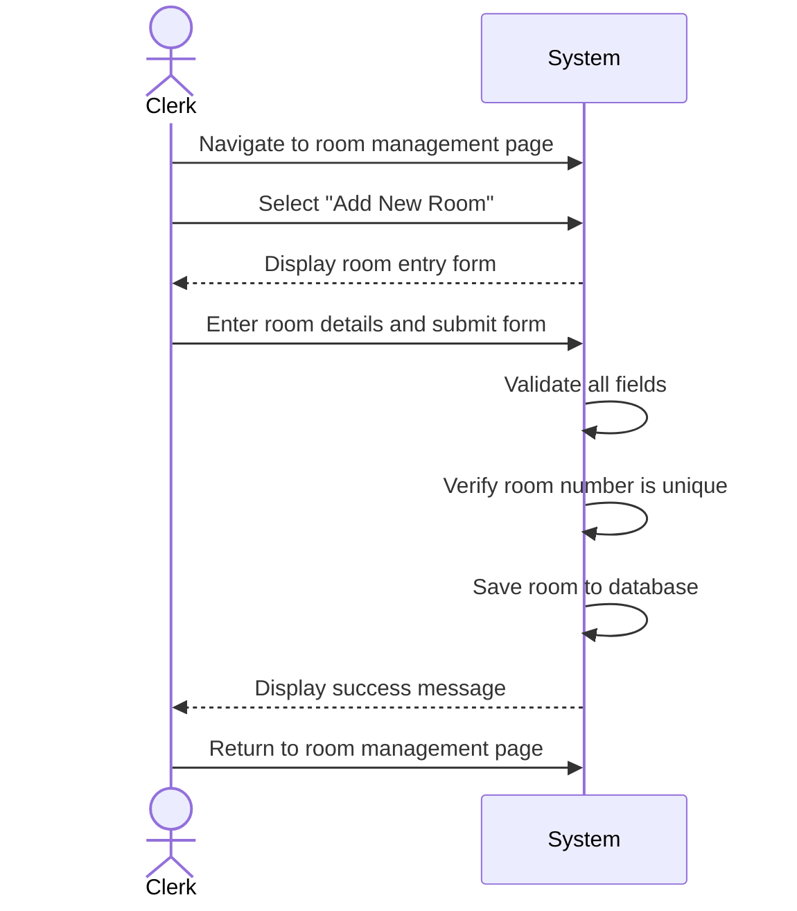

| Use Case Name | Add Room |
|---|---|
| Actor | Hotel Clerk |
| Author | Jace Yarborough |
| Preconditions | 1. System operational 2. Hotel clerk is logged in |
| Postconditions | 1. New room is added to hotel inventory 2. Room is available for reservations |
| Main Success Scenario | 1. Hotel clerk navigates to room management page 2. Hotel clerk selects "Add New Room" 3. System displays room entry form 4. Hotel clerk enters room details: &nbsp;&nbsp;&nbsp;&nbsp;- Room number &nbsp;&nbsp;&nbsp;&nbsp;- Floor/theme (Nature Retreat, Urban Elegance, Vintage Charm) &nbsp;&nbsp;&nbsp;&nbsp;- Room type (single, double, family, suite, deluxe, standard) &nbsp;&nbsp;&nbsp;&nbsp;- Bed type and quantity (twin, full, queen, king) &nbsp;&nbsp;&nbsp;&nbsp;- Smoking/non-smoking status &nbsp;&nbsp;&nbsp;&nbsp;- Quality level (executive, business, comfort, economy) &nbsp;&nbsp;&nbsp;&nbsp;- Maximum daily rate 5. Hotel clerk submits form 6. System validates all fields 7. System verifies room number is unique 8. System saves room to database 9. System displays success message 10. Hotel clerk returns to room management page |
| Extensions | [6]a. **Required fields missing** &nbsp;&nbsp;&nbsp;&nbsp;[6]a1 System highlights missing fields &nbsp;&nbsp;&nbsp;&nbsp;[6]a2 System displays error "Please fill in all required fields" &nbsp;&nbsp;&nbsp;&nbsp;[6]a3 Return to step 4 [6]b. **Invalid data format** &nbsp;&nbsp;&nbsp;&nbsp;[6]b1 System displays error "Invalid format for [field name]" &nbsp;&nbsp;&nbsp;&nbsp;[6]b2 Return to step 4 [7]a. **Duplicate room number** &nbsp;&nbsp;&nbsp;&nbsp;[7]a1 System displays error "Room number already exists" &nbsp;&nbsp;&nbsp;&nbsp;[7]a2 Return to step 4 [8]a. **Database error** &nbsp;&nbsp;&nbsp;&nbsp;[8]a1 System displays error "Unable to add room. Try again" &nbsp;&nbsp;&nbsp;&nbsp;[8]a2 Use case ends |
| Special Reqs | ● Room numbers must follow hotel numbering convention ● Maximum daily rate must be positive value ● All room additions must be logged |

---

## Operation Contract

| Operation | `addRoom(roomNumber: String, theme: String, roomType: String, bedType: String, smokingStatus: Boolean, qualityLevel: String, maxDailyRate: Decimal)` |
|---|---|
| Cross References | Use Case: Add Room |
| Preconditions | 1. Hotel clerk is logged in 2. System is operational |
| Postconditions | 1. A new Room instance was created and saved to the database 2. Room was associated with the hotel inventory 3. Room.status was set to 'available' 4. The room addition was logged |
