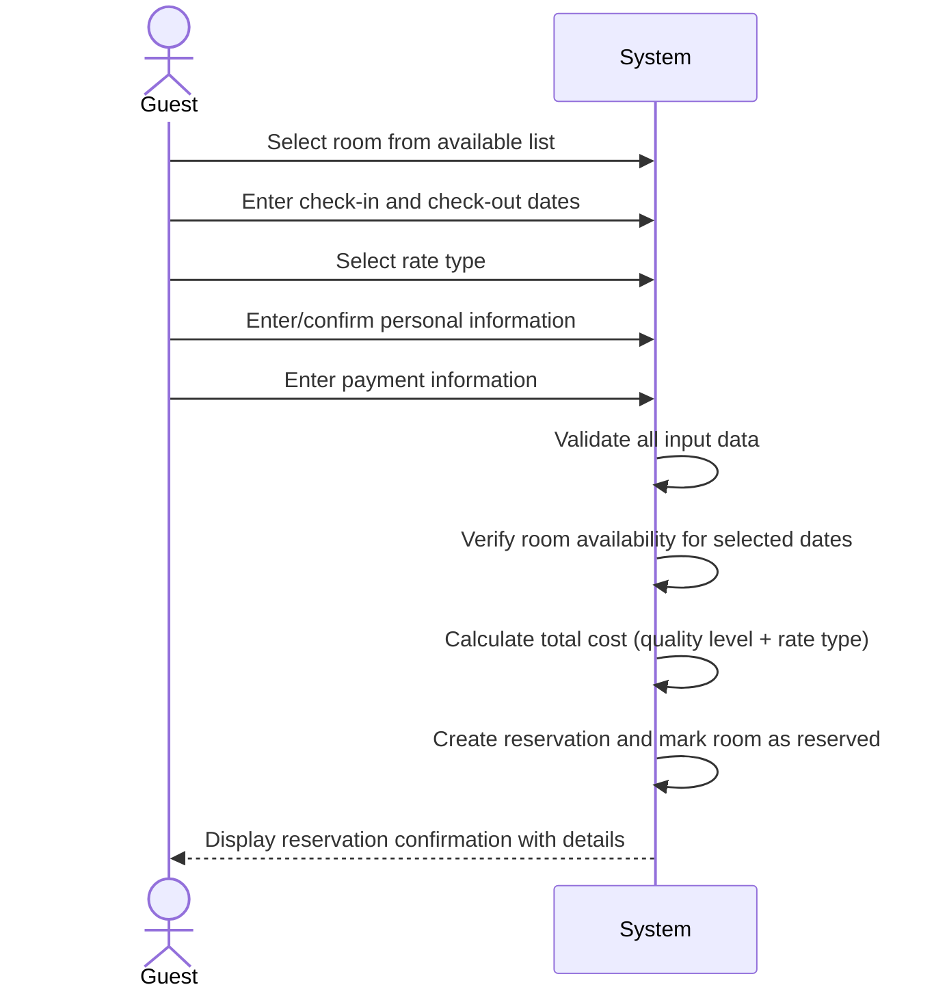

| Use Case Name | Make Reservation |
|---------------|-----------------|
| Actor         | Hotel Guest     |
| Author        | Erick Martinez  |
| Preconditions | 1. The hotel system is functional and online  2. The user is logged in to the system  3. Room and reservation data exists in the database  4. The user has searched for available rooms |
| Postconditions | 1. A new reservation is created in the system  2. The selected room is marked as reserved for the specified dates  3. Guest information is recorded (name, address, credit card number, expiration date)  4. Confirmation is displayed to the user |
| Main Success Scenario | 1. The user selects a room from the list of available rooms  2. The user enters the check-in and check-out dates  3. The user selects the rate type (standard, promotion, group, or non-refundable)  4. The user enters or confirms their personal information (name, address)  5. The user enters payment information (credit card number, expiration date)  6. The system validates all input data  7. The system verifies room availability for the selected dates  8. The system calculates the total cost based on quality level and rate type  9. The system creates the reservation and stores it in the database  10. The system displays reservation confirmation with details |
| Extensions | [3]a. **Corporate guest selected** &nbsp;&nbsp;&nbsp;&nbsp;[3]a1 The user selects their corporation from the list &nbsp;&nbsp;&nbsp;&nbsp;[3]a2 The system records the corporation for billing purposes &nbsp;&nbsp;&nbsp;&nbsp;[3]a3 Continue from step 4 [6]a. **Invalid input data** &nbsp;&nbsp;&nbsp;&nbsp;[6]a1 The system displays an error message indicating the invalid fields &nbsp;&nbsp;&nbsp;&nbsp;[6]a2 The user corrects the input &nbsp;&nbsp;&nbsp;&nbsp;[6]a3 Continue from step 6 [7]a. **Room is no longer available** &nbsp;&nbsp;&nbsp;&nbsp;[7]a1 The system notifies the user that the room has been booked &nbsp;&nbsp;&nbsp;&nbsp;[7]a2 The system redirects the user to search for available rooms &nbsp;&nbsp;&nbsp;&nbsp;[7]a3 Use case ends |
| Special Reqs | ● Credit card information must be securely stored ● Reservation must be atomic (all or nothing) |

---

## Operation Contract

| Operation | `makeReservation(roomId: String, checkInDate: Date, checkOutDate: Date, rateType: String, guestInfo: GuestInfo, paymentInfo: PaymentInfo)` |
|---|---|
| Cross References | Use Case: Make Reservation |
| Preconditions | 1. Guest is logged in 2. The selected room is available for the requested dates 3. Room and reservation data exist in the database |
| Postconditions | 1. A new Reservation was created in the database 2. Selected Room was marked as reserved for the specified dates 3. Guest information (name, address, credit card number, expiration date) was recorded 4. Reservation.totalCost was calculated based on quality level and rate type |

