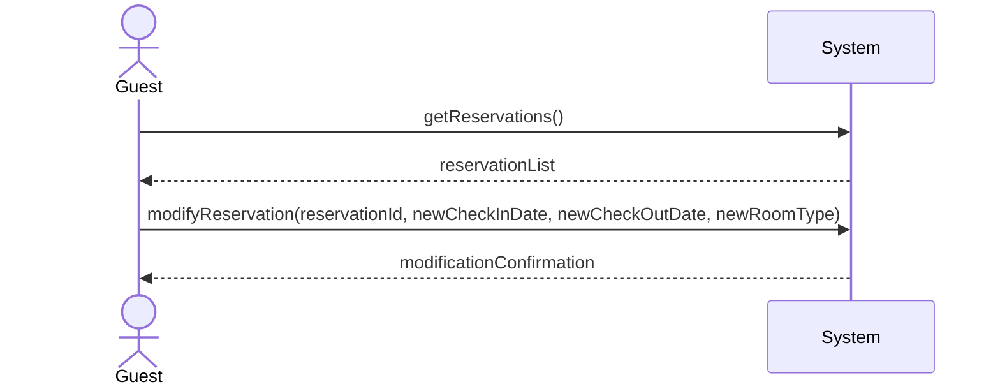
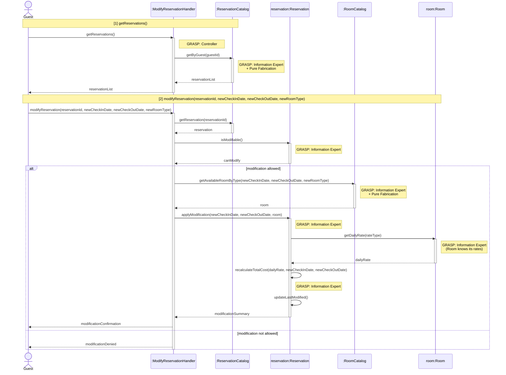

| Use Case Name| Modify Reservation |
|---------------|-----------------|
| Actor         | Hotel Guest    |
| Author        | Zain Altaf     |
| Preconditions | 1. The hotel guest is logged into the system.  2.The guest has an existing reservation.   3. The reservation has not yet started.|
|Postconditions | 1. The reservation is updated only if modification is permitted.   2. If modification is not permitted, the reservation remains unchanged.   3. Any change in price is recalculated and recorded. |
|Main Success Scenario| 1. The guest selects the option to view their reservations.  2. The system displays the guest’s reservations. 3. The guest selects a reservation to modify. 4. The system displays the current reservation details   5.The guest enters the requested changes (e.g., dates or room type).  6. The system checks whether the modification request is more than X hours before the check-in time.   7. The system checks room availability for the requested changes.   8. The system recalculates the reservation cost, if applicable.   9. The system displays the updated reservation details.   10. The guest confirms the modification.   11. The system updates the reservation.   12. The system displays a modification confirmation message.|
|Extensions| [6]a. **Modification not allowed (within X hours of check-in)** &nbsp;&nbsp;&nbsp;&nbsp;[6]a1 The system determines that the modification request is within X hours of the check-in time. &nbsp;&nbsp;&nbsp;&nbsp;[6]a2 The system displays a message explaining that modifications are not permitted according to the policy.|
|Special Reqs| ● The system must enforce the X-hour modification policy exactly. ● Availability checks must be consistent with current reservations.  ● Price recalculation must follow hotel pricing rules.|

### Operation Contract

| Operation | `modifyReservation(reservationId: String, newCheckInDate: Date, newCheckOutDate: Date, newRoomType: String)` |
|---|---|
| Cross References | Use Case: Modify Reservation |
| Preconditions | 1. Guest is logged in 2. Reservation exists and is associated with the guest 3. The modification is requested more than X hours before check-in 4. The reservation has not yet started |
| Postconditions | 1. Reservation.checkInDate and/or Reservation.checkOutDate were updated (if changed) 2. Reservation was associated with the new room type (if changed) 3. Reservation.totalCost was recalculated and updated 4. Reservation.lastModified timestamp was updated |

### Design Sequence Diagram

| Pattern | Applied To | Rationale |
|---|---|---|
| **Controller** | `:ModifyReservationHandler` | Use-case controller; handles both system operations for this use case session |
| **Information Expert + Pure Fabrication** | `:ReservationCatalog` | Holds all Reservation data; retrieves reservations by guest and by ID |
| **Information Expert** | `reservation:Reservation` | Has `checkInDate` — enforces the X-hour modification policy; applies its own date/room changes and recalculates `totalCost` |
| **Information Expert** | `room:Room` | Has `maxDailyRate`, `promotionRate` — provides rate data for cost recalculation |
| **Information Expert + Pure Fabrication** | `:RoomCatalog` | Checks availability for the requested room type and date range |

