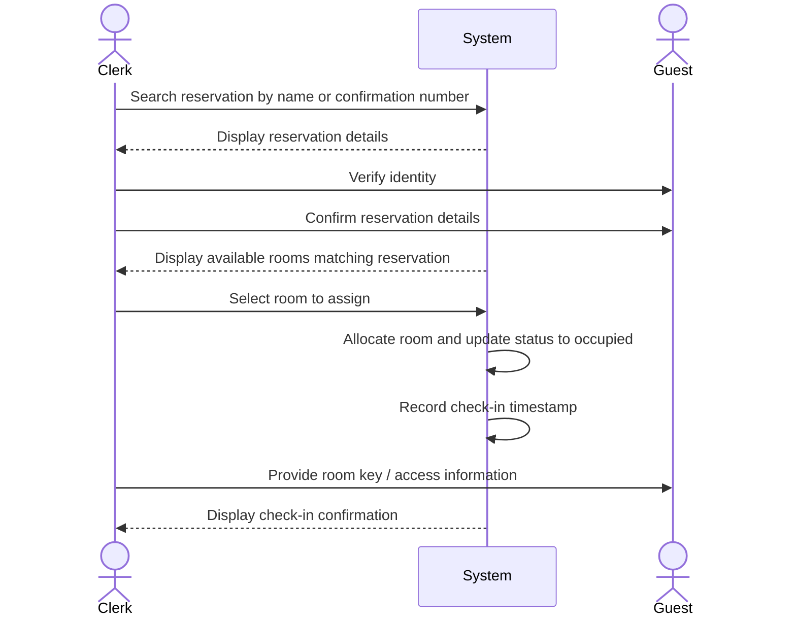

| Use Case Name | Process Check-In |
|---------------|-----------------|
| Actor         | Hotel Clerk    |
| Author        | Erick Martinez |
| Preconditions | 1. The hotel system is functional and online  2. The clerk is logged in to the system  3. The guest has an existing reservation for the current date  4. At least one room matching the reservation criteria is available |
| Postconditions | 1. The guest is checked in and assigned to a specific room  2. The room status is updated to occupied  3. The check-in date and time are recorded  4. The guest can access hotel services (including the store) |
| Main Success Scenario | 1. The clerk searches for the guest's reservation by name or confirmation number  2. The system displays the reservation details  3. The clerk verifies the guest's identity  4. The clerk confirms the reservation details with the guest  5. The system displays available rooms matching the reservation  6. The clerk selects a room to assign to the guest  7. The system allocates the room to the guest  8. The system updates the room status to occupied  9. The system records the check-in timestamp  10. The clerk provides the room key/access information to the guest  11. The system displays check-in confirmation |
| Extensions | [1]a. **Reservation not found** &nbsp;&nbsp;&nbsp;&nbsp;[1]a1 The clerk verifies guest information &nbsp;&nbsp;&nbsp;&nbsp;[1]a2 The clerk offers to create a new reservation (see Make Reservation use case) &nbsp;&nbsp;&nbsp;&nbsp;[1]a3 Use case ends or continues with new reservation [4]a. **Guest requests different room type** &nbsp;&nbsp;&nbsp;&nbsp;[4]a1 The clerk searches for alternative available rooms &nbsp;&nbsp;&nbsp;&nbsp;[4]a2 The system displays available alternatives with price differences &nbsp;&nbsp;&nbsp;&nbsp;[4]a3 The guest selects a new room type &nbsp;&nbsp;&nbsp;&nbsp;[4]a4 The system updates the reservation with new rate if applicable &nbsp;&nbsp;&nbsp;&nbsp;[4]a5 Continue from step 5 [6]a. **No rooms available matching reservation** &nbsp;&nbsp;&nbsp;&nbsp;[6]a1 The system notifies the clerk of the situation &nbsp;&nbsp;&nbsp;&nbsp;[6]a2 The clerk offers an upgrade or alternative room &nbsp;&nbsp;&nbsp;&nbsp;[6]a3 The guest accepts or declines the alternative &nbsp;&nbsp;&nbsp;&nbsp;[6]a4 If declined, the clerk processes a cancellation with no penalty &nbsp;&nbsp;&nbsp;&nbsp;[6]a5 Use case ends or continues with alternative room |
| Special Reqs | ● Check-in must update room availability in real-time ● Guest must have an active reservation to access store purchasing |

---

## Operation Contract

| Operation | `processCheckIn(reservationId: String, roomId: String)` |
|---|---|
| Cross References | Use Case: Process Check-In |
| Preconditions | 1. Hotel clerk is logged in 2. Guest has a reservation for the current date 3. The specified room is available and matches the reservation criteria |
| Postconditions | 1. Room.status was changed to 'occupied' 2. Reservation.checkInTimestamp was recorded 3. Reservation was associated with the specific assigned Room 4. Guest.checkedIn was set to true |

