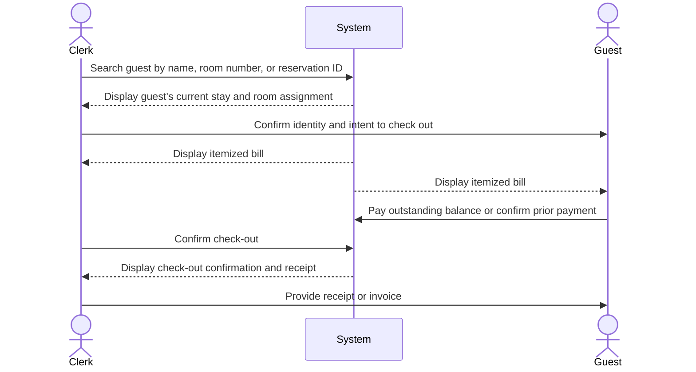

| Use Case Name | Process Check-Out |
|---------------|-----------------|
| Actor         | Hotel Clerk    |
| Author        | [Aaron]    |
| Preconditions | 1. The hotel system is functional and online  2. The clerk is logged in to the system  3. The guest has been checked in and is currently occupying a room  4. The guest's room and stay details exist in the database |
| Postconditions | 1. The guest is checked out and the room is released  2. The room status is updated to available (or cleaning/maintenance as configured)  3. The check-out date and time are recorded  4. The final bill is calculated and recorded  5. Any outstanding balance or payment confirmation is documented |
| Main Success Scenario | 1. The clerk searches for the guest by name, room number, or reservation ID  2. The system displays the guest's current stay and room assignment  3. The clerk confirms the guest's identity and intent to check out  4. The system calculates the final bill (room charges, minibar, store purchases, incidentals)  5. The system displays the itemized bill to the clerk and guest  6. The guest pays any outstanding balance (or confirms prior payment)  7. The clerk confirms check-out in the system  8. The system updates the room status to available  9. The system records the check-out timestamp  10. The system displays a check-out confirmation and receipt (if requested)  11. The clerk provides the receipt or invoice to the guest |
| Extensions | [1]a. **Guest or room not found** &nbsp;&nbsp;&nbsp;&nbsp;[1]a1 The system displays a message that no matching stay was found &nbsp;&nbsp;&nbsp;&nbsp;[1]a2 The clerk verifies room number or guest name &nbsp;&nbsp;&nbsp;&nbsp;[1]a3 Return to step 1 or use case ends [6]a. **Payment declined or insufficient** &nbsp;&nbsp;&nbsp;&nbsp;[6]a1 The system displays payment failure message &nbsp;&nbsp;&nbsp;&nbsp;[6]a2 The clerk requests alternative payment or arranges follow-up &nbsp;&nbsp;&nbsp;&nbsp;[6]a3 Return to step 6 or use case ends with balance documented [8]a. **System cannot update room status** &nbsp;&nbsp;&nbsp;&nbsp;[8]a1 The system displays an error and logs the failure &nbsp;&nbsp;&nbsp;&nbsp;[8]a2 The clerk retries or escalates; check-out may be completed manually and room status updated later |
| Special Reqs | ● Check-out must update room availability in real-time for Search Available Room ● Final bill must include all room charges and any store or incidental charges linked to the stay ● Check-out time and payment status must be logged for auditing |

---

## Operation Contract

| Operation | `processCheckOut(guestId: String)` |
|---|---|
| Cross References | Use Case: Process Check-Out |
| Preconditions | 1. Hotel clerk is logged in 2. Guest is currently checked in and occupying a room 3. Guest's stay details exist in the database |
| Postconditions | 1. Room.status was changed to 'available' 2. Stay.checkOutTimestamp was recorded 3. Final bill was calculated and recorded (room charges, store purchases, and incidentals) 4. Guest.checkedIn was set to false 5. Payment status was documented and logged |

