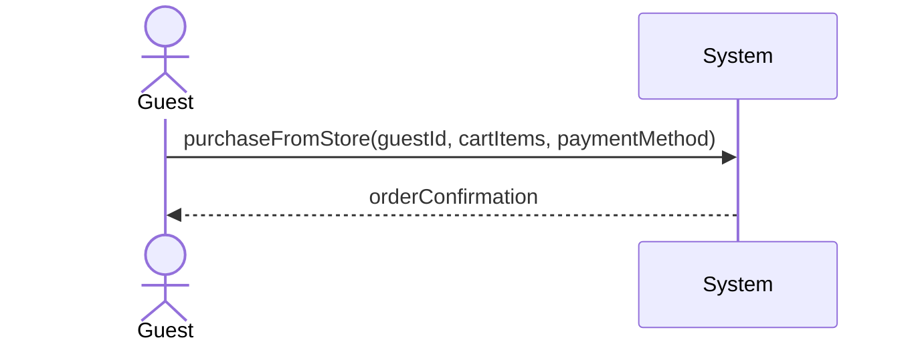
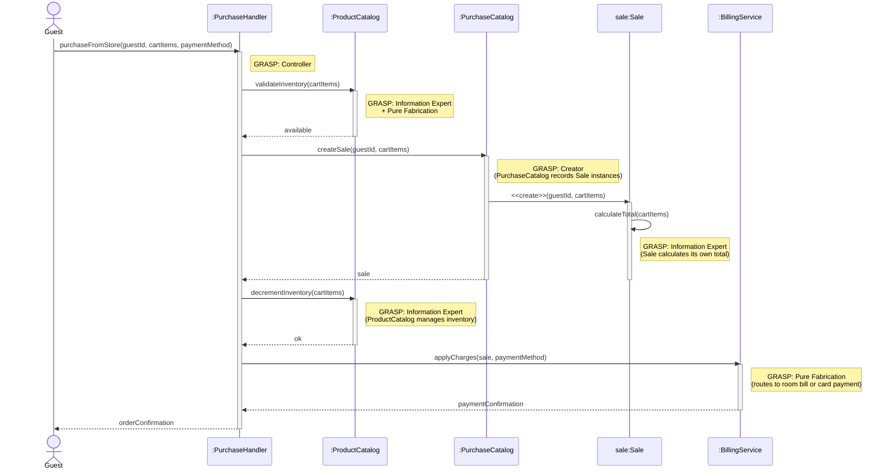

| Use Case Name | Purchase from Store |
|---------------|-----------------|
| Actor         | Guest          |
| Author        | [Aaron]    |
| Preconditions | 1. The guest is logged into the hotel system  2. The guest has browsed the product catalog and identified items to purchase  3. The guest is checked in (or the system allows store purchases for registered guests as per policy)  4. Products are available in inventory |
| Postconditions | 1. The selected products are recorded as purchased and associated with the guest (and room/stay if checked in)  2. Inventory for purchased items is updated  3. Payment is recorded and the guest receives confirmation  4. Charges are applied to the room bill (if checked in) or paid at time of purchase |
| Main Success Scenario | 1. The guest navigates to the Store from the main dashboard  2. The guest adds one or more products to the cart (product, quantity, size/variant if applicable)  3. The guest views the cart and adjusts quantities or removes items if desired  4. The guest proceeds to checkout  5. The system displays order summary (items, quantities, prices, total) and confirms guest/room for billing  6. The guest confirms payment method (charge to room or enter card)  7. The system validates payment and inventory availability  8. The system records the sale and updates inventory  9. The system applies charges to the room bill or completes the payment transaction  10. The system displays order confirmation and, if applicable, delivery or pickup details  11. The guest acknowledges the confirmation |
| Extensions | [2]a. **Product no longer available** &nbsp;&nbsp;&nbsp;&nbsp;[2]a1 The system notifies the guest that the item is out of stock &nbsp;&nbsp;&nbsp;&nbsp;[2]a2 The guest removes the item or selects an alternative &nbsp;&nbsp;&nbsp;&nbsp;[2]a3 Continue from step 3 [7]a. **Payment failed** &nbsp;&nbsp;&nbsp;&nbsp;[7]a1 The system displays payment error message &nbsp;&nbsp;&nbsp;&nbsp;[7]a2 The guest corrects payment details or chooses another method &nbsp;&nbsp;&nbsp;&nbsp;[7]a3 Return to step 6 [7]b. **Guest not checked in and no payment method** &nbsp;&nbsp;&nbsp;&nbsp;[7]b1 The system prompts for a valid payment method to complete purchase &nbsp;&nbsp;&nbsp;&nbsp;[7]b2 Use case ends if guest cannot provide payment |
| Special Reqs | ● Store purchases for checked-in guests must be chargeable to the room and visible on the final bill (Process Check-Out) ● Inventory must be decremented atomically with the sale ● Payment and order details must be stored securely and logged for auditing |

### Operation Contract

| Operation | `purchaseFromStore(guestId: String, cartItems: List<CartItem>, paymentMethod: PaymentMethod)` |
|---|---|
| Cross References | Use Case: Purchase from Store |
| Preconditions | 1. Guest is logged in 2. All items in the cart are available in inventory 3. Guest is checked in or has a valid payment method on file |
| Postconditions | 1. A new Sale was created and associated with the guest and current stay 2. Inventory quantity was decremented for each purchased item 3. Charges were applied to the guest's room bill (if checked in) or a payment transaction was completed 4. Order confirmation was generated and associated with the sale |

### Design Sequence Diagram

| Pattern | Applied To | Rationale |
|---|---|---|
| **Controller** | `:PurchaseHandler` | Use-case controller; receives the `purchaseFromStore` system operation |
| **Information Expert + Pure Fabrication** | `:ProductCatalog` | Holds all Product and inventory data; validates stock and decrements quantities |
| **Creator + Pure Fabrication** | `:PurchaseCatalog` | Records Sale instances (GRASP Creator: B records A → B creates A) |
| **Information Expert** | `sale:Sale` | Calculates its own total from the cart items |
| **Pure Fabrication** | `:BillingService` | Routes charges to the room bill or processes a card payment; no domain counterpart |

