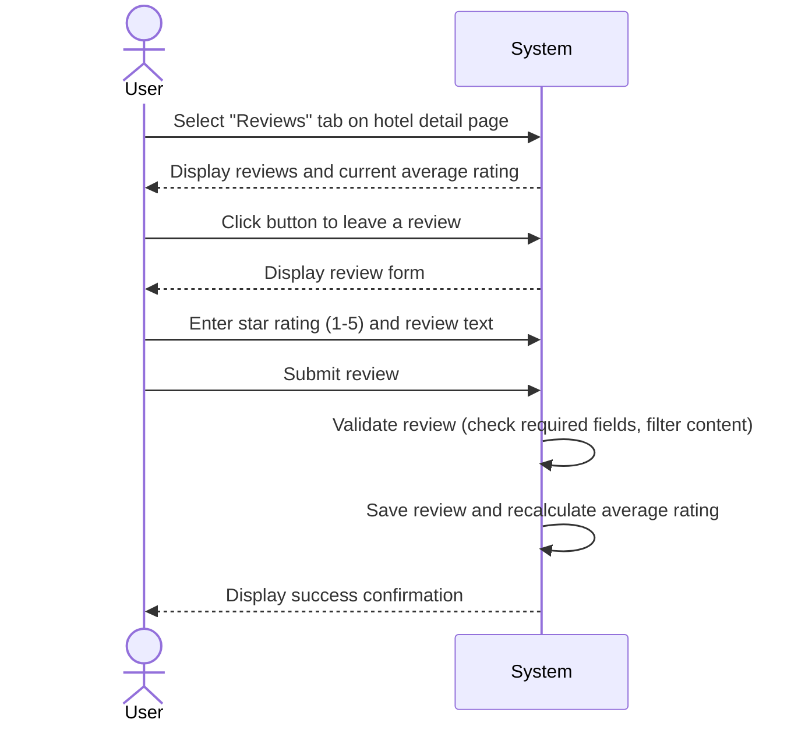

| Use Case Name | Leaving and / or Viewing a Review |
|---------------|-----------------|
| Actor         | Previous Hotel Guest / Potential Guest |
| Author        | James Bagwell |
| Preconditions | 1. The user is on the review / details page.  2. To leave a review, the user must be logged into their account and theyu must have reserved AND checked-in to a room previously. |
| Postconditions | 1. The new review is saved to the database and displayed on the hotel page.   2. The hotel’s average star rating is updated. |
| Main Success Scenario | 1. The User selects the "Reviews" tab on the hotel detail page.  2. The System displays a list of existing reviews and the current average rating.  3. The User clicks the button to leave a review.  4. The User leaves a star rating ( 1–5 ) and writes their review in the text field.   5. The User clicks the submits the review.   6. The System validates the review and indicates that the review was successfully left. |
| Extensions | [3]a. **User is not logged in** &nbsp;&nbsp;&nbsp;&nbsp; [3]a1. The System prompts the user to log in or sign up. &nbsp;&nbsp;&nbsp;&nbsp; [3]a2. Upon successful login, the system redirects the user back to the review form. [5]b. **Incomplete Review Form** &nbsp;&nbsp;&nbsp;&nbsp; [5]b1. The System highlights the missing fields (for example, if the star rating is left blank). &nbsp;&nbsp;&nbsp;&nbsp; [5]b2. The System prevents submission until all required fields are filled.|
| Special Reqs | ● The system must filter for profanity or restricted content before publishing. ● The user must be able to filter how many reviews they want to see ( For example, show 10 reviews ).  ● Users should be able to sort reviews by "Most Recent" or "Highest Rated."|

---

## Operation Contract

| Operation | `submitReview(hotelId: String, starRating: Integer, reviewText: String)` |
|---|---|
| Cross References | Use Case: Leaving and / or Viewing a Review |
| Preconditions | 1. User is logged in 2. User has a prior completed stay (checked in) at the hotel |
| Postconditions | 1. A new Review was created and associated with the hotel 2. Review was associated with the Guest account 3. Hotel.averageStarRating was recalculated and updated 4. Review was stored in the database and made visible on the hotel page |

