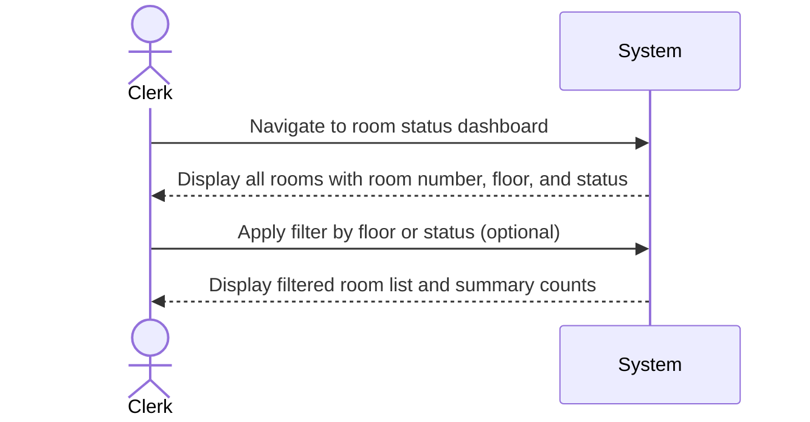

| Use Case Name | View Room Status |
|---------------|-----------------|
| Actor         | Hotel Clerk    |
| Author        | Jonathan Deiss |
| Preconditions | 1. Hotel clerk is logged into the system 2. Room data exists in the database |
| Postconditions | 1. The clerk has viewed the current status of all rooms 2. No data is modified |
| Main Success Scenario | 1. The clerk navigates to the room status dashboard 2. The system retrieves all rooms from the database 3. The system displays each room with its room number, floor/theme, and current status (available, reserved, or occupied) 4. The clerk optionally filters rooms by floor or status 5. The system updates the displayed list based on the applied filter 6. The system displays a summary count of rooms by status |
| Extensions | [2]a. **No rooms in system** &nbsp;&nbsp;&nbsp;&nbsp;[2]a1 The system displays a message indicating no rooms have been added yet &nbsp;&nbsp;&nbsp;&nbsp;[2]a2 Use case ends [5]a. **No rooms match filter** &nbsp;&nbsp;&nbsp;&nbsp;[5]a1 The system displays a message indicating no rooms match the selected criteria |
| Special Reqs | ● Room statuses must reflect real-time reservation and check-in data ● The dashboard must display a summary count of rooms by status |

---

## Operation Contract

| Operation | `viewRoomStatus(floorFilter: String, statusFilter: String)` |
|---|---|
| Cross References | Use Case: View Room Status |
| Preconditions | 1. Hotel clerk is logged in 2. Room data exists in the database |
| Postconditions | 1. No domain model state was changed (read-only operation) 2. A list of rooms with their current status was retrieved and displayed, filtered by the given criteria if provided |

