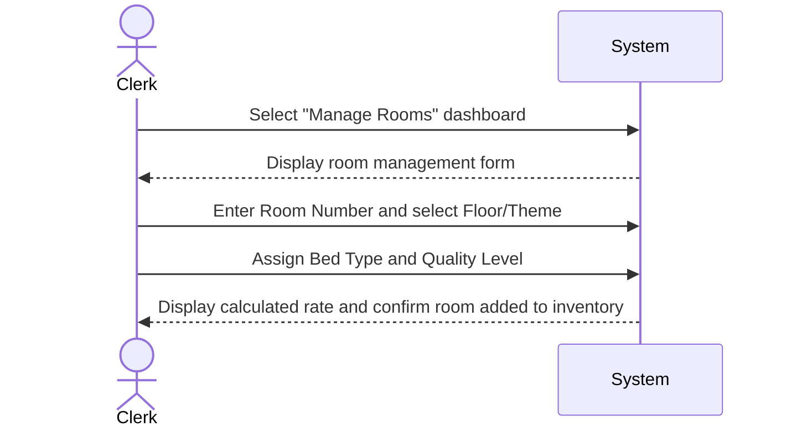

| Use Case Name | Configure Room Inventory |
|---------------|-----------------|
| Actor         | Hotel Clerk    |
| Author        | Jonathan Deiss |
| Preconditions | 1. The clerk is logged into an authorized Clerk account |
| Postconditions | 1. A new room is added to the hotel inventory with a specific theme and daily rate |
| Main Success Scenario | 1. The clerk selects the "Manage Rooms" dashboard  2. The clerk enters a Room Number and selects a Floor/Theme (e.g., Nature Retreat)  3. The clerk assigns a Bed Type (Twin, Full, Queen, King) and Quality Level  4. The system calculates the "Maximum Daily Rate" based on the Quality Level  5. The system saves the room status as "Available" for future searches |
| Extensions | [2]a. **Duplicate Room Number** &nbsp;&nbsp;&nbsp;&nbsp;[2]a1 System prevents saving and alerts the clerk that the room number already exists [4]a. **Rate Overrides** &nbsp;&nbsp;&nbsp;&nbsp;[4]a1 Clerk can manually set a "Promotion Rate" for a specific room |
| Special Reqs | ● Data Integrity: The system must enforce that "Suite" types only exist on the "Urban Elegance" floor as per the problem statement |

---

## Operation Contract

| Operation | `configureRoom(roomNumber: String, theme: String, bedType: String, qualityLevel: String)` |
|---|---|
| Cross References | Use Case: Configure Room Inventory |
| Preconditions | 1. Hotel clerk is logged in with an authorized clerk account 2. The room number does not already exist in the system |
| Postconditions | 1. A new Room was created and saved to the inventory 2. Room.theme was set to the selected floor/theme 3. Room.bedType was set 4. Room.qualityLevel was set 5. Room.maxDailyRate was calculated based on quality level and saved 6. Room.status was set to 'available' |

