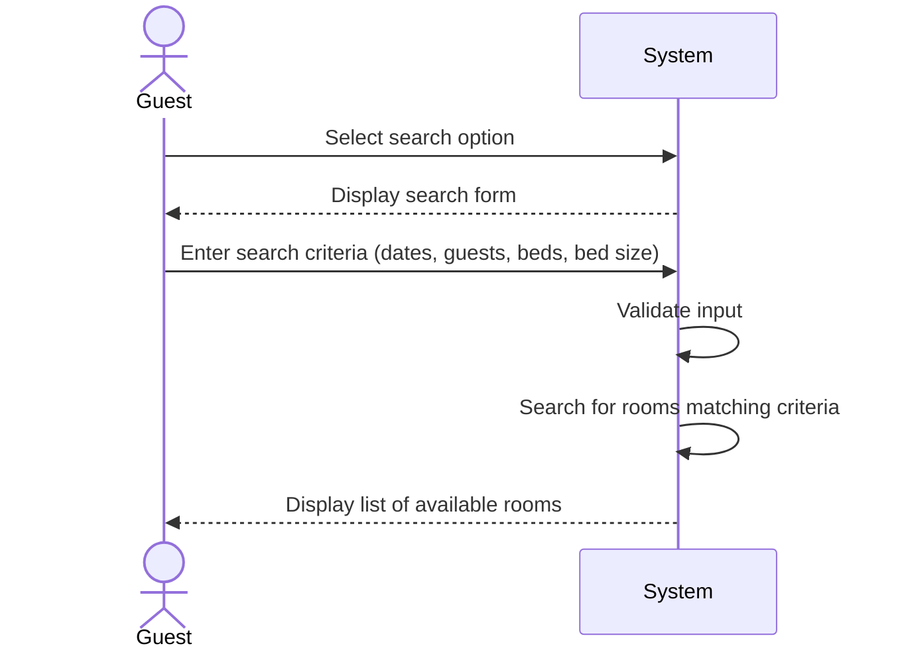

| Use Case Name | Search Available Room |
|---------------|-----------------|
| Actor         | Hotel Guest    |
| Author        | James Bagwell  |
| Preconditions | 1. The hotel system is functional and online  2. Room and reservation data exists in the database |
| Postconditions | 1. Available rooms are displayed to the user  2. Data is not modified |
| Main Success Scenario | 1. The user selects the search option  2. The user enters their search criteria such as check in / out date, number of guests, number of beds, bed size, etc.  3. System validates input  4. System searches for rooms that match user criteria, if available  5. System displays list of available rooms that match user criteria, if available |
| Extensions | |
| Special Reqs | |

---

## Operation Contract

| Operation | `searchAvailableRooms(checkInDate: Date, checkOutDate: Date, numGuests: Integer, numBeds: Integer, bedSize: String)` |
|---|---|
| Cross References | Use Case: Search Available Room |
| Preconditions | 1. Hotel system is functional and online 2. Room and reservation data exist in the database |
| Postconditions | 1. No domain model state was changed (read-only operation) 2. A list of rooms matching the search criteria was retrieved and displayed |

