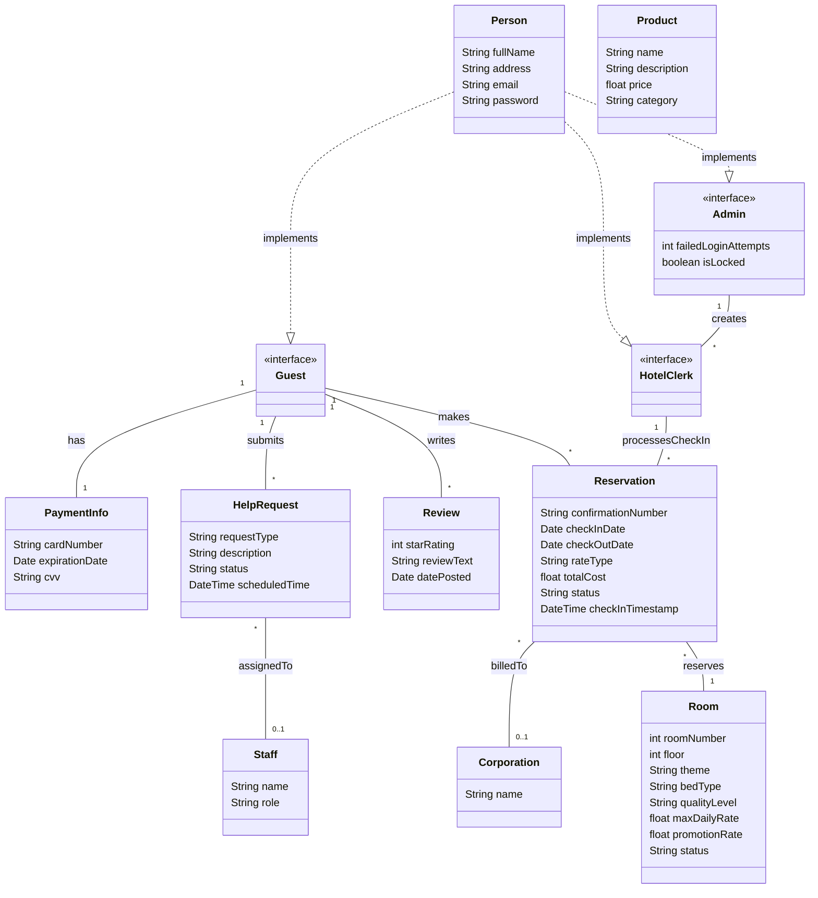

# Domain Model

```mermaid
classDiagram
    class Person {
        String fullName
        String address
        String email
        String password
    }

    class Guest {
        <<interface>>
    }

    class Admin {
        <<interface>>
        int failedLoginAttempts
        boolean isLocked
    }

    class HotelClerk {
        <<interface>>
    }

    Person ..|> Guest : implements
    Person ..|> Admin : implements
    Person ..|> HotelClerk : implements

    class PaymentInfo {
        String cardNumber
        Date expirationDate
        String cvv
    }

    class Room {
        int roomNumber
        int floor
        String theme
        String bedType
        String qualityLevel
        float maxDailyRate
        float promotionRate
        String status
    }

    class Reservation {
        String confirmationNumber
        Date checkInDate
        Date checkOutDate
        String rateType
        float totalCost
        String status
        DateTime checkInTimestamp
    }

    class Product {
        String name
        String description
        float price
        String category
    }

    class Review {
        int starRating
        String reviewText
        Date datePosted
    }

    class HelpRequest {
        String requestType
        String description
        String status
        DateTime scheduledTime
    }

    class Corporation {
        String name
    }

    class Staff {
        String name
        String role
    }

    Guest "1" -- "1" PaymentInfo : has
    Guest "1" -- "*" Reservation : makes
    Guest "1" -- "*" Review : writes
    Guest "1" -- "*" HelpRequest : submits
    Reservation "*" -- "1" Room : reserves
    Reservation "*" -- "0..1" Corporation : billedTo
    Admin "1" -- "*" HotelClerk : creates
    HotelClerk "1" -- "*" Reservation : processesCheckIn
    HelpRequest "*" -- "0..1" Staff : assignedTo
```
